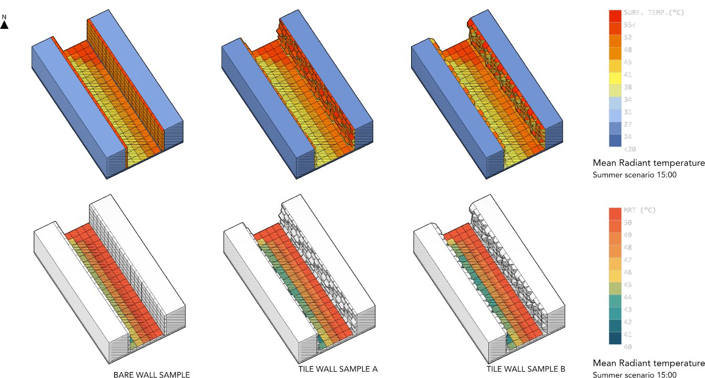
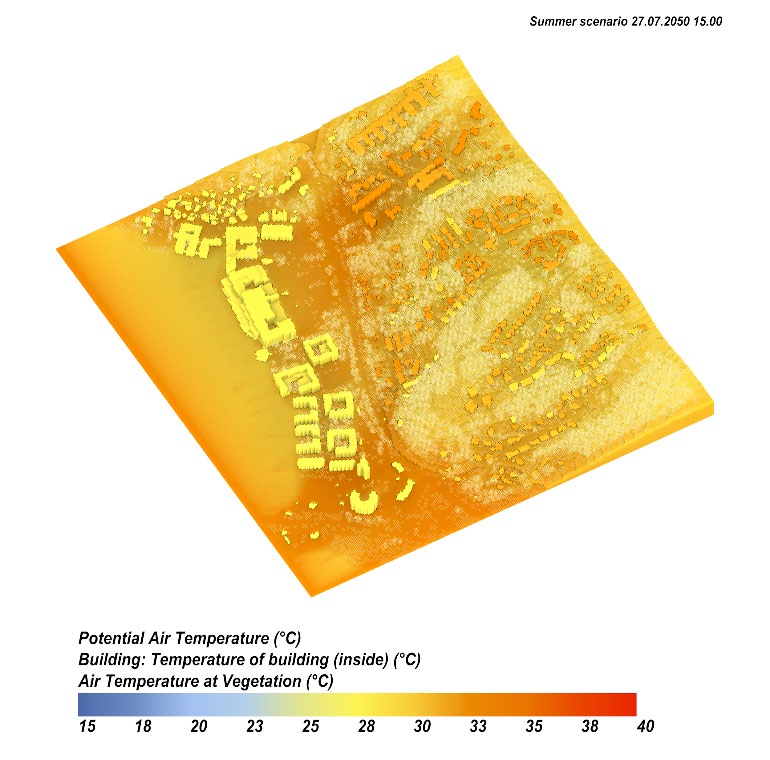
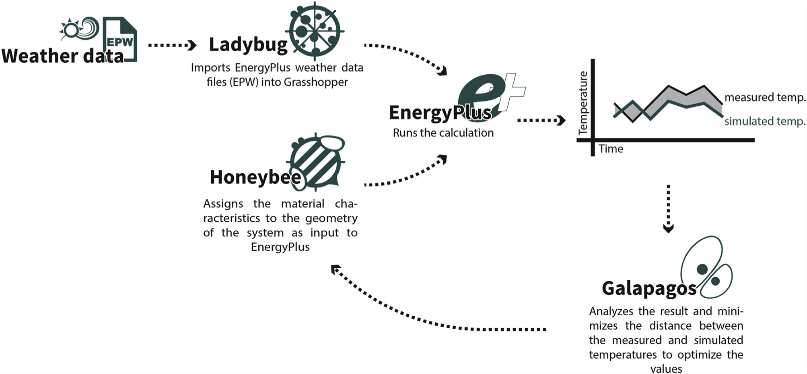

An external wall is two things at once: the last surface of a room and the first surface of a street. The two tools normally used to calculate it don't acknowledge this. Building energy simulation treats that wall as a boundary facing air at a temperature read from the weather file; urban microclimate simulation treats it as a surface at an imposed temperature, often perfectly flat. Each side ignores that the other reacts: the heat leaving during the day warms the street, and a warmer street radiates heat back at the envelope, which then lets more of it in.

This article is a review of work carried out by the authors — a group spread across the University of Parma, the Royal Danish Academy in Copenhagen, the University of Camerino, TU Delft and the Politecnico di Bari — and it starts exactly here. The thesis is that the open space, the envelope and the interior are *dual climate givers*: each generates climate for the other two. There are two questions, stated plainly: is the thermal link between inside and outside worth studying, and are digital environments ready to represent it?

## Five cases, one shared rule

The collected cases span five scales and five different design levers: the geometry and colour of a façade; nature-based solutions such as green façades and street trees; buffer zones such as porticoes; the shape of streets and squares; the urban fabric and topography as a whole. In all of them the physics at play is the same — exchanges by conduction, by convection and by shortwave radiation (the sun, direct and reflected several times between buildings that face each other) and longwave radiation (the heat every warm surface emits). The height and spacing of urban elements decide how much solar radiation is absorbed; the emissivity of materials and vegetation decides how much is re-emitted. This is what makes it sensible to design the outside and the inside together rather than at separate scales.

## The two engines: ENVI-met and Ladybug Tools

The authors work with two simulation chains, with opposite strengths.

**ENVI-met** is a three-dimensional microclimate model that resolves the interaction between air, plants and surfaces in an urban environment. It is based on computational fluid dynamics (CFD) and holds urban morphology, microclimate and outdoor comfort together in a single model. Its building model is coupled to the outdoor airflow field and returns an estimate of heat and moisture transfer through the façade, plus a predictive calculation of wall and indoor temperatures. The limits are stated: ENVI-met does not account for shortwave reflection inside rooms or radiative exchange between internal walls, and it estimates indoor air temperature with a simplified method. The indoor temperatures and heating and cooling loads it produces should be read as an approximate assessment, not a full energy calculation.

**Ladybug Tools** approaches the problem from the opposite side. It has introduced workflows to simulate outdoor comfort, and these couple to an interior resolved by the EnergyPlus thermal engine. The outdoor calculation starts right there: first EnergyPlus computes ground and building surface temperatures, then from these the longwave radiation field reaching people in the street is derived. Airflow, when needed, is imported from an external CFD tool such as Butterfly. The result is a chain in which the same geometry feeds the building's cooling load and the perceived temperature on the pavement.

Validation is what separates a simulated number from a verified one. The Ladybug Tools workflow was compared by the authors against real measurements: a globe thermometer and sensors placed inside and outside a façade, with good agreement between calculation and measurement, and a second comparison in an urban canyon on the campus of National Formosa University, Taiwan.

For green façades, the comparison with reality is wired into the method itself. The procedure called *green façade optimisation* uses Galapagos, an optimiser, to search recursively for the model parameters: at each iteration the simulated result is compared with temperatures measured on site, and the loop closes only when the two values match (**Figure 1**). At that point the calibrated model provides the inner and outer surface temperatures of the green wall, and from there one can choose the thickness of vertical greenery that genuinely benefits both the people passing in the street and the building's occupants.

## The façade changes the street

The first group of studies tests the façade as a double-sided climate device. A preliminary work varied the window-to-wall ratio and the colour of the outermost layer, for façades in Copenhagen and Madrid, measuring the effect on mean radiant temperature and on illuminance inside and out. In Copenhagen, depending on the façade type, the mean radiant temperature in the street can rise by 2 °C — a milder winter; in Madrid it can drop by up to 4 °C in summer — a cooler street. Later studies, with four façade types — no shading, fixed, dynamic and adaptive shading — applied to a canyon on Østergade in Copenhagen, show that glazed surfaces raise street temperature while shading systems lower it in the immediate vicinity of the façade, and that the effect holds at very different latitudes, from Copenhagen to Brindisi to Abu Dhabi.

An ongoing study isolates geometry alone: carved and relief façades applied to an urban canyon, with wall surface temperature and pedestrian-level mean radiant temperature assessed on three-dimensional models (**Figure 2**). Geometry alone shifts the surface temperature of the vertical walls by up to 15 °C average difference, and up to 5 °C of mean radiant temperature measured at ground level. A further study on Catania, carried out to counter the city's urban heat island, shows that the façade type mainly changes the building's energy demand: going from a light plaster to a dark one raises annual demand by 10 % on lava stone masonry, 5.5 % on brick masonry and 1.6 % on masonry with external insulation — proof that the outdoor microclimatic condition weighs heavily on the interior.

## Trees: they cool the street, and indoors?

That trees cool the air in summer, through shade and evapotranspiration, is well known. Less known is their effect on the indoor temperature of nearby buildings, for which no reliable mathematical model exists. The authors estimated it with the ENVI-met calculation, driven by two Grasshopper plugins — Morpho and Ladybug — for a site in Shanghai, a hot-humid climate, with two buildings facing an asphalt street: on the left a masonry façade, on the right a glazed curtain wall. Two scenarios were compared, with and without spherical-crowned trees, modelled with a low leaf density (2 m² per m³).

Near the trees the UTCI comfort index drops by more than 2.3 °C compared with the no-tree scenario. But not everywhere: on the north side, in some sun-exposed areas, the UTCI *rises* by 0.2 °C, because the reduction in wind speed and sky view factor outweighs the shade. The same mechanism enters the building with the curtain wall: the fall in air speed caused by the trees tends to raise the indoor temperature at certain moments, and yet the daily average indoors stays almost 2 °C below the no-tree scenario, on a June day at one in the afternoon. It is the most instructive anomaly in the review: the very presence of greenery that cools the street can, through the missing wind, push the indoor environment of a lightweight building the other way — and only a model that holds the two sides together shows it.

## Buffer zones

A study of Palazzo Tassoni Estense in Ferrara, today home to the Department of Architecture, uses ENVI-met to measure what the fifteenth-century porticoed courtyard does on the hottest days. The answer: buffer spaces lower the outdoor temperature and make the courtyard liveable when the street is scorching. This "man-made" microclimate does not come from greenery or water, but from the indoor temperatures of the rooms facing the courtyard — the building cooling its own open space.

## Venice's compact fabric

At block scale, an ENVI-met simulation of the historic fabric of Venice — with the climate projected to 2050 under the IPCC — links urban form to perceived temperature. Around Campo Santi Giovanni e Paolo the Physiological Equivalent Temperature (PET) varies widely with the compactness of the fabric: on the impermeable paving in full sun, near the church, it reaches 44 °C; where the fabric opens towards the side canal it drops to 32 °C, thanks to the shade of the façades. The flip side: without wind to disperse the heat, and with the still water of the canals, evaporative processes and local relative humidity increase. On the indoor front, preliminary results indicate that compactness sharply reduces building temperatures, and that the increase in shaded areas — in courtyards, in narrow alleys — lowers the outdoor temperature and cuts direct radiation on the façades.

## Topography and greenery at Stenungsund

The last case takes the scale to more than a square kilometre: the harbour front of Stenungsund, Sweden, simulated with ENVI-met for the current climate and for that of 2050. The port, residential buildings of different ages, patches of dense vegetation and an irregular topography of small valleys shape the local climate. Dense greenery lowers air temperatures measurably where there is vegetation and porous surfaces. On the map the old, poorly insulated buildings can be told apart by an indoor temperature almost equal to the outdoor one — which in 2050 will easily reach 35 °C — against the 26–28 °C of the more recent buildings (**Figure 3**). Where dense vegetation is very close, some poorly insulated buildings approach that 26–28 °C thanks to shade alone: outdoor greenery partly compensating for a poor envelope.

## What the tools can and cannot do

To the first question — is the thermal link between inside and outside worth studying? — the cases answer yes: façades, green solutions, buffer zones, the shape of streets and squares and the urban fabric all have a strong effect, on both the outside and the inside. To the second — are the tools ready? — the answer is more nuanced. Thermally coupling inside and outside is possible today, but the two engines are not interchangeable. ENVI-met proved valid when the solution to be assessed is nature-based and implemented on site, while its calculation of the interior remains coarse. Ladybug Tools is the more robust workflow when the object of study is the mutual thermal impact between the interior and the building's features, but it depends on an external tool for wind. In both cases the airflow field is the weak link. The next step the authors point to is to map a wider population of coupled cases and move from diagnosis to designing solutions that act on the outside–inside continuum.

---

**Short glossary**

- *Microclimate*: the thermal, radiative and ventilation conditions of a limited portion of a city — a street, a courtyard, a square — determined by the shape of buildings, materials and vegetation more than by the regional climate.
- *Coupling*: making the model of a building's interior and that of the outdoor urban space talk to each other in a single calculation, so that the output of one is the input of the other.
- *Mean radiant temperature (MRT)*: the net radiation a still body exchanges with all the surrounding surfaces, the sum of a shortwave component (sun) and a longwave one (heat emitted by warm surfaces). In the street it weighs on comfort more than air temperature does.
- *UTCI, PET*: two heat-stress indices that combine radiant temperature, air temperature, humidity and wind into a single scale of categories, from "no stress" to "extreme stress".
- *ENVI-met*: a three-dimensional urban microclimate model based on computational fluid dynamics, simulating air, plants and surfaces in a single environment.
- *EnergyPlus, Ladybug Tools*: respectively the building thermal-balance engine and the suite that makes it talk to the outdoor comfort calculation inside Rhino/Grasshopper.
- *Window-to-wall ratio (WWR)*: the fraction of glazed surface on a façade.
- *Sky view factor (SVF)*: the portion of the sky vault visible from a point; the lower it is, the less a surface can shed longwave heat to the sky.

$$$

Una parete esterna è due cose nello stesso momento: l'ultima superficie di una stanza e la prima superficie di una strada. I due strumenti con cui di solito la si calcola non lo ammettono. La simulazione energetica dell'edificio tratta quel muro come un contorno affacciato su aria a una temperatura letta dal file climatico; la simulazione del microclimate urbano lo tratta come una superficie a temperatura imposta, spesso perfettamente piatta. Ogni lato ignora che l'altro reagisce: il calore che esce di giorno scalda la strada, e una strada più calda irraggia calore verso l'involucro, che a quel punto ne fa entrare di più.

Questo articolo è una rassegna di lavori condotti dagli autori — un gruppo distribuito tra l'Università di Parma, la Royal Danish Academy di Copenhagen, l'Università di Camerino, la TU Delft e il Politecnico di Bari — e parte proprio da qui. La tesi è che lo spazio aperto, l'involucro e l'interno siano *dual climate givers*: ciascuno genera clima per gli altri due. Le domande sono due, dichiarate senza giri: il legame termico fra dentro e fuori vale la pena di essere studiato, e gli ambienti digitali sono pronti a rappresentarlo?

## Cinque casi, una regola comune

I casi raccolti coprono cinque scale e cinque leve progettuali diverse: la geometria e il colore di una facciata; le soluzioni basate sulla natura come le facciate verdi e gli alberi di strada; le zone cuscinetto come i portici; la forma di strade e piazze; il tessuto urbano e la topografia nel loro insieme. In tutti, la fisica in gioco è la stessa — scambi per conduzione, per convezione e per radiazione a onda corta (il sole, diretto e riflesso più volte tra edifici che si fronteggiano) e a onda lunga (il calore che ogni superficie calda emette). Altezza e distanza degli elementi urbani decidono quanta radiazione solare viene assorbita; l'emissività dei materiali e della vegetazione decide quanta ne viene riemessa. È questo che rende sensato progettare insieme il fuori e il dentro invece che a scale separate.

## I due motori: ENVI-met e Ladybug Tools

Gli autori lavorano con due catene di simulazione, con punti di forza opposti.

**ENVI-met** è un modello microclimatico tridimensionale che risolve l'interazione tra aria, piante e superfici in un ambiente urbano. È basato sulla fluidodinamica computazionale (CFD) e tiene insieme morfologia urbana, microclimate e comfort esterno in un unico modello. Il suo modello di edificio è accoppiato al campo di moto dell'aria esterna e restituisce una stima del trasferimento di calore e umidità attraverso la facciata, oltre a un calcolo predittivo delle temperature di parete e interne. I limiti sono dichiarati: ENVI-met non tiene conto della riflessione della radiazione a onda corta all'interno degli ambienti né degli scambi radiativi tra pareti interne, e stima la temperatura interna dell'aria con un metodo semplificato. Le temperature interne e i carichi di riscaldamento e raffrescamento che ne escono vanno letti come una valutazione approssimata, non come un calcolo energetico completo.

**Ladybug Tools** affronta il problema dal lato opposto. Ha introdotto flussi di lavoro per simulare il comfort esterno, e questi si accoppiano a un interno risolto dal motore termico EnergyPlus. Il calcolo esterno parte proprio da lì: prima EnergyPlus calcola le temperature del suolo e delle superfici degli edifici, poi da queste si ricava il campo di radiazione a onda lunga che investe chi sta in strada. Il moto dell'aria, quando serve, viene importato da uno strumento esterno di CFD come Butterfly. Il risultato è una catena in cui la stessa geometria alimenta il carico di raffrescamento dell'edificio e la temperatura percepita sul marciapiede.

La validazione è la parte che distingue un numero simulato da un numero verificato. Il flusso di Ladybug Tools è stato confrontato dagli autori con misure reali: un globotermometro e sensori collocati dentro e fuori una facciata, con buon accordo tra calcolo e misura, e un secondo confronto in un canyon urbano nel campus della National Formosa University, a Taiwan.

Per le facciate verdi il confronto con la realtà è cablato dentro il metodo stesso. La procedura chiamata *green facade optimisation* usa Galapagos, un ottimizzatore, per cercare in modo ricorsivo i parametri del modello: a ogni iterazione il risultato simulato viene confrontato con le temperature misurate in sito, e il ciclo si chiude solo quando i due valori coincidono (**Figura 1**). A quel punto il modello calibrato fornisce le temperature superficiali interne ed esterne della parete verde, e da lì si può scegliere lo spessore di verde verticale che conviene davvero a chi passa in strada e a chi abita l'edificio.

## La facciata cambia la strada

Il primo gruppo di studi mette alla prova la facciata come dispositivo climatico a doppia faccia. Un lavoro preliminare ha variato il rapporto tra superficie vetrata e superficie opaca (window-to-wall ratio) e il colore dello strato più esterno, per facciate a Copenhagen e a Madrid, misurando l'effetto sulla temperatura media radiante e sull'illuminamento dentro e fuori. A Copenhagen, a seconda del tipo di facciata, la temperatura media radiante in strada può salire di 2 °C — un inverno più mite; a Madrid può scendere fino a 4 °C in estate — una strada più fresca. Studi successivi, con quattro tipi di facciata — nessuna schermatura, schermatura fissa, dinamica e adattiva — applicati a un canyon di Østergade a Copenhagen, mostrano che le superfici vetrate alzano la temperatura della strada mentre i sistemi di schermatura la abbassano nell'intorno immediato della facciata, e che l'effetto si ritrova a latitudini molto diverse, da Copenhagen a Brindisi ad Abu Dhabi.

Uno studio in corso isola la sola geometria: facciate scolpite e a rilievo applicate a un canyon urbano, con la temperatura superficiale delle pareti e la temperatura media radiante al livello del pedone valutate su modelli tridimensionali (**Figura 2**). La geometria da sola sposta la temperatura superficiale delle pareti verticali fino a 15 °C di differenza media, e fino a 5 °C di temperatura media radiante misurata a terra. Un ulteriore studio su Catania, condotto per contrastare l'isola di calore urbana della città, mostra che il tipo di facciata cambia soprattutto la domanda di energia dell'edificio: passare da un intonaco chiaro a uno scuro fa crescere il fabbisogno annuo del 10 % su una muratura in pietra lavica, del 5,5 % su una in laterizio e dell'1,6 % su una con cappotto — la prova che la condizione microclimatica esterna pesa in modo netto sull'interno.

## Alberi: raffrescano la strada, e dentro?

Che gli alberi raffreschino l'aria in estate, per ombra ed evapotraspirazione, è noto. Meno noto è il loro effetto sulla temperatura interna degli edifici vicini, per cui non esiste un modello matematico affidabile. Gli autori lo hanno stimato con il calcolo di ENVI-met, guidato da due plugin per Grasshopper — Morpho e Ladybug — per un sito a Shanghai, clima caldo-umido, con due edifici affacciati su una strada asfaltata: a sinistra una facciata in muratura, a destra un curtain wall vetrato. Sono stati confrontati due scenari, con e senza alberi a chioma sferica, modellati con una densità fogliare bassa (2 m² per m³).

Vicino agli alberi l'indice di comfort UTCI scende di oltre 2,3 °C rispetto allo scenario senza alberi. Ma non ovunque: sul lato nord, in alcune zone esposte al sole, l'UTCI *aumenta* di 0,2 °C, perché la riduzione di velocità del vento e del fattore di vista del cielo prevale sull'ombra. Lo stesso meccanismo entra dentro l'edificio col curtain wall: la caduta della velocità dell'aria dovuta agli alberi tende a far salire la temperatura interna in certi momenti, e tuttavia la media giornaliera dell'interno resta quasi 2 °C sotto lo scenario senza alberi, in una giornata di giugno all'una del pomeriggio. È l'anomalia più istruttiva della rassegna: la stessa presenza di verde che rinfresca la strada può, per via del vento mancante, spingere in direzione opposta l'ambiente interno di un edificio leggero — e solo un modello che tiene insieme i due lati lo fa vedere.

## Le zone cuscinetto

Uno studio su Palazzo Tassoni Estense, a Ferrara, sede oggi del Dipartimento di Architettura, usa ENVI-met per misurare cosa fa il cortile porticato quattrocentesco nelle giornate più calde. La risposta: gli spazi cuscinetto abbassano la temperatura esterna e rendono il cortile vivibile quando la strada è rovente. Questo microclimate "costruito" non nasce dal verde né dall'acqua, ma dalle temperature interne degli ambienti che affacciano sul cortile — l'edificio che raffredda il proprio spazio aperto.

## Il tessuto compatto di Venezia

Alla scala dell'isolato, una simulazione ENVI-met sul tessuto storico di Venezia — con il clima proiettato al 2050 secondo l'IPCC — lega la forma urbana alla temperatura percepita. Attorno a Campo Santi Giovanni e Paolo la Physiological Equivalent Temperature (PET) varia molto con la compattezza del tessuto: sui selciati impermeabili in pieno sole, vicino alla chiesa, arriva a 44 °C; dove il tessuto si apre verso il canale laterale scende a 32 °C, grazie all'ombra delle facciate. Il rovescio: senza vento che disperda il calore, e con l'acqua ferma dei canali, i processi evaporativi e l'umidità relativa locale aumentano. Sul fronte interno, i risultati preliminari indicano che la compattezza riduce in modo netto le temperature degli edifici, e che l'aumento delle zone d'ombra — nei cortili, nelle calli strette — abbassa la temperatura esterna e taglia la radiazione diretta sulle facciate.

## Topografia e verde a Stenungsund

L'ultimo caso porta la scala a oltre un chilometro quadrato: il fronte portuale di Stenungsund, in Svezia, simulato con ENVI-met per il clima attuale e per quello del 2050. Il porto, gli edifici residenziali di età diverse, le macchie di vegetazione densa e una topografia irregolare a piccole valli disegnano il clima locale. Il verde denso abbassa le temperature dell'aria in modo misurabile dove ci sono vegetazione e superfici porose. Nella mappa si riconoscono gli edifici vecchi, poco isolati, dalla temperatura interna quasi uguale a quella esterna — che nel 2050 raggiungerà facilmente 35 °C — contro i 26–28 °C degli edifici più recenti (**Figura 3**). Dove la vegetazione fitta è molto vicina, alcuni edifici mal isolati si avvicinano a quei 26–28 °C solo grazie all'ombra: il verde esterno che compensa in parte un involucro scadente.

## Cosa possono e non possono fare gli strumenti

Alla prima domanda — vale la pena studiare il legame termico dentro-fuori? — i casi rispondono di sì: facciate, soluzioni verdi, zone cuscinetto, forma di strade e piazze e tessuto urbano incidono tutti, in modo forte, sia sull'esterno sia sull'interno. Alla seconda — gli strumenti sono pronti? — la risposta è più sfumata. Accoppiare termicamente interno ed esterno è possibile oggi, ma i due motori non sono intercambiabili. ENVI-met si è dimostrato valido quando la soluzione da valutare è basata sulla natura ed è implementata in sito, mentre il suo calcolo dell'interno resta grossolano. Ladybug Tools è il flusso più robusto quando l'oggetto dello studio è l'impatto termico reciproco tra l'interno e le caratteristiche dell'edificio, ma dipende da uno strumento esterno per il vento. In entrambi i casi il campo di moto dell'aria è l'anello debole. Il passo successivo indicato dagli autori è mappare una popolazione più ampia di casi accoppiati e passare dalla diagnosi alla progettazione di soluzioni che agiscano sul continuo esterno-interno.

---

**Piccolo glossario**

- *Microclimate*: le condizioni termiche, radiative e di ventilazione di una porzione limitata di città — una strada, un cortile, una piazza — determinate dalla forma degli edifici, dai materiali e dalla vegetazione più che dal clima regionale.
- *Coupling (accoppiamento)*: far dialogare in un unico calcolo il modello dell'interno di un edificio e quello dello spazio urbano esterno, così che l'uscita di uno sia l'ingresso dell'altro.
- *Temperatura media radiante (MRT)*: la radiazione netta che un corpo fermo scambia con tutte le superfici intorno, somma di una componente a onda corta (sole) e una a onda lunga (calore emesso dalle superfici calde). In strada pesa sul comfort più della temperatura dell'aria.
- *UTCI, PET*: due indici di stress termico che combinano temperatura radiante, temperatura dell'aria, umidità e vento in un'unica scala di categorie, da "nessuno stress" allo "stress estremo".
- *ENVI-met*: modello microclimatico urbano tridimensionale basato sulla fluidodinamica computazionale, che simula aria, piante e superfici in un unico ambiente.
- *EnergyPlus, Ladybug Tools*: rispettivamente il motore di bilancio termico degli edifici e la suite che lo fa dialogare con il calcolo del comfort esterno dentro Rhino/Grasshopper.
- *Window-to-wall ratio (WWR)*: la frazione di superficie vetrata su una facciata.
- *Sky view factor (SVF)*: la porzione di volta celeste visibile da un punto; più è bassa, meno una superficie riesce a disperdere calore a onda lunga verso il cielo.
