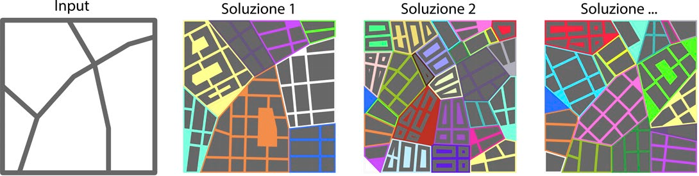

# Density and intensity: reading a neighbourhood as surface ratios

Since 2010 the City of New York has been sending teams of volunteers onto the city's flat roofs to spread a white reflective paint. Where the roof is painted, the temperature under the covering drops by as much as 30 %, and some of that cooling is felt in the air around the building too. It is an almost free intervention. But deciding where it is worth doing, and on which streets before others, calls for a description of the urban fabric that is usually not at hand: how much wall surface faces the street, how much ground is covered by buildings, how much greenery there is, how tall the blocks are.

This work starts there: reducing a portion of a city to a handful of numbers of this kind and running them through a microclimate simulation chain, to see how much the form and materials of the built environment shift the comfort of people in the street. The wider frame of the research weighs three factors in urban quality: climatic, empathic, technological. Here the first one counts, together with its link to morphology.

## Density as a ratio between surfaces

Urban density is usually measured in inhabitants or volumes per hectare. A microclimate simulation needs something more physical. We described each fabric with four ratios between surfaces, plus the average building height (**Figure 1**): the *site coverage ratio*, the fraction of ground occupied by the building footprint; the *façade-to-site ratio*, the façade surface divided by the ground area; and the grass and tree coverage ratios, again relative to the area of the sample. These indices adapt quickly to different fabrics and can be derived from a geometric model without detailed surveys.

, façade surface (façade-to-site), grass surface and tree-covered surface, each divided by the area of the sample. Above, the average building height relative to the average eaves level.")

With these indices we characterised seven type fabrics, reported in **Table 1**: two portions of Rome, two of Athens, one of Barcelona, one of New York and one of Oxnard, in California. The sharpest contrast is between New York and the others: a *façade-to-site ratio* of 7.78 against values below 1.3 elsewhere, and an average height of 106 m against the 6–17 m of the horizontally developed cities. At the opposite extreme is Oxnard, with a grass coverage of 0.80 and no tree surface recorded in New York.

**Table 1.** Surface density indices for the seven type fabrics (Rome A and B, Athens A and B, Barcelona, New York, Oxnard).

| Index | Rome A | Rome B | Athens A | Athens B | Barcelona | New York | Oxnard |
|---|---|---|---|---|---|---|---|
| Average building height | 15 m | 13 m | 12 m | 10 m | 17 m | 106 m | 6 m |
| Site coverage ratio | 0.47 | 0.49 | 0.38 | 0.41 | 0.47 | 0.60 | 0.39 |
| Façade-to-site ratio | 1.25 | 0.96 | 0.80 | 0.94 | 0.82 | 7.78 | 0.60 |
| Tree coverage ratio | 0.04 | 0.03 | 0.01 | 0.01 | 0.00 | 0.00 | 0.06 |
| Grass coverage ratio | 0.30 | 0.03 | 0.12 | 0.10 | 0.06 | 0.00 | 0.80 |

## Three engines inside Grasshopper

The calculation chain runs entirely in the Grasshopper environment and has three phases.

The first is a parametric generator of urban fabric, meant to replace manual drawing. As input it takes only the outer perimeter of the area and the main streets, as open polylines. From there it builds blocks, secondary streets and green areas according to a set of parameters — maximum block side, plot shape ratio, offset from the street fronts, size of the internal courtyard, building height range — and assigns the characteristics to homogeneous zones that can be edited in real time (**Figure 2**). The result is that many city scenarios can be generated and compared in a single afternoon of work.



The second phase uses the Urban Weather Generator (UWG), connected to Grasshopper through the Dragonfly plug-in. UWG is a tool developed at MIT that transforms a "rural" weather data file — measured at exurban stations, typically airports — into an "urban" file that is closer to the real city. To do this it accounts for the material properties of soils, roofs and walls, the urban form, the anthropogenic heat generated in the street and inside buildings, and the presence of greenery. It does not stop at traditional factors such as the sky view factor or the verticality ratio of the canyon: it recomputes several relationships between the built environment and the territory, and among these the three indices already seen (site coverage, façade-to-site, average height).

The third phase computes comfort with the Ladybug plug-in, which returns the Universal Thermal Climate Index (UTCI): the outdoor perceived temperature in degrees Celsius, mapped as a colour gradient over the plan. The inputs are dry-bulb temperature, wind at 10 m, relative humidity, mean radiant temperature and the subject's data (age, gender, height, mass, metabolism, clothing). The first three come from the climate file modified by UWG; the mean radiant temperature is computed numerically according to the UNI-EN 27726 standard. The environmental comfort band is given as 19 to 26 °C, with the 26–28 °C band acceptable for short periods.[^1]

It must be said clearly: this is an entirely simulated workflow. There is no comparison with field measurements in this work, and the outputs are presented as "validatable" in a future development, not yet validated. The comparisons that follow should therefore be read as differences between calculation scenarios, not as temperatures verified on site.

## Seven fabrics, in the hottest week

The case studies were chosen for their geometric and climatic characteristics. Rome, Athens, Barcelona and Oxnard fall in the Csa band of the Köppen classification (Mediterranean, hot dry summer) and have mainly horizontal development; New York is in the Cfa band (humid subtropical) and is the vertical fabric par excellence. Oxnard is the greenest and most permeable sample, New York the most impermeable. Each sample is a square about 500 m on a side and each city was evaluated in its own hottest week of the year, defined from the climate file.

For each sample the UTCI was computed three times: with the original rural climate file (*weather data 1*), with the file made urban by UWG (*weather data 2*) and with a third "paradox" version (*weather data 3*), in which the fabric keeps its form and geometric ratios unchanged but all materials have an albedo of 1 (maximum reflectance) and there is total green-roof coverage.

## What the maps show

**Figure 3** lines up the seven fabrics (rows) against the three climate files (columns), with the UTCI as a gradient over the plan: blue is comfort, red is heat discomfort, and the temperature scale changes from city to city. Moving from *weather data 1* to *weather data 2* — that is, adding the urban characterisation to the climate file — shifts the map towards red almost everywhere: it is the heat island effect that the rural file does not see. The paradox case (*weather data 3*) recovers part of that heat where materials matter, that is in the dense fabrics; elsewhere little changes.

 the UTCI computed over the plan with three climate files: the starting rural one (weather data 1), the one made urban by UWG (weather data 2) and the paradox one with albedo 1 and green roofs everywhere (weather data 3). Blue is comfort, red is heat discomfort; the temperature scale changes from city to city. Moving from weather data 1 to 2 shifts almost every map towards red.")

## New York in winter, Europe in summer

The most instructive part is that the sign of the heat island depends on which density dominates. In winter the heat island is an advantage, and it is stronger in fabrics with vertical density: in New York, with that *façade-to-site ratio* of 7.78, the urban file raises winter temperatures locally, with a thermal gradient of 6–7 °C readable on the annual map (**Figure 4**); over the whole year the difference between urban and rural fabric in New York is about 1 °C.[^2] In summer it reverses: it is horizontal density that exacerbates the intensity of the heat island and its negative effects tied to overheating.

 in Oxnard and New York, in the rural file and in the urban one, with the difference between the two in greyscale. In New York the band of differences is more marked in the cold months: that is where vertical density retains more heat.")

## Less than a degree, but systematic

For the European Csa fabrics the monthly gap between *weather data 1* and *weather data 2* stays around 1 °C in every month (**Figures 5–7**). It is small, but it is constant, and for this kind of simulation it means that a generic climate file can no longer be used without the urban characterisation: the signal is there.

```grafico
tipo: barre
x: month
yMax: 29
assi:
  y: true
  titoloY: Dry-bulb temperature (°C)
serie:
  - chiave: urban
    etichetta: Urban file (weather data 2)
    colore: var(--chart-1)
  - chiave: rural
    etichetta: Rural file (weather data 1)
    colore: var(--chart-3)
dati:
  - { month: Jan, rural: 7.9, urban: 9.0 }
  - { month: Feb, rural: 8.3, urban: 9.3 }
  - { month: Mar, rural: 10.3, urban: 11.3 }
  - { month: Apr, rural: 13.0, urban: 14.3 }
  - { month: May, rural: 17.2, urban: 18.6 }
  - { month: Jun, rural: 21.0, urban: 22.1 }
  - { month: Jul, rural: 24.5, urban: 25.4 }
  - { month: Aug, rural: 24.2, urban: 25.4 }
  - { month: Sep, rural: 21.3, urban: 22.6 }
  - { month: Oct, rural: 16.0, urban: 17.3 }
  - { month: Nov, rural: 12.6, urban: 13.5 }
  - { month: Dec, rural: 9.0, urban: 10.0 }
didascalia: Rome. Monthly mean dry-bulb temperature in the rural file (weather data 1) and in the one made urban by UWG (weather data 2). The gap stays around 1 °C in every month, but it is systematic and always in the same direction. Values read from the paper's charts; 0–29 °C scale shared with Athens and Barcelona for comparison.
```

```grafico
tipo: barre
x: month
yMax: 29
assi:
  y: true
  titoloY: Dry-bulb temperature (°C)
serie:
  - chiave: urban
    etichetta: Urban file (weather data 2)
    colore: var(--chart-1)
  - chiave: rural
    etichetta: Rural file (weather data 1)
    colore: var(--chart-3)
dati:
  - { month: Jan, rural: 11.0, urban: 11.5 }
  - { month: Feb, rural: 9.7, urban: 10.6 }
  - { month: Mar, rural: 11.5, urban: 12.2 }
  - { month: Apr, rural: 15.0, urban: 16.2 }
  - { month: May, rural: 19.7, urban: 20.5 }
  - { month: Jun, rural: 24.8, urban: 25.5 }
  - { month: Jul, rural: 27.6, urban: 28.4 }
  - { month: Aug, rural: 27.9, urban: 28.6 }
  - { month: Sep, rural: 24.0, urban: 25.0 }
  - { month: Oct, rural: 19.3, urban: 20.0 }
  - { month: Nov, rural: 14.5, urban: 15.3 }
  - { month: Dec, rural: 11.1, urban: 11.6 }
didascalia: Athens. Monthly mean dry-bulb temperature in the rural file (weather data 1) and in the one made urban by UWG (weather data 2). Here too the monthly gap is small but constant and always in the same direction. Values read from the paper's charts; 0–29 °C scale shared with Rome and Barcelona.
```

```grafico
tipo: barre
x: month
yMax: 29
assi:
  y: true
  titoloY: Dry-bulb temperature (°C)
serie:
  - chiave: urban
    etichetta: Urban file (weather data 2)
    colore: var(--chart-1)
  - chiave: rural
    etichetta: Rural file (weather data 1)
    colore: var(--chart-3)
dati:
  - { month: Jan, rural: 9.0, urban: 9.1 }
  - { month: Feb, rural: 9.8, urban: 10.0 }
  - { month: Mar, rural: 11.2, urban: 11.4 }
  - { month: Apr, rural: 13.2, urban: 13.4 }
  - { month: May, rural: 16.0, urban: 16.2 }
  - { month: Jun, rural: 19.7, urban: 20.0 }
  - { month: Jul, rural: 23.1, urban: 23.3 }
  - { month: Aug, rural: 23.2, urban: 23.3 }
  - { month: Sep, rural: 21.1, urban: 21.3 }
  - { month: Oct, rural: 17.3, urban: 17.5 }
  - { month: Nov, rural: 12.8, urban: 13.0 }
  - { month: Dec, rural: 9.8, urban: 10.0 }
didascalia: Barcelona. Monthly mean dry-bulb temperature in the rural file (weather data 1) and in the one made urban by UWG (weather data 2). The gap is the smallest of the three European fabrics, but it stays in the same direction throughout. Values read from the paper's charts; 0–29 °C scale shared with Rome and Athens.
```

The limiting cases are the American ones, and they are limiting in opposite senses. Oxnard, made of low and sparse buildings, shows no appreciable differences in perceived comfort between the urban and peri-urban area in either season. Nor does it show them in the paradox case: bringing all materials to albedo 1 and covering every roof with greenery does not shift street comfort. Where the built fabric is thin, acting on the materials of the built environment is an almost inert lever — outdoor comfort there is governed by something else.

## What the model leaves out

The workflow is simulated and not validated in the field: this is the main limitation, and it is worth repeating.

For each city a single fabric sample and a single hot week are analysed: the analysis does not cover prolonged heat waves or the variability from one year to the next.

UWG modifies the climate file but does not solve the fluid dynamics of the urban canyon: wind channelling between buildings, turbulence, aerodynamic sheltering are not modelled. Wind enters only as an hourly value at 10 m height.

The third factor declared by the research, "architectural empathy", here remains more a programme than a measure: it is hooked to the UTCI but is not operationalised independently.

Finally, the cities are reconstructed as homogeneous morphological types. The results hold for the type of fabric, not for the specific block with its history and its exceptions.

## What to take away

Three things remain, net of the limitations.

First: describing density as ratios between surfaces — ground coverage, façade over ground, greenery — instead of as inhabitants per hectare makes the urban fabric a direct input of a microclimate simulation, and the full loop (generate the fabric, urbanise the climate with UWG, compute the UTCI) fits in one working session.

Second: the heat island does not have a fixed sign. Vertical density retains useful heat in winter, horizontal density makes things worse in summer, and this distinction emerges only by characterising the climate file city by city.

Third: where the built fabric is sparse, acting on materials shifts street comfort little, even pushing them to the physical limit. Knowing in advance on which fabrics the material lever works and on which it does not is exactly what a preliminary analysis method should return to a designer, with the caveat that these outputs still need to be verified in the field.

---

**Bibliographic reference**
M. F. Ottone, R. Cocci Grifoni, G. E. Marchesani, D. Riera, *Densità - intensità. Elementi materiali ed immateriali per una valutazione della qualità urbana / Density - intensity. Material and immaterial elements in assessing urban quality*, TECHNE — Journal of Technology for Architecture and Environment, 17 (2019), pp. 278–288. <https://doi.org/10.13128/Techne-24022>

**Data and code availability**
The paper does not declare a data or code repository. The chain relies on public tools: Urban Weather Generator via Dragonfly and Ladybug, both inside Grasshopper.

**Short glossary**

- *Site coverage ratio*: fraction of the study area occupied by the ground footprint of the buildings.
- *Façade-to-site ratio*: total façade surface divided by the ground area of the sample; it grows with the height and fragmentation of the built environment.
- *UTCI (Universal Thermal Climate Index)*: outdoor perceived temperature in °C, combining air temperature, mean radiant temperature, humidity and wind in a single scale.
- *Mean radiant temperature*: the temperature of a fictitious, thermally uniform environment that would exchange with the body the same radiant power as the real environment; here computed according to the UNI-EN 27726 standard.
- *Urban Weather Generator (UWG)*: model developed at MIT that converts a climate file measured outside the city into one representative of the urban microclimate, using form, materials, anthropogenic heat and greenery.
- *Urban heat island*: the temperature difference between the built area and the surrounding countryside; almost always positive at night, with an intensity that depends on morphology and materials.

[^1]: The reference UTCI scale places the absence of thermal stress between 9 and 26 °C; the 19–26 °C band used in the paper is a more restrictive reading.

[^2]: The 6–7 °C gradient is the reading of the annual map of New York in Figure 4; the roughly 1 °C annual average is the value stated in the paper's text. The paper also alternates between referring to the "hottest week" (maps in Figure 3) and to "seasonal" winter and summer effects (Figures 4 and 5–7), which come from separate annual processings of the same climate file.

$$$

# Densità e intensità: leggere un quartiere come rapporti tra superfici

Dal 2010 il Comune di New York manda squadre di volontari sui tetti piani della città a stendere una vernice bianca riflettente. Dove il tetto viene dipinto, la temperatura sotto la copertura scende anche del 30 %, e un po' di quel raffrescamento si sente pure nell'aria intorno all'edificio. È un intervento quasi gratuito. Decidere però dove conviene farlo, e su quali strade prima che su altre, richiede una descrizione del tessuto urbano che di solito non si ha sottomano: quanta superficie di parete si affaccia sulla strada, quanto suolo è coperto dagli edifici, quanto verde c'è, quanto sono alti gli isolati.

Questo lavoro parte da lì: ridurre una porzione di città a pochi numeri di questo tipo e farli girare dentro una catena di simulazione del microclima, per vedere quanto forma e materiali del costruito spostino il comfort di chi sta in strada. Il quadro più ampio della ricerca pesa tre fattori nella qualità urbana: climatico, empatico, tecnologico. Qui contano il primo e il suo legame con la morfologia.

## La densità come rapporto tra superfici

La densità urbana si misura di solito in abitanti o volumi per ettaro. Per una simulazione microclimatica serve qualcosa di più fisico. Abbiamo descritto ogni tessuto con quattro rapporti tra superfici, più l'altezza media degli edifici (**Figura 1**): il *site coverage ratio*, cioè la frazione di suolo occupata dall'impronta degli edifici; il *façade-to-site ratio*, la superficie di facciata divisa per l'area a terra; e i rapporti di copertura a prato e ad alberi, di nuovo rispetto all'area del campione. Sono indici che si adattano in fretta a tessuti diversi e che si possono ricavare da un modello geometrico senza rilievi di dettaglio.

, superficie di facciata (façade-to-site), superficie a prato e superficie alberata, ciascuna divisa per l'area del campione. In alto, l'altezza media degli edifici rispetto alla quota di gronda media.")

Con questi indici abbiamo caratterizzato sette tessuti tipo, riportati nella **Tabella 1**: due porzioni di Roma, due di Atene, una di Barcellona, una di New York e una di Oxnard, in California. Il contrasto più netto è tra New York e le altre: un *façade-to-site ratio* di 7,78 contro valori sotto 1,3 altrove, e un'altezza media di 106 m contro i 6–17 m delle città a sviluppo orizzontale. All'estremo opposto Oxnard, con una copertura a prato di 0,80 e nessuna superficie alberata registrata a New York.

**Tabella 1.** Indici di densità delle superfici per i sette tessuti tipo (Roma A e B, Atene A e B, Barcellona, New York, Oxnard).

| Indice | Roma A | Roma B | Atene A | Atene B | Barcellona | New York | Oxnard |
|---|---|---|---|---|---|---|---|
| Altezza media edifici | 15 m | 13 m | 12 m | 10 m | 17 m | 106 m | 6 m |
| Site coverage ratio | 0,47 | 0,49 | 0,38 | 0,41 | 0,47 | 0,60 | 0,39 |
| Façade-to-site ratio | 1,25 | 0,96 | 0,80 | 0,94 | 0,82 | 7,78 | 0,60 |
| Tree coverage ratio | 0,04 | 0,03 | 0,01 | 0,01 | 0,00 | 0,00 | 0,06 |
| Grass coverage ratio | 0,30 | 0,03 | 0,12 | 0,10 | 0,06 | 0,00 | 0,80 |

## Tre motori dentro Grasshopper

La catena di calcolo è tutta in ambiente Grasshopper e si compone di tre fasi.

La prima è un generatore parametrico di tessuto urbano, pensato per sostituire il disegno manuale. Come input prende solo il perimetro esterno dell'area e le strade principali, sotto forma di spezzate aperte. Da lì costruisce isolati, strade secondarie e aree verdi in base a una serie di parametri — lato massimo dell'isolato, rapporto di forma dei lotti, offset dai fronti strada, dimensione della corte interna, intervallo di altezza degli edifici — e assegna le caratteristiche a zone omogenee modificabili in tempo reale (**Figura 2**). Il risultato è che si possono generare e confrontare molti scenari di città nello stesso pomeriggio di lavoro.


La seconda fase usa l'Urban Weather Generator (UWG), collegato a Grasshopper tramite il plug-in Dragonfly. UWG è uno strumento sviluppato al MIT che trasforma un file di dati meteorologici "rurale" — misurato in stazioni extraurbane, tipicamente gli aeroporti — in un file "urbano" più aderente alla città reale. Per farlo tiene conto delle proprietà dei materiali di suoli, tetti e pareti, della forma urbana, del calore antropogenico generato in strada e dentro gli edifici, e della presenza di verde. Non si ferma a fattori tradizionali come lo sky view factor o il rapporto di verticalità del canyon: ricalcola diverse relazioni tra edificato e territorio, e tra queste i tre indici già visti (site coverage, façade-to-site, altezza media).

La terza fase calcola il comfort con il plug-in Ladybug, che restituisce l'Universal Thermal Climate Index (UTCI): la temperatura percepita all'aperto in gradi centigradi, mappata come gradiente di colore sulla pianta. Gli ingressi sono temperatura di bulbo secco, vento a 10 m, umidità relativa, temperatura media radiante e i dati del soggetto (età, genere, altezza, massa, metabolismo, vestiario). Le prime tre voci vengono dal file climatico modificato da UWG; la temperatura media radiante è calcolata numericamente secondo la norma UNI-EN 27726. La fascia di comfort ambientale è indicata tra 19 e 26 °C, con la fascia 26–28 °C accettabile per brevi periodi.[^1]

Va detto con chiarezza: è un flusso interamente simulato. In questo lavoro non c'è confronto con misure in campo, e gli output sono presentati come "validabili" in uno sviluppo futuro, non ancora validati. I confronti che seguono vanno quindi letti come differenze tra scenari di calcolo, non come temperature verificate sul posto.

## Sette tessuti, nella settimana più calda

I casi studio sono stati scelti per le loro caratteristiche geometriche e climatiche. Roma, Atene, Barcellona e Oxnard ricadono nella fascia Csa della classificazione di Köppen (mediterraneo, estate calda e secca) e hanno sviluppo prevalentemente orizzontale; New York è in fascia Cfa (subtropicale umido) ed è il tessuto verticale per eccellenza. Oxnard è il campione più verde e permeabile, New York il più impermeabile. Ogni campione è un quadrato di circa 500 m di lato e ogni città è stata valutata nella propria settimana più calda dell'anno, definita a partire dal file climatico.

Per ogni campione l'UTCI è stato calcolato tre volte: con il file climatico originale rurale (*weather data 1*), con il file reso urbano da UWG (*weather data 2*) e con una terza versione "paradosso" (*weather data 3*), in cui il tessuto mantiene forma e rapporti geometrici invariati ma tutti i materiali hanno albedo pari a 1 (riflettanza massima) e c'è copertura totale a tetto verde.

## Cosa mostrano le mappe

La **Figura 3** mette in fila i sette tessuti (righe) contro i tre file climatici (colonne), con l'UTCI come gradiente sulla pianta: il blu è comfort, il rosso è disagio da caldo, e la scala di temperatura cambia da città a città. Il passaggio da *weather data 1* a *weather data 2* — cioè l'aggiunta della caratterizzazione urbana al file climatico — sposta la mappa verso il rosso quasi ovunque: è l'effetto isola di calore che il file rurale non vede. Il caso paradosso (*weather data 3*) recupera parte di quel calore là dove i materiali contano, cioè nei tessuti densi; altrove cambia poco.

 l'UTCI calcolato sulla pianta con tre file climatici: quello rurale di partenza (weather data 1), quello reso urbano da UWG (weather data 2) e quello paradosso con albedo 1 e tetti verdi ovunque (weather data 3). Blu è comfort, rosso è disagio da caldo; la scala di temperatura cambia da città a città. Il passaggio da weather data 1 a 2 sposta quasi tutte le mappe verso il rosso.")

## New York d'inverno, l'Europa d'estate

La parte più istruttiva è che il segno dell'isola di calore dipende da quale densità domina. D'inverno l'isola di calore è un vantaggio, ed è più forte nei tessuti a densità verticale: a New York, con quel *façade-to-site ratio* di 7,78, il file urbano alza le temperature invernali in modo puntuale, con un gradiente termico di 6–7 °C leggibile sulla mappa annuale (**Figura 4**); sull'intero anno la differenza tra tessuto urbano e rurale a New York è di circa 1 °C.[^2] D'estate si inverte: è la densità orizzontale a esasperare l'intensità dell'isola di calore e i suoi effetti negativi legati al surriscaldamento.

 a Oxnard e a New York, nel file rurale e in quello urbano, con la differenza tra i due in scala di grigi. A New York la fascia delle differenze è più marcata nei mesi freddi: è lì che la densità verticale trattiene più calore.")

## Meno di un grado, ma sistematico

Per i tessuti europei in fascia Csa lo scarto mensile tra *weather data 1* e *weather data 2* resta attorno a 1 °C in tutti i mesi (**Figure 5–7**). È poco, ma è costante, e per questo tipo di simulazione dice che non si può più usare un file climatico generico senza la caratterizzazione urbana: il segnale c'è.

```grafico
tipo: barre
x: month
yMax: 29
assi:
  y: true
  titoloY: Dry-bulb temperature (°C)
serie:
  - chiave: urban
    etichetta: Urban file (weather data 2)
    colore: var(--chart-1)
  - chiave: rural
    etichetta: Rural file (weather data 1)
    colore: var(--chart-3)
dati:
  - { month: Jan, rural: 7.9, urban: 9.0 }
  - { month: Feb, rural: 8.3, urban: 9.3 }
  - { month: Mar, rural: 10.3, urban: 11.3 }
  - { month: Apr, rural: 13.0, urban: 14.3 }
  - { month: May, rural: 17.2, urban: 18.6 }
  - { month: Jun, rural: 21.0, urban: 22.1 }
  - { month: Jul, rural: 24.5, urban: 25.4 }
  - { month: Aug, rural: 24.2, urban: 25.4 }
  - { month: Sep, rural: 21.3, urban: 22.6 }
  - { month: Oct, rural: 16.0, urban: 17.3 }
  - { month: Nov, rural: 12.6, urban: 13.5 }
  - { month: Dec, rural: 9.0, urban: 10.0 }
didascalia: Roma. Temperatura di bulbo secco media mensile nel file rurale (weather data 1) e in quello reso urbano da UWG (weather data 2). Lo scarto resta attorno a 1 °C in tutti i mesi, ma è sistematico e sempre nello stesso verso. Valori letti dai grafici del paper; scala 0–29 °C condivisa con Atene e Barcellona per il confronto.
```

```grafico
tipo: barre
x: month
yMax: 29
assi:
  y: true
  titoloY: Dry-bulb temperature (°C)
serie:
  - chiave: urban
    etichetta: Urban file (weather data 2)
    colore: var(--chart-1)
  - chiave: rural
    etichetta: Rural file (weather data 1)
    colore: var(--chart-3)
dati:
  - { month: Jan, rural: 11.0, urban: 11.5 }
  - { month: Feb, rural: 9.7, urban: 10.6 }
  - { month: Mar, rural: 11.5, urban: 12.2 }
  - { month: Apr, rural: 15.0, urban: 16.2 }
  - { month: May, rural: 19.7, urban: 20.5 }
  - { month: Jun, rural: 24.8, urban: 25.5 }
  - { month: Jul, rural: 27.6, urban: 28.4 }
  - { month: Aug, rural: 27.9, urban: 28.6 }
  - { month: Sep, rural: 24.0, urban: 25.0 }
  - { month: Oct, rural: 19.3, urban: 20.0 }
  - { month: Nov, rural: 14.5, urban: 15.3 }
  - { month: Dec, rural: 11.1, urban: 11.6 }
didascalia: Atene. Temperatura di bulbo secco media mensile nel file rurale (weather data 1) e in quello reso urbano da UWG (weather data 2). Anche qui lo scarto mensile è piccolo ma costante e sempre nello stesso verso. Valori letti dai grafici del paper; scala 0–29 °C condivisa con Roma e Barcellona.
```

```grafico
tipo: barre
x: month
yMax: 29
assi:
  y: true
  titoloY: Dry-bulb temperature (°C)
serie:
  - chiave: urban
    etichetta: Urban file (weather data 2)
    colore: var(--chart-1)
  - chiave: rural
    etichetta: Rural file (weather data 1)
    colore: var(--chart-3)
dati:
  - { month: Jan, rural: 9.0, urban: 9.1 }
  - { month: Feb, rural: 9.8, urban: 10.0 }
  - { month: Mar, rural: 11.2, urban: 11.4 }
  - { month: Apr, rural: 13.2, urban: 13.4 }
  - { month: May, rural: 16.0, urban: 16.2 }
  - { month: Jun, rural: 19.7, urban: 20.0 }
  - { month: Jul, rural: 23.1, urban: 23.3 }
  - { month: Aug, rural: 23.2, urban: 23.3 }
  - { month: Sep, rural: 21.1, urban: 21.3 }
  - { month: Oct, rural: 17.3, urban: 17.5 }
  - { month: Nov, rural: 12.8, urban: 13.0 }
  - { month: Dec, rural: 9.8, urban: 10.0 }
didascalia: Barcellona. Temperatura di bulbo secco media mensile nel file rurale (weather data 1) e in quello reso urbano da UWG (weather data 2). Lo scarto è il più contenuto dei tre tessuti europei, ma resta sempre nello stesso verso. Valori letti dai grafici del paper; scala 0–29 °C condivisa con Roma e Atene.
```

I casi limite sono quelli americani, e sono limite in senso opposto. Oxnard, fatto di edifici bassi e radi, non mostra differenze apprezzabili di comfort percepito tra area urbana e periurbana in nessuna delle due stagioni. E non le mostra nemmeno nel caso paradosso: portare tutti i materiali ad albedo 1 e coprire ogni tetto di verde non sposta il comfort in strada. Dove il costruito è sottile, agire sui materiali del costruito è una leva quasi inerte — il comfort esterno lì è governato da altro.

## Cosa resta fuori dal modello

Il flusso è simulato e non validato in campo: è il limite principale, e vale la pena ripeterlo.

Per ogni città si analizza un solo campione di tessuto e una sola settimana calda: l'analisi non copre le ondate di calore prolungate né la variabilità tra un anno e l'altro.

UWG modifica il file climatico ma non risolve la fluidodinamica del canyon urbano: canalizzazione del vento tra gli edifici, turbolenza, schermatura aerodinamica non sono modellate. Il vento entra solo come dato orario a 10 m di quota.

Il terzo fattore dichiarato dalla ricerca, l'"empatia architettonica", qui resta più un programma che una misura: viene agganciato all'UTCI ma non è operazionalizzato in modo indipendente.

Infine, le città sono ricostruite per tipi morfologici omogenei. I risultati valgono per il tipo di tessuto, non per l'isolato specifico con la sua storia e le sue eccezioni.

## Cosa se ne ricava

Tre cose restano, al netto dei limiti.

La prima: descrivere la densità come rapporti tra superfici — copertura del suolo, facciata su suolo, verde — invece che come abitanti per ettaro rende il tessuto urbano un ingresso diretto di una simulazione microclimatica, e il giro completo (genera il tessuto, urbanizza il clima con UWG, calcola l'UTCI) sta in una sessione di lavoro.

La seconda: l'isola di calore non ha un segno fisso. La densità verticale trattiene calore utile d'inverno, quella orizzontale peggiora le cose d'estate, e questa distinzione emerge solo caratterizzando il file climatico città per città.

La terza: dove il costruito è rado, intervenire sui materiali sposta poco il comfort di strada, anche spingendoli al limite fisico. Sapere in anticipo su quali tessuti la leva materica funziona e su quali no è esattamente ciò che un metodo di analisi preliminare dovrebbe restituire a un progettista, con l'avvertenza che questi output vanno ancora verificati sul campo.

---

**Riferimento bibliografico**
M. F. Ottone, R. Cocci Grifoni, G. E. Marchesani, D. Riera, *Densità - intensità. Elementi materiali ed immateriali per una valutazione della qualità urbana / Density - intensity. Material and immaterial elements in assessing urban quality*, TECHNE — Journal of Technology for Architecture and Environment, 17 (2019), pp. 278–288. <https://doi.org/10.13128/Techne-24022>

**Disponibilità di dati e codice**
Il paper non dichiara un repository di dati o codice. La catena si appoggia a strumenti pubblici: Urban Weather Generator via Dragonfly e Ladybug, entrambi dentro Grasshopper.

**Piccolo glossario**

- *Site coverage ratio*: frazione dell'area di studio occupata dall'impronta a terra degli edifici.
- *Façade-to-site ratio*: superficie totale di facciata divisa per l'area a terra del campione; cresce con l'altezza e la frammentazione del costruito.
- *UTCI (Universal Thermal Climate Index)*: temperatura percepita all'aperto in °C, che combina temperatura dell'aria, temperatura media radiante, umidità e vento in un'unica scala.
- *Temperatura media radiante*: la temperatura di un ambiente fittizio, termicamente uniforme, che scambierebbe con il corpo la stessa potenza radiante dell'ambiente reale; qui calcolata secondo la norma UNI-EN 27726.
- *Urban Weather Generator (UWG)*: modello sviluppato al MIT che converte un file climatico misurato fuori città in uno rappresentativo del microclima urbano, usando forma, materiali, calore antropogenico e verde.
- *Isola di calore urbana*: la differenza di temperatura tra l'area costruita e la campagna circostante; positiva quasi sempre di notte, con intensità che dipende dalla morfologia e dai materiali.

[^1]: La scala UTCI di riferimento colloca l'assenza di stress termico tra 9 e 26 °C; la fascia 19–26 °C usata nel paper è una lettura più restrittiva.

[^2]: Il gradiente di 6–7 °C è la lettura della mappa annuale di New York in Figura 4; il valore medio annuo di circa 1 °C è quello indicato nel testo del paper. Il paper alterna inoltre il riferimento a "settimana più calda" (mappe di Figura 3) e a effetti "stagionali" invernali ed estivi (Figure 4 e 5–7), che vengono da elaborazioni annuali distinte dello stesso file climatico.
