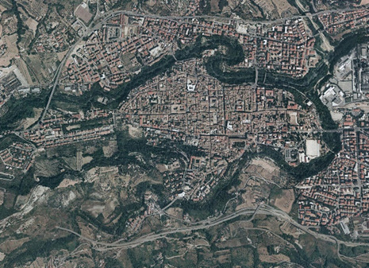
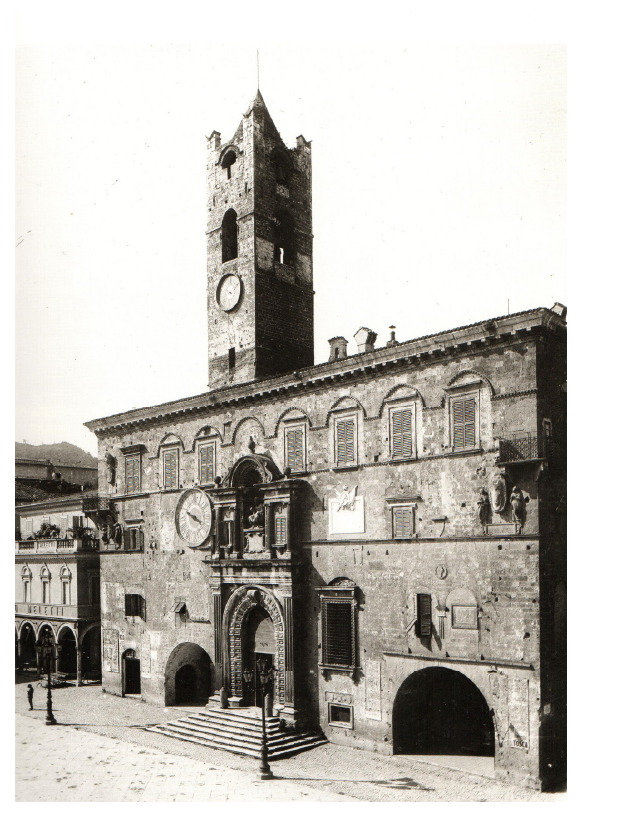
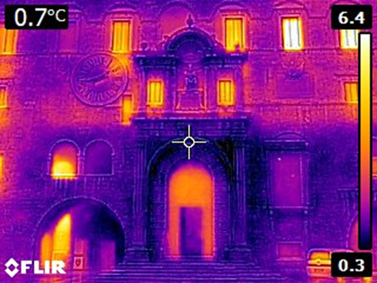
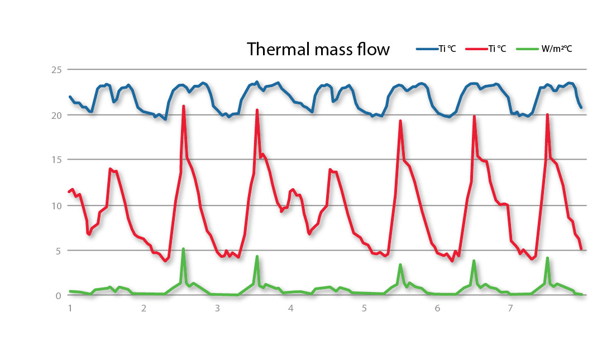
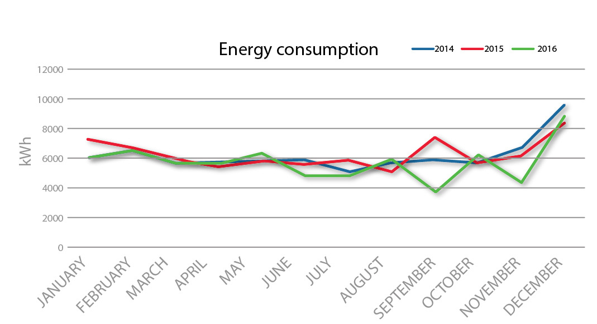
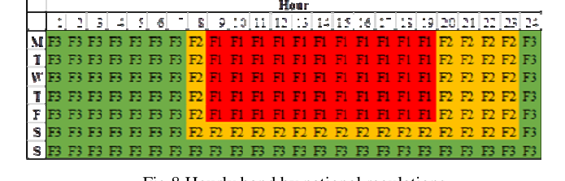

## What to measure before insulating a historical building

---

# Cosa misurare prima di isolare un palazzo storico

$$$

# Cosa misurare prima di isolare un palazzo storico

Nel centro storico di Ascoli Piceno non si costruisce quasi niente di nuovo. Gli uffici comunali, i musei, le sale di rappresentanza stanno dentro palazzi di cinque o sei secoli, adattati a forza a un uso dopo l'altro, e molti portano ancora problemi irrisolti di gestione, sicurezza e consumo. Intanto le direttive europee chiedono agli enti pubblici tagli netti sui consumi e una quota crescente di energia da fonti rinnovabili. Il problema è che le strategie pensate per il nuovo — cappotto esterno, sostituzione dei serramenti, isolamento in copertura — su un edificio vincolato sono quasi tutte fuori discussione. Manca, nella disciplina del restauro, un metodo di diagnosi energetica tarato su questi edifici.

Abbiamo provato a costruirne uno su un caso solo: il Palazzo dei Capitani del Popolo, che chiude un lato di Piazza del Popolo. È un edificio adatto perché è insieme un monumento di prima grandezza e una macchina amministrativa in funzione, con uffici, sale espositive e la sala del consiglio comunale distribuiti su quattro piani più un seminterrato che ospita il museo archeologico. Ed è rappresentativo: Ascoli è una città molto uniforme per materiali e forme — travertino, torri, logge, tetti in coppi (**Figura 1**) — quindi un metodo che funziona qui ha buone probabilità di funzionare sugli altri palazzi pubblici del centro.



## Un palazzo che è sei edifici in uno

Il palazzo nasce dalla fusione, nel 1296, di due case-torri duecentesche, unificate da una nuova facciata sulla piazza. Tra Trecento e Quattrocento viene ampliato verso nord e verso sud; tra il 1518 e il 1520 si rifà la facciata posteriore su progetto di Nicola Filotesio, detto Cola dell'Amatrice. L'ultimo restauro, che ha riaperto il palazzo il 10 ottobre 1987 dopo vent'anni di chiusura, ha sostituito parte dei solai e delle coperture con solette in cemento armato, secondo le norme di allora (**Figura 2**).



Per la diagnosi conta questo: l'involucro è massiccio e di spessore molto variabile, con due logge profonde e un cortile porticato su tre livelli che si comporta come un microclima a sé — uno dei punti deboli del complesso. I muri perimetrali sono in travertino, con spessori mai inferiori a 90 cm.[^1] Numeri di questo tipo non stanno in nessun abaco: vanno rilevati sull'edificio.

## Cosa dicono i muri

Abbiamo caratterizzato l'involucro con tecniche non distruttive. La termografia a infrarossi mappa la temperatura superficiale apparente e mette in evidenza le anomalie nella distribuzione del calore (**Figura 3**). Sulla facciata est la dispersione si concentra tutta su porte e finestre: vetri tradizionali e infissi che chiudono male, non storici ma ormai obsoleti rispetto alle norme, e senza sistemi di schermatura né interni né esterni, per rispetto del carattere monumentale. Il resto della parete non mostra ponti termici — un risultato atteso, perché la muratura storica in pietra a grande massa non ne genera.



Poi abbiamo misurato la thermal transmittance in opera con un termoflussimetro: piastre sensibili al flusso applicate sul lato interno del muro, sensori di temperatura all'esterno, tutto collegato a un data logger per almeno sette giorni consecutivi, come richiede la norma per gli edifici storici (**Figura 4**).[^2] Il risultato è che la trasmittanza dei muri rientra nei limiti di legge: il travertino spesso, da solo, isola già a sufficienza. La parete accumula calore su una faccia senza cederlo direttamente all'altra e tiene l'interno su una temperatura pressoché costante mentre fuori oscilla molto. Questa thermal mass elevata ha un effetto contro-intuitivo: contribuisce a scaldare gli ambienti e permette di limitare l'uso degli impianti. Sono numeri misurati, non simulati — ed è la differenza che rende difendibile la conclusione che su questi muri non c'è niente da fare.



## Il profilo dei consumi elettrici

I dati di consumo li ha forniti l'amministrazione, ed è difficile ottenerli in forma disaggregata. Sui tre anni 2014-2016 il consumo elettrico mensile è coerente da un anno all'altro, con un massimo invernale (**Figura 5**).



In Italia la giornata è divisa in tre fasce orarie — F1, F2, F3 — che definiscono il costo dell'energia prelevata dalla rete: F1 sono le ore centrali dei giorni feriali, F2 le fasce di spalla e il sabato, F3 la notte, le prime ore del mattino e l'intera domenica (**Figura 6**). Nel palazzo il consumo medio in F1 è di 2.852 kWh al mese.



Normalizzando i consumi sul numero di ore che cadono in ciascuna fascia si vede che il carico è molto sbilanciato sulle ore diurne, che in primavera ed estate coprono sia la F1 sia buona parte della F2 (**Figura 7**). Il consumo notturno (F2 e F3) non è legato ad attività lavorativa e si può ridurre: sostituire le lampade a vapori di sodio dell'illuminazione esterna con LED, spostare i carichi differibili, introdurre sistemi di accumulo. Un dato però va preso con cautela: la legge assume che gli impianti di riscaldamento funzionino dieci ore al giorno, ipotesi ragionevole per abitazioni e uffici ma che sovrastima il consumo di un edificio aperto per appuntamento o con orari particolari.[^3]

, 2014-2016. Diversamente dal grafico dei consumi assoluti, qui la F1 stacca nettamente F2 e F3, e resta visibile anche la distanza tra F2 e F3: il consumo per ora è concentrato nelle ore di luce.")

## Un impianto fotovoltaico da 25 kWp

La parte quantitativa dello studio è la stima di un impianto fotovoltaico. Non è una simulazione dinamica dell'edificio: è un bilancio mensile tra la produzione attesa dell'impianto e i consumi reali misurati, fascia per fascia. Data la superficie disponibile, l'impianto ipotizzato ha una potenza di 25 kWp ed è collocato direttamente sulla falda del tetto, dove non altera la percezione dell'edificio dalla piazza.

Il bilancio mese per mese è nella **Tabella 1**. Sull'intero anno, il 91 % dell'energia prodotta cade in fascia F1[^4] — cioè esattamente dove l'energia dalla rete costa di più e dove il palazzo consuma la quota maggiore, il 47 % del totale. In media l'impianto copre il 75 % del fabbisogno in F1, con punte del 100 % da aprile ad agosto, e circa il 38 % del fabbisogno elettrico complessivo, con un autoconsumo dell'89 %.

*Tabella 1. Produzione stimata del fotovoltaico da 25 kWp e consumo misurato in fascia F1, kWh al mese, e quota di fabbisogno coperta nelle tre fasce. Ultima riga: copertura media annua per fascia.*

| Mese | Produzione F1 | Consumo F1 | Copertura F1 | Copertura F2 | Copertura F3 |
|---|---|---|---|---|---|
| Gennaio | 1.187 | 3.156 | 38 % | 1 % | 0 % |
| Febbraio | 1.588 | 3.220 | 49 % | 5 % | 0 % |
| Marzo | 2.513 | 3.133 | 80 % | 11 % | 4 % |
| Aprile | 2.928 | 2.751 | 100 % | 16 % | 9 % |
| Maggio | 3.341 | 2.620 | 100 % | 14 % | 14 % |
| Giugno | 3.419 | 2.712 | 100 % | 16 % | 17 % |
| Luglio | 3.689 | 3.016 | 100 % | 16 % | 17 % |
| Agosto | 3.375 | 2.169 | 100 % | 16 % | 9 % |
| Settembre | 2.640 | 3.386 | 78 % | 9 % | 3 % |
| Ottobre | 2.016 | 2.740 | 74 % | 7 % | 1 % |
| Novembre | 1.301 | 2.585 | 50 % | 2 % | 0 % |
| Dicembre | 1.108 | 3.854 | 29 % | 1 % | 0 % |
| **Anno** | | | **75 %** | **10 %** | **6 %** |

```grafico
tipo: linea
x: mese
xTemporale: false
yMin: 0
yMax: 100
assi:
  y: true
  titoloY: Fabbisogno in fascia F1 coperto (%)
serie:
  - chiave: copertura
    etichetta: Copertura F1
riferimenti:
  - y: 100
    etichetta: Fascia F1 interamente coperta
dati:
  - { mese: Gen, copertura: 38 }
  - { mese: Feb, copertura: 49 }
  - { mese: Mar, copertura: 80 }
  - { mese: Apr, copertura: 100 }
  - { mese: Mag, copertura: 100 }
  - { mese: Giu, copertura: 100 }
  - { mese: Lug, copertura: 100 }
  - { mese: Ago, copertura: 100 }
  - { mese: Set, copertura: 78 }
  - { mese: Ott, copertura: 74 }
  - { mese: Nov, copertura: 50 }
  - { mese: Dic, copertura: 29 }
didascalia: "Quota del fabbisogno elettrico in fascia F1 coperta dal fotovoltaico da 25 kWp, mese per mese. Valori letti dalla Tabella 1 del paper. Da aprile ad agosto la produzione copre l'intera fascia F1; a dicembre, con la domanda massima e la produzione minima, si ferma al 29 %."
```

C'è anche un margine di spostamento dei carichi. La fascia F3 comprende le ore diurne della domenica: un ulteriore 15 % circa dei consumi potrebbe ragionevolmente essere spostato nelle ore di luce di un giorno feriale e coperto dall'impianto.

## L'anomalia di dicembre

A dicembre il palazzo consuma il massimo dell'anno in fascia F1 (3.854 kWh) mentre l'impianto produce il minimo (1.108 kWh): la copertura scende al 29 %, il valore peggiore dei dodici mesi. Lo scarto è strutturale, non un problema di taratura. Dimensionare il fotovoltaico sul fabbisogno di dicembre significherebbe sovradimensionarlo per l'estate, quando già copre tutto e l'energia in più andrebbe in gran parte sprecata o ceduta alla rete a basso valore. È il motivo per cui il risultato onesto dello studio è "il 38 % su base annua", non l'autosufficienza.

## Cosa questo studio non copre

Un edificio solo, in uno studio a scala di conferenza. L'analisi riguarda l'energia elettrica; il combustibile per riscaldamento e acqua calda sanitaria è trattato solo in modo qualitativo. Il fotovoltaico è uno scenario di carta: non è stato installato né monitorato, e la stima di produzione non entra nel merito degli ombreggiamenti reali della falda o del calo di resa dei moduli nel tempo. I dati di consumo forniti dall'amministrazione sono aggregati e faticosi da ottenere. La trasmittanza è stata misurata sul tipo murario prevalente, non su tutte le stratigrafie di un edificio che ne ha molte. E non c'è una simulazione dinamica che confronti alternative di retrofit dell'involucro — in parte perché su un monumento vincolato quelle alternative, in concreto, sono poche.

## Cosa se ne ricava

La cosa trasferibile non è un numero, è una sequenza. Prima si misura, con tecniche non distruttive, cosa fa davvero l'involucro: spesso, come qui, fa meglio di quanto ci si aspetti, e la conclusione corretta è non toccarlo. Poi si leggono i consumi per fascia oraria, per capire quando l'edificio spende e a che prezzo. Infine si sceglie da un menu ristretto di interventi reversibili: illuminazione efficiente, spostamento dei carichi, fotovoltaico sulla falda dove la geometria del tetto lo nasconde alla vista. Per una città come Ascoli, dove decine di funzioni pubbliche stanno in palazzi di travertino simili tra loro, il metodo regge anche là dove i singoli numeri non si possono copiare.

---

**Riferimento bibliografico**
R. Cocci Grifoni, E. Petrucci, S. Tascini, M. Pierantozzi, D. Lapucci, G. E. Marchesani, *Energy Efficiency Improvements in Italian Historical Buildings: The Case Study of Ascoli Piceno*, in *2018 IEEE International Conference on Environment and Electrical Engineering and 2018 IEEE Industrial and Commercial Power Systems Europe (EEEIC / I&CPS Europe)*, 2018, pp. 1-6. <https://doi.org/10.1109/EEEIC.2018.8642896>

**Piccolo glossario**

- *Thermal transmittance (trasmittanza termica, U)*: il flusso di calore che attraversa un metro quadrato di parete per ogni grado di differenza di temperatura tra i due lati. Più è basso, meglio la parete isola. Qui è stata misurata in opera, non stimata da abaco.
- *Thermal mass (massa termica)*: la capacità di un elemento pesante di assorbire calore e rilasciarlo con ritardo. In un muro di travertino da 90 cm smorza le oscillazioni esterne e tiene l'interno quasi costante.
- *Thermal bridge (ponte termico)*: un punto dell'involucro dove il calore passa più facilmente che nel resto — di solito un giunto o un elemento strutturale. Le murature storiche a grande massa in genere non ne hanno.
- *Termoflussimetro (heat flow meter)*: strumento che misura in opera il flusso di calore attraverso una parete, con piastre sul lato interno e sensori di temperatura all'esterno, registrando per più giorni.
- *Fasce orarie F1/F2/F3*: la suddivisione della giornata usata in Italia per tariffare l'energia elettrica. F1 è la fascia diurna feriale, la più cara; F3 la notte e la domenica, la più economica.
- *Autoconsumo (self-consumption)*: la quota di energia prodotta dall'impianto che viene usata sul posto nello stesso momento, invece di essere immessa in rete.

[^1]: Quattro piani fuori terra più un seminterrato che ospita il museo archeologico; muri perimetrali in travertino di spessore non inferiore a 90 cm.

[^2]: Il metodo prevede piastre sensibili al flusso sul lato interno della parete e sensori di temperatura all'esterno, collegati a un data logger; la registrazione dura almeno sette giorni, come stabilito dalla normativa per gli edifici storici.

[^3]: La norma fissa convenzionalmente in dieci ore giornaliere il funzionamento degli impianti di riscaldamento. Per un edificio con apertura a orari ridotti o su appuntamento questo gonfia la stima del consumo termico.

[^4]: Sull'intero anno il 91 % della produzione cade in F1, il 5 % in F2 e il 3 % in F3; l'autoconsumo dell'impianto è dell'89 %. Il testo del paper indica una copertura del fabbisogno elettrico totale "di circa il 38 %"; ricalcolando dalle percentuali della Tabella 1 si ottiene circa il 39 %.
