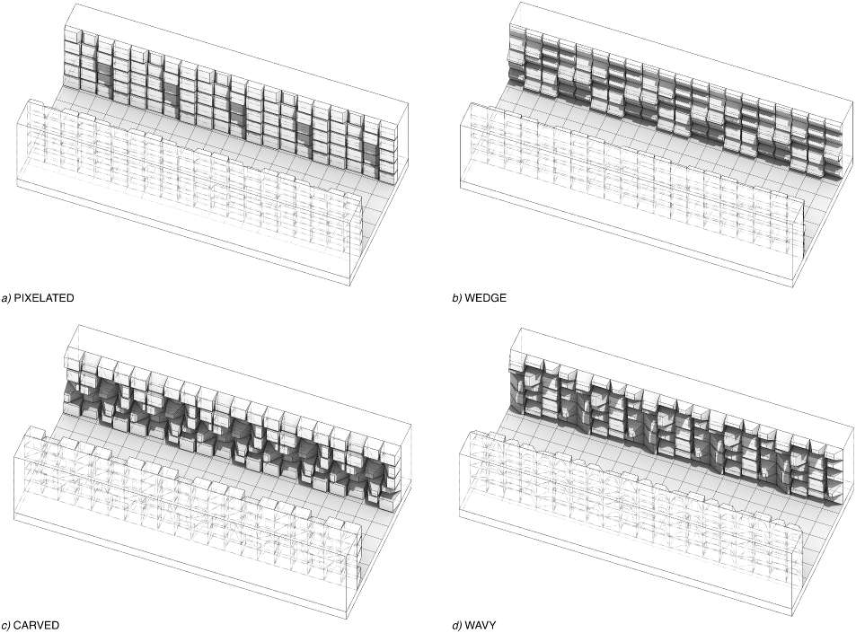

The weather file used to size mechanical systems in Nicosia, Cyprus, lists a design maximum temperature of 44.4 °C, and during the hottest week of the year the solar radiation on a horizontal plane exceeds 900 W/m² at midday. It is one of the harshest settings in Europe for a passive cooling strategy, and in the climate projected to 2050 it is not only the daytime peak that rises: the night-time minima rise too, leaving the walls less time to shed the heat stored during the day (**Figure 1**). That is why we chose this particular site for a question usually tackled only halfway: do the carved, folded, "pixelated" façades that contemporary architecture has been producing for twenty years — almost always as a stylistic choice — also do a measurable thermal job? And if so, for whom: for the building behind the wall, or for the people walking in the street in front of it?

```grafico
tipo: linea
x: ora
yMin: 18
assi:
  y: true
  titoloY: Air temperature (°C)
serie:
  - chiave: oggi
    etichetta: Current climate
    colore: var(--chart-1)
  - chiave: futuro
    etichetta: 2050 projection (RCP 8.5)
    colore: var(--chart-2)
    tratteggio: "5,4"
dati:
  - { ora: "2025-08-03T01:00", oggi: 25.4, futuro: 31.0 }
  - { ora: "2025-08-03T02:00", oggi: 24.8, futuro: 30.3 }
  - { ora: "2025-08-03T03:00", oggi: 23.1, futuro: 28.2 }
  - { ora: "2025-08-03T04:00", oggi: 21.0, futuro: 25.3 }
  - { ora: "2025-08-03T05:00", oggi: 22.8, futuro: 27.1 }
  - { ora: "2025-08-03T06:00", oggi: 26.5, futuro: 30.7 }
  - { ora: "2025-08-03T07:00", oggi: 29.8, futuro: 33.9 }
  - { ora: "2025-08-03T08:00", oggi: 32.2, futuro: 36.4 }
  - { ora: "2025-08-03T09:00", oggi: 34.5, futuro: 38.6 }
  - { ora: "2025-08-03T10:00", oggi: 35.8, futuro: 40.0 }
  - { ora: "2025-08-03T11:00", oggi: 37.6, futuro: 42.0 }
  - { ora: "2025-08-03T12:00", oggi: 36.7, futuro: 40.8 }
  - { ora: "2025-08-03T13:00", oggi: 35.9, futuro: 40.2 }
  - { ora: "2025-08-03T14:00", oggi: 35.6, futuro: 39.8 }
  - { ora: "2025-08-03T15:00", oggi: 33.8, futuro: 37.2 }
  - { ora: "2025-08-03T16:00", oggi: 30.5, futuro: 34.1 }
  - { ora: "2025-08-03T17:00", oggi: 28.8, futuro: 32.8 }
  - { ora: "2025-08-03T18:00", oggi: 27.9, futuro: 32.1 }
  - { ora: "2025-08-03T19:00", oggi: 27.3, futuro: 31.7 }
  - { ora: "2025-08-03T20:00", oggi: 26.8, futuro: 31.0 }
  - { ora: "2025-08-03T21:00", oggi: 26.2, futuro: 30.3 }
  - { ora: "2025-08-03T22:00", oggi: 25.5, futuro: 29.4 }
  - { ora: "2025-08-03T23:00", oggi: 24.7, futuro: 28.2 }
  - { ora: "2025-08-04T00:00", oggi: 23.6, futuro: 27.0 }
  - { ora: "2025-08-04T01:00", oggi: 22.4, futuro: 26.9 }
  - { ora: "2025-08-04T02:00", oggi: 24.5, futuro: 28.5 }
  - { ora: "2025-08-04T03:00", oggi: 28.0, futuro: 31.8 }
  - { ora: "2025-08-04T04:00", oggi: 31.6, futuro: 35.4 }
  - { ora: "2025-08-04T05:00", oggi: 33.5, futuro: 37.4 }
  - { ora: "2025-08-04T06:00", oggi: 34.6, futuro: 38.9 }
  - { ora: "2025-08-04T07:00", oggi: 34.8, futuro: 39.1 }
  - { ora: "2025-08-04T08:00", oggi: 37.1, futuro: 41.5 }
  - { ora: "2025-08-04T09:00", oggi: 34.7, futuro: 39.0 }
  - { ora: "2025-08-04T10:00", oggi: 34.2, futuro: 38.6 }
  - { ora: "2025-08-04T11:00", oggi: 35.0, futuro: 39.4 }
  - { ora: "2025-08-04T12:00", oggi: 33.6, futuro: 37.8 }
  - { ora: "2025-08-04T13:00", oggi: 32.0, futuro: 35.8 }
  - { ora: "2025-08-04T14:00", oggi: 29.5, futuro: 33.6 }
  - { ora: "2025-08-04T15:00", oggi: 27.4, futuro: 31.8 }
  - { ora: "2025-08-04T16:00", oggi: 26.6, futuro: 31.1 }
  - { ora: "2025-08-04T17:00", oggi: 26.4, futuro: 31.0 }
  - { ora: "2025-08-04T18:00", oggi: 26.0, futuro: 30.5 }
  - { ora: "2025-08-04T19:00", oggi: 25.4, futuro: 29.9 }
  - { ora: "2025-08-04T20:00", oggi: 24.5, futuro: 28.6 }
  - { ora: "2025-08-04T21:00", oggi: 23.2, futuro: 27.1 }
  - { ora: "2025-08-04T22:00", oggi: 21.8, futuro: 25.4 }
  - { ora: "2025-08-04T23:00", oggi: 20.8, futuro: 25.5 }
  - { ora: "2025-08-05T00:00", oggi: 24.0, futuro: 28.4 }
  - { ora: "2025-08-05T01:00", oggi: 27.2, futuro: 31.7 }
  - { ora: "2025-08-05T02:00", oggi: 30.5, futuro: 35.0 }
  - { ora: "2025-08-05T03:00", oggi: 33.4, futuro: 37.8 }
  - { ora: "2025-08-05T04:00", oggi: 36.2, futuro: 40.5 }
  - { ora: "2025-08-05T05:00", oggi: 36.2, futuro: 40.5 }
  - { ora: "2025-08-05T06:00", oggi: 36.8, futuro: 41.2 }
  - { ora: "2025-08-05T07:00", oggi: 37.6, futuro: 42.4 }
  - { ora: "2025-08-05T08:00", oggi: 38.1, futuro: 42.3 }
  - { ora: "2025-08-05T09:00", oggi: 38.7, futuro: 43.1 }
  - { ora: "2025-08-05T10:00", oggi: 36.0, futuro: 40.3 }
  - { ora: "2025-08-05T11:00", oggi: 33.2, futuro: 37.4 }
  - { ora: "2025-08-05T12:00", oggi: 30.1, futuro: 34.2 }
  - { ora: "2025-08-05T13:00", oggi: 27.9, futuro: 32.1 }
  - { ora: "2025-08-05T14:00", oggi: 26.8, futuro: 31.2 }
  - { ora: "2025-08-05T15:00", oggi: 26.4, futuro: 31.0 }
  - { ora: "2025-08-05T16:00", oggi: 26.1, futuro: 30.6 }
  - { ora: "2025-08-05T17:00", oggi: 25.8, futuro: 30.2 }
  - { ora: "2025-08-05T18:00", oggi: 24.8, futuro: 29.2 }
  - { ora: "2025-08-05T19:00", oggi: 23.8, futuro: 28.2 }
  - { ora: "2025-08-05T20:00", oggi: 26.0, futuro: 30.4 }
  - { ora: "2025-08-05T21:00", oggi: 29.4, futuro: 33.8 }
  - { ora: "2025-08-05T22:00", oggi: 32.7, futuro: 37.1 }
  - { ora: "2025-08-05T23:00", oggi: 35.1, futuro: 39.6 }
  - { ora: "2025-08-06T00:00", oggi: 36.7, futuro: 41.1 }
  - { ora: "2025-08-06T01:00", oggi: 36.8, futuro: 41.2 }
  - { ora: "2025-08-06T02:00", oggi: 38.1, futuro: 42.6 }
  - { ora: "2025-08-06T03:00", oggi: 38.2, futuro: 42.7 }
  - { ora: "2025-08-06T04:00", oggi: 38.5, futuro: 42.9 }
  - { ora: "2025-08-06T05:00", oggi: 37.2, futuro: 41.5 }
  - { ora: "2025-08-06T06:00", oggi: 34.4, futuro: 38.6 }
  - { ora: "2025-08-06T07:00", oggi: 30.8, futuro: 34.9 }
  - { ora: "2025-08-06T08:00", oggi: 28.2, futuro: 32.2 }
  - { ora: "2025-08-06T09:00", oggi: 27.4, futuro: 32.1 }
  - { ora: "2025-08-06T10:00", oggi: 27.7, futuro: 32.2 }
  - { ora: "2025-08-06T11:00", oggi: 27.6, futuro: 32.0 }
  - { ora: "2025-08-06T12:00", oggi: 27.6, futuro: 32.1 }
  - { ora: "2025-08-06T13:00", oggi: 27.8, futuro: 32.3 }
  - { ora: "2025-08-06T14:00", oggi: 26.2, futuro: 30.5 }
  - { ora: "2025-08-06T15:00", oggi: 24.8, futuro: 29.0 }
  - { ora: "2025-08-06T16:00", oggi: 23.8, futuro: 28.3 }
  - { ora: "2025-08-06T17:00", oggi: 26.0, futuro: 30.6 }
  - { ora: "2025-08-06T18:00", oggi: 28.8, futuro: 33.5 }
  - { ora: "2025-08-06T19:00", oggi: 32.2, futuro: 37.0 }
  - { ora: "2025-08-06T20:00", oggi: 35.0, futuro: 39.8 }
  - { ora: "2025-08-06T21:00", oggi: 36.6, futuro: 41.5 }
  - { ora: "2025-08-06T22:00", oggi: 37.6, futuro: 42.5 }
  - { ora: "2025-08-06T23:00", oggi: 38.8, futuro: 43.6 }
  - { ora: "2025-08-07T00:00", oggi: 39.9, futuro: 44.3 }
  - { ora: "2025-08-07T01:00", oggi: 38.0, futuro: 42.2 }
  - { ora: "2025-08-07T02:00", oggi: 35.3, futuro: 39.4 }
  - { ora: "2025-08-07T03:00", oggi: 32.6, futuro: 36.5 }
  - { ora: "2025-08-07T04:00", oggi: 29.9, futuro: 33.7 }
  - { ora: "2025-08-07T05:00", oggi: 28.0, futuro: 32.1 }
  - { ora: "2025-08-07T06:00", oggi: 27.3, futuro: 31.8 }
  - { ora: "2025-08-07T07:00", oggi: 27.3, futuro: 31.9 }
  - { ora: "2025-08-07T08:00", oggi: 26.8, futuro: 31.4 }
  - { ora: "2025-08-07T09:00", oggi: 26.1, futuro: 30.6 }
  - { ora: "2025-08-07T10:00", oggi: 25.2, futuro: 29.7 }
  - { ora: "2025-08-07T11:00", oggi: 24.2, futuro: 28.4 }
  - { ora: "2025-08-07T12:00", oggi: 23.9, futuro: 28.3 }
  - { ora: "2025-08-07T13:00", oggi: 26.5, futuro: 31.0 }
  - { ora: "2025-08-07T14:00", oggi: 30.2, futuro: 34.8 }
  - { ora: "2025-08-07T15:00", oggi: 33.8, futuro: 38.4 }
  - { ora: "2025-08-07T16:00", oggi: 36.5, futuro: 41.2 }
  - { ora: "2025-08-07T17:00", oggi: 37.5, futuro: 42.2 }
  - { ora: "2025-08-07T18:00", oggi: 38.3, futuro: 42.9 }
  - { ora: "2025-08-07T19:00", oggi: 38.4, futuro: 43.0 }
  - { ora: "2025-08-07T20:00", oggi: 38.7, futuro: 43.2 }
  - { ora: "2025-08-07T21:00", oggi: 38.5, futuro: 42.8 }
  - { ora: "2025-08-07T22:00", oggi: 38.1, futuro: 42.4 }
  - { ora: "2025-08-07T23:00", oggi: 38.6, futuro: 43.0 }
  - { ora: "2025-08-08T00:00", oggi: 33.2, futuro: 37.3 }
  - { ora: "2025-08-08T01:00", oggi: 29.5, futuro: 33.5 }
  - { ora: "2025-08-08T02:00", oggi: 28.0, futuro: 32.1 }
  - { ora: "2025-08-08T03:00", oggi: 27.4, futuro: 31.8 }
  - { ora: "2025-08-08T04:00", oggi: 27.0, futuro: 31.5 }
  - { ora: "2025-08-08T05:00", oggi: 26.4, futuro: 30.8 }
  - { ora: "2025-08-08T06:00", oggi: 25.6, futuro: 29.9 }
  - { ora: "2025-08-08T07:00", oggi: 24.8, futuro: 29.2 }
  - { ora: "2025-08-08T08:00", oggi: 24.4, futuro: 28.8 }
  - { ora: "2025-08-08T09:00", oggi: 26.8, futuro: 31.2 }
  - { ora: "2025-08-08T10:00", oggi: 29.5, futuro: 34.0 }
  - { ora: "2025-08-08T11:00", oggi: 34.2, futuro: 38.7 }
  - { ora: "2025-08-08T12:00", oggi: 37.6, futuro: 42.2 }
  - { ora: "2025-08-08T13:00", oggi: 38.8, futuro: 43.3 }
  - { ora: "2025-08-08T14:00", oggi: 39.2, futuro: 43.7 }
  - { ora: "2025-08-08T15:00", oggi: 39.9, futuro: 44.4 }
  - { ora: "2025-08-08T16:00", oggi: 40.3, futuro: 44.8 }
  - { ora: "2025-08-08T17:00", oggi: 40.5, futuro: 45.0 }
  - { ora: "2025-08-08T18:00", oggi: 38.9, futuro: 43.2 }
  - { ora: "2025-08-08T19:00", oggi: 35.7, futuro: 39.8 }
  - { ora: "2025-08-08T20:00", oggi: 32.6, futuro: 36.7 }
  - { ora: "2025-08-08T21:00", oggi: 30.5, futuro: 34.6 }
  - { ora: "2025-08-08T22:00", oggi: 28.7, futuro: 32.9 }
  - { ora: "2025-08-08T23:00", oggi: 28.0, futuro: 32.5 }
  - { ora: "2025-08-09T00:00", oggi: 27.6, futuro: 32.3 }
  - { ora: "2025-08-09T01:00", oggi: 26.8, futuro: 31.4 }
  - { ora: "2025-08-09T02:00", oggi: 25.8, futuro: 30.3 }
  - { ora: "2025-08-09T03:00", oggi: 24.9, futuro: 29.3 }
  - { ora: "2025-08-09T04:00", oggi: 24.2, futuro: 28.6 }
  - { ora: "2025-08-09T05:00", oggi: 26.4, futuro: 30.8 }
  - { ora: "2025-08-09T06:00", oggi: 29.8, futuro: 34.2 }
  - { ora: "2025-08-09T07:00", oggi: 33.5, futuro: 38.0 }
  - { ora: "2025-08-09T08:00", oggi: 36.2, futuro: 40.8 }
  - { ora: "2025-08-09T09:00", oggi: 37.8, futuro: 42.3 }
  - { ora: "2025-08-09T10:00", oggi: 38.6, futuro: 43.1 }
  - { ora: "2025-08-09T11:00", oggi: 38.9, futuro: 43.5 }
  - { ora: "2025-08-09T12:00", oggi: 39.0, futuro: 43.6 }
  - { ora: "2025-08-09T13:00", oggi: 38.5, futuro: 43.0 }
  - { ora: "2025-08-09T14:00", oggi: 37.8, futuro: 42.2 }
  - { ora: "2025-08-09T15:00", oggi: 36.0, futuro: 40.4 }
  - { ora: "2025-08-09T16:00", oggi: 33.2, futuro: 37.6 }
  - { ora: "2025-08-09T17:00", oggi: 30.6, futuro: 34.8 }
  - { ora: "2025-08-09T18:00", oggi: 29.0, futuro: 33.2 }
  - { ora: "2025-08-09T19:00", oggi: 28.2, futuro: 32.4 }
  - { ora: "2025-08-09T20:00", oggi: 27.7, futuro: 31.9 }
  - { ora: "2025-08-09T21:00", oggi: 27.1, futuro: 31.2 }
  - { ora: "2025-08-09T22:00", oggi: 26.4, futuro: 30.5 }
  - { ora: "2025-08-09T23:00", oggi: 25.6, futuro: 29.6 }
  - { ora: "2025-08-10T00:00", oggi: 24.9, futuro: 28.8 }
didascalia: "Hourly air temperature over the hottest week (3–9 August) in the present-day weather file (solid line) and in the one morphed to 2050 under the RCP 8.5 scenario (dashed line); hourly values read off the paper's chart (Fig. 1). Both the daytime peaks and the night-time minima rise by a few degrees. The 168 hours on the horizontal axis cover the seven consecutive days."
```

In the literature these two fronts are almost always studied separately. Those concerned with energy savings simulate the building interior and ignore the street; those concerned with pedestrian comfort model the urban canyon and treat the façade as a flat surface. We tried to hold them together, on the same model and with the same metrics, isolating a single variable: form.

## A reference canyon, to isolate form

The testbed is a canonical urban canyon: two buildings 60 metres long and 15 metres tall, separated by a 15-metre-wide street. The ratio between building height and street width is therefore 1 — a value typical of compact Mediterranean fabric, enough to generate self-shading but without closing off the view of the sky entirely. Everything that is not geometry stays fixed: the material is concrete, the albedo 0.35, the emissivity 0.90, and the systems and occupancy schedules are those of a standard office. The only thing that changes is the relief of the façade, in five versions: flat (the reference), pixelated, wedge, carved and wavy (**Figure 2**).



Each geometry was evaluated in two canyon orientations — east–west and north–south, the extremes of solar exposure — and in two climates: the hottest week currently on record in the Nicosia file (3–9 August, with the hottest day on the 9th) and the same week projected to 2050 under the high-emissions RCP 8.5 scenario, obtained by "morphing" the present-day weather file.[^1]

The price of such a controlled setup is that the numbers must be read for what they are: the effect of form with all else equal, not a prediction of how much a real building would cool down. Materials are kept identical across geometries — monolithic concrete for the microclimate, a realistic insulated assembly for the energy calculation — and wind as a flow field and costs are left out. These are choices, and we return to them at the end.

## Two calculation engines, and a laboratory testbed

This is the part we approached with the most caution, because a geometry like the carved one strains standard algorithms: deep cavities generate multiple reflections of sunlight that a single simulation engine tends to represent poorly. We therefore coupled two engines with distinct tasks, inside a workflow built on the Ladybug/Honeybee tools (**Figure 3**).

 solves the surface heat balance and provides wall and pavement temperatures as well as annual cooling loads; Radiance (bottom) solves the short-wave solar radiation at pedestrian level, including the multiple reflections in the deep geometries. Honeybee and Ladybug Tools recombine the two contributions into mean radiant temperature and compute the UTCI.")

EnergyPlus calculates how much heat enters, accumulates in and leaves each surface, but it describes geometry in a simplified way and can underestimate the trapping of radiation in the recesses. Radiance does the opposite: it tracks precisely the light bouncing between surfaces, but on its own it does not handle the long-wave heat exchange — the heat that a hot wall radiates into its surroundings. In the coupled workflow Radiance computes the short-wave field on the three-dimensional geometry, EnergyPlus provides the surface temperatures from which the long-wave field is derived, and the two contributions are summed point by point to obtain the mean radiant temperature — the net radiation that a stationary body exchanges with all the surfaces around it — on a grid of sensors at pedestrian height, 1.5 metres.

Before applying this coupling to the complex geometries, we verified it in the laboratory against real measurements. We built eight full-scale concrete panels (90 × 90 cm), from a near-flat surface to deep grids of orthogonal recesses, brought them to thermal equilibrium under an array of infrared lamps in an insulated chamber and recorded their surface temperature with a calibrated thermal camera. The same eight panels were simulated with the same workflow, and the maps were compared one by one (**Figure 4**).

, the surface temperature measured in the laboratory with a thermal camera (middle row) and the one computed by the simulation (bottom row), on the same 25–42 °C scale. This is the direct measurement-to-model comparison that underpins confidence in every canyon result.")

The mean difference between measurement and simulation stayed between 0.41 and 1.51 °C depending on the panel, with a near-zero systematic error and an overall error of 3 %.[^2] On this basis we set Radiance's ambient-bounce count to five: enough to capture the radiative trapping in the cavities, not so much as to artificially amplify the short-wave component. It is a check that takes up a section of the paper, but it is what separates a simulated number from a number you can trust.

## On the walls: up to 8.5 °C, but only where the sun comes in at a grazing angle

For wall temperature the dominant mechanism is self-shading, and it is most effective where the sun arrives at a grazing angle. In the north–south canyon, where the façades face east and west and take low sun in the morning and evening, the flat east wall reaches a peak of 44.2 °C at 13:00: the wedge geometry lowers it by 8.5 °C, the largest reduction recorded. On the west wall, which peaks at 40.9 °C in the late afternoon, the pixelated geometry cuts 6.1 °C. In the east–west canyon, where the façades face south and north and the sun strikes them more head-on, the same gains shrink to 2.4 °C on the south wall and 3.8 °C on the north one.

But if you look at the 24-hour average rather than the peak, the best geometry changes: it is the carved one, which lowers the daily wall average by between 1.1 and 2.6 °C across all orientations. Its recesses increase the exposed surface, and at night this helps shed heat by convection, even though during the day it shades a little less than wedge and pixelated. In practice: wedge and pixelated are better at clipping the peaks, the carved one is better at reducing the heat accumulated over the whole day.

## In the street: what matters is how much the walls radiate, not the shade

Air temperature says little about what you feel in a narrow street with scorching walls. What matters is the mean radiant temperature, and in the north–south canyon the carved geometry lowers its peak by 4.7 °C compared with the flat façade (**Figure 5**). Translated into the UTCI comfort index, which also incorporates air, humidity and wind, that is 3.2 °C less: enough to shift the condition from "strong" heat stress to the threshold of "moderate".

, decomposed into the long-wave component emitted by the surfaces (centre) and the short-wave component from the sun (right), for the five geometries. In the articulated geometries almost all of the drop is in the centre column: cooler walls that radiate less.")

The decomposition shows where the gain comes from. In the flat façade the long-wave component is 36.7 °C at the peak hour; with the carved geometry it drops to 31.9 °C, while the short-wave component stays practically identical (from 42.0 to 42.1 °C). The relief for the pedestrian therefore does not come from more shade on the pavement, but from the fact that the carved walls, cooler at the surface, radiate less heat onto them. Over the week's cumulative exposure, the carved geometry brings the daytime hours of "very strong" stress (UTCI above 38 °C) from 33 % to 24 % of the time — nine points less, redistributed toward the less severe categories. Wavy and pixelated gain five points; the wedge, on this pedestrian metric, is indistinguishable from the flat wall.

## The anomalies: when form makes things worse

Not all geometries go in the same direction, and this is the most instructive part. In the east–west canyon the wedge façade *increases* the peak mean radiant temperature by 0.7 °C compared with the flat one: the multiple bounces between the sloping faces, instead of dispersing, redirect flux toward the pedestrian plane and outweigh the benefit of the wall's self-shading.[^3]

On the pavement something similar happens with the pixelated one. In the north–south canyon the carved geometry lowers the peak pavement temperature by 1.5 °C, but the pixelated one *raises* it by 1.1 °C: its many small facets, instead of reflecting light diffusely toward the sky, send about 20 % of it downward, onto the asphalt below. It is an effect that an analysis focused only on the wall would not see, and that in design practice would shift the problem from the building to the people walking.

## By 2050 the advantage thins out

Under the future climate the geometries do not age in the same way. We measure how much the peak mean radiant temperature worsens going from the present climate to that of 2050: for the flat façade in the north–south canyon the worsening is 3.0 °C, and all the articulated geometries contain it — the pixelated one limits it to 1.1 °C. But in the east–west canyon the same pixelated geometry does the opposite: it takes the worsening from 1.9 to 3.3 °C. This is a maladaptation — a form that works today and risks working worse just when the climate warms the most — and a validated simulation lets you spot it before building, not after.[^4]

On the energy side, in the present climate the three-dimensional façades reduce the annual cooling load by 9–16 % relative to the flat reference: the carved one is the best, around 16 %, pixelated and wavy are around 13 %, the wedge stops at 9 % (**Figure 6**). By 2050 the savings compress to 6–9 %: a warmer background climate raises both daytime and night-time temperatures, reduces the margin of self-shading and makes the extra surface of the deep geometries slightly penalising in terms of conduction.

```grafico
tipo: barre
x: periodo
assi:
  y: true
  titoloY: Annual cooling load (kWh/m²)
  titoloX: Climate scenario
serie:
  - chiave: piatta
    etichetta: Flat
    colore: var(--chart-1)
  - chiave: pixelata
    etichetta: Pixelated
    colore: var(--chart-2)
  - chiave: scavata
    etichetta: Carved
    colore: var(--chart-3)
  - chiave: ondulata
    etichetta: Wavy
    colore: var(--chart-4)
  - chiave: cuneo
    etichetta: Wedge
    colore: var(--chart-5)
dati:
  - { periodo: Current, piatta: 96.3, pixelata: 80.0, scavata: 80.6, ondulata: 82.2, cuneo: 85.0 }
  - { periodo: "2050", piatta: 102.5, pixelata: 91.2, scavata: 93.3, ondulata: 92.8, cuneo: 94.4 }
didascalia: "Annual cooling load (kWh/m²) by geometry, in the present-day climate and in that of 2050, in greyscale from darkest (flat) to lightest (wedge); values read off the paper's chart (Fig. 9). In both scenarios the flat façade is the most energy-hungry, but the gap between flat and articulated narrows visibly under the future climate."
```

## Compared with paints and green façades

To give these numbers a scale we set them alongside the ranges reported in the literature for other passive façade strategies — measured under different conditions, so not comparable point by point, but useful for orders of magnitude. Green façades remain superior for cooling the contact surface (down to −14 °C in some field cases), but they bring a more modest benefit at the canyon scale (UTCI around −1.6 °C) and an annual cooling saving (about 7–15 %) similar to or slightly below that of geometry. Retroreflective finishes give a mean radiant temperature relief of 3–5 °C in the street, of the same order as the one obtained here with the carved geometry. Put differently: changing only form, without special materials, produces effects comparable to material interventions that are more onerous to maintain over time — with the difference that form must be chosen together with orientation, not regardless of it.

## What the model leaves out

Wind enters the model only as an hourly value from the weather file, which feeds the exterior convection and the wind-speed term in the UTCI. There is no fluid-dynamics coupling: channelling, turbulence and the canyon's aerodynamic sheltering effect are not modelled, and this is the first extension to make for a windy location. The test is also on a single hot-dry Mediterranean climate: extension to humid or subtropical climates should be approached with caution, because moisture reduces the effectiveness of the long-wave cooling on which much of the benefit rests. Finally, materials are kept constant to attribute everything to geometry: the study does not address the combination of form and surface treatments (reflective paints, greenery), nor constructability, maintenance, cost or embodied carbon — variables that a real design choice puts on the table alongside thermal performance.

## The takeaway

For the same material, a carved façade well oriented in a north–south canyon costs the same design effort as a flat one and returns up to 4.7 °C less mean radiant temperature for those walking and about 16 % less cooling energy for the building. The same form on the wrong axis — the wedge in the east–west canyon, the pixelated one on the pavement — cancels the advantage or reverses it. The useful result for a designer is not "3D façades cool", but that the effect has a sign that depends on orientation, and that today it can be calculated before laying the first panel.

---

**Bibliographic reference**
E. Naboni, G. E. Marchesani, R. Cocci Grifoni, *3D façade geometry as a dual passive control in hot urban canyons: reducing street MRT and cooling loads*, Building and Environment 297 (2026) 114479. <https://doi.org/10.1016/j.buildenv.2026.114479>

**Data and code availability**
The Rhino 8 geometry, the Grasshopper definitions, the main EnergyPlus and Radiance inputs and outputs and the Python post-processing scripts are public: GitHub repository `emanuelenaboni/3d-facade-geometry-grasshopper-scripts` (v1.0.0) and archived release on Zenodo, <https://doi.org/10.5281/zenodo.17637740>.

**Short glossary**

- *Mean radiant temperature (MRT)*: the net radiation that a stationary body exchanges with all the surrounding surfaces, the sum of a short-wave component (direct and reflected sun) and a long-wave one (heat emitted by hot surfaces). In the street it is the factor that weighs most on comfort, more than air temperature.
- *UTCI*: a heat-stress index that combines mean radiant temperature, air temperature, humidity and wind into a single scale, divided into categories from "no stress" to "extreme heat stress".
- *Urban canyon, H/W ratio*: the ratio between the height of the buildings flanking a street and the width of the street itself. H/W = 1 means buildings as tall as the street is wide.
- *Self-shading*: the ability of an articulated surface to shade itself with its own relief, reducing the solar radiation that strikes it.
- *RCP 8.5*: a high-emissions climate scenario, used here as a stress test for 2050.
- *EnergyPlus, Radiance, Ladybug/Honeybee*: respectively the building heat-balance engine, the solar-radiation ray-tracing engine, and the suite that makes them talk to each other inside Rhino/Grasshopper.

[^1]: The future file was generated by morphing with CCWorldWeatherGen, which combines the historical series with the changes projected by global climate models. RCP 8.5 is a high-emissions, low-likelihood pathway: here it serves as an upper bound for the stress test, not as an expected projection.

[^2]: Mean absolute differences between 0.41 and 1.51 °C on the individual panels; systematic error (MBE) +0.06 °C; coefficient of variation of the root mean square error, CV(RMSE), equal to 3.0 %. The panels were 90 × 90 cm, in a chamber at 25 °C with nearly still air (< 0.05 m/s) and a uniform radiative load of 500 W/m² from halogen lamps. Two declared limits of the rig: the halogen spectrum is not the full solar one, and wind convection is deliberately excluded to stress the radiative algorithms.

[^3]: The absolute values of peak mean radiant temperature in the canyon (on the order of 74–79 °C) are affected by Ladybug Tools' known tendency to overestimate the short-wave component when reflectances and view factors are not defined carefully; this is why the Radiance bounce parameter was kept conservative. What matters here are the relative comparisons between geometries, not the absolute values.

[^4]: In the paper this quantity is also reported as an "adaptation benefit" with an explicit sign, but the sign convention between Table 12 and the text of §5.5 is not consistent (the same favourable case appears as −1.9 °C in the table and as +1.9 °C in the text). To avoid ambiguity, here the quantity is described as "how much the peak worsens moving to the 2050 climate": a lower number is better.

$$$

Il file climatico che si usa per dimensionare gli impianti a Nicosia, a Cipro, indica come temperatura massima di progetto 44,4 °C, e nella settimana più calda dell'anno la radiazione solare sul piano orizzontale supera i 900 W/m² a mezzogiorno. È una delle condizioni più dure d'Europa per una strategia di raffrescamento passivo, e nel clima proiettato al 2050 non è solo il picco diurno ad alzarsi: salgono anche le minime notturne, lasciando alle pareti meno tempo per smaltire il calore accumulato di giorno (**Figura 1**). È il motivo per cui abbiamo scelto proprio quel sito per una domanda che di solito si affronta a metà: le facciate scolpite, piegate, "pixelate" che l'architettura contemporanea produce da vent'anni — quasi sempre come scelta di linguaggio — fanno anche un lavoro termico misurabile? E se sì, per chi: per l'edificio dietro la parete, o per chi cammina nella strada davanti?

```grafico
tipo: linea
x: ora
yMin: 18
assi:
  y: true
  titoloY: Air temperature (°C)
serie:
  - chiave: oggi
    etichetta: Current climate
    colore: var(--chart-1)
  - chiave: futuro
    etichetta: 2050 projection (RCP 8.5)
    colore: var(--chart-2)
    tratteggio: "5,4"
dati:
  - { ora: "2025-08-03T01:00", oggi: 25.4, futuro: 31.0 }
  - { ora: "2025-08-03T02:00", oggi: 24.8, futuro: 30.3 }
  - { ora: "2025-08-03T03:00", oggi: 23.1, futuro: 28.2 }
  - { ora: "2025-08-03T04:00", oggi: 21.0, futuro: 25.3 }
  - { ora: "2025-08-03T05:00", oggi: 22.8, futuro: 27.1 }
  - { ora: "2025-08-03T06:00", oggi: 26.5, futuro: 30.7 }
  - { ora: "2025-08-03T07:00", oggi: 29.8, futuro: 33.9 }
  - { ora: "2025-08-03T08:00", oggi: 32.2, futuro: 36.4 }
  - { ora: "2025-08-03T09:00", oggi: 34.5, futuro: 38.6 }
  - { ora: "2025-08-03T10:00", oggi: 35.8, futuro: 40.0 }
  - { ora: "2025-08-03T11:00", oggi: 37.6, futuro: 42.0 }
  - { ora: "2025-08-03T12:00", oggi: 36.7, futuro: 40.8 }
  - { ora: "2025-08-03T13:00", oggi: 35.9, futuro: 40.2 }
  - { ora: "2025-08-03T14:00", oggi: 35.6, futuro: 39.8 }
  - { ora: "2025-08-03T15:00", oggi: 33.8, futuro: 37.2 }
  - { ora: "2025-08-03T16:00", oggi: 30.5, futuro: 34.1 }
  - { ora: "2025-08-03T17:00", oggi: 28.8, futuro: 32.8 }
  - { ora: "2025-08-03T18:00", oggi: 27.9, futuro: 32.1 }
  - { ora: "2025-08-03T19:00", oggi: 27.3, futuro: 31.7 }
  - { ora: "2025-08-03T20:00", oggi: 26.8, futuro: 31.0 }
  - { ora: "2025-08-03T21:00", oggi: 26.2, futuro: 30.3 }
  - { ora: "2025-08-03T22:00", oggi: 25.5, futuro: 29.4 }
  - { ora: "2025-08-03T23:00", oggi: 24.7, futuro: 28.2 }
  - { ora: "2025-08-04T00:00", oggi: 23.6, futuro: 27.0 }
  - { ora: "2025-08-04T01:00", oggi: 22.4, futuro: 26.9 }
  - { ora: "2025-08-04T02:00", oggi: 24.5, futuro: 28.5 }
  - { ora: "2025-08-04T03:00", oggi: 28.0, futuro: 31.8 }
  - { ora: "2025-08-04T04:00", oggi: 31.6, futuro: 35.4 }
  - { ora: "2025-08-04T05:00", oggi: 33.5, futuro: 37.4 }
  - { ora: "2025-08-04T06:00", oggi: 34.6, futuro: 38.9 }
  - { ora: "2025-08-04T07:00", oggi: 34.8, futuro: 39.1 }
  - { ora: "2025-08-04T08:00", oggi: 37.1, futuro: 41.5 }
  - { ora: "2025-08-04T09:00", oggi: 34.7, futuro: 39.0 }
  - { ora: "2025-08-04T10:00", oggi: 34.2, futuro: 38.6 }
  - { ora: "2025-08-04T11:00", oggi: 35.0, futuro: 39.4 }
  - { ora: "2025-08-04T12:00", oggi: 33.6, futuro: 37.8 }
  - { ora: "2025-08-04T13:00", oggi: 32.0, futuro: 35.8 }
  - { ora: "2025-08-04T14:00", oggi: 29.5, futuro: 33.6 }
  - { ora: "2025-08-04T15:00", oggi: 27.4, futuro: 31.8 }
  - { ora: "2025-08-04T16:00", oggi: 26.6, futuro: 31.1 }
  - { ora: "2025-08-04T17:00", oggi: 26.4, futuro: 31.0 }
  - { ora: "2025-08-04T18:00", oggi: 26.0, futuro: 30.5 }
  - { ora: "2025-08-04T19:00", oggi: 25.4, futuro: 29.9 }
  - { ora: "2025-08-04T20:00", oggi: 24.5, futuro: 28.6 }
  - { ora: "2025-08-04T21:00", oggi: 23.2, futuro: 27.1 }
  - { ora: "2025-08-04T22:00", oggi: 21.8, futuro: 25.4 }
  - { ora: "2025-08-04T23:00", oggi: 20.8, futuro: 25.5 }
  - { ora: "2025-08-05T00:00", oggi: 24.0, futuro: 28.4 }
  - { ora: "2025-08-05T01:00", oggi: 27.2, futuro: 31.7 }
  - { ora: "2025-08-05T02:00", oggi: 30.5, futuro: 35.0 }
  - { ora: "2025-08-05T03:00", oggi: 33.4, futuro: 37.8 }
  - { ora: "2025-08-05T04:00", oggi: 36.2, futuro: 40.5 }
  - { ora: "2025-08-05T05:00", oggi: 36.2, futuro: 40.5 }
  - { ora: "2025-08-05T06:00", oggi: 36.8, futuro: 41.2 }
  - { ora: "2025-08-05T07:00", oggi: 37.6, futuro: 42.4 }
  - { ora: "2025-08-05T08:00", oggi: 38.1, futuro: 42.3 }
  - { ora: "2025-08-05T09:00", oggi: 38.7, futuro: 43.1 }
  - { ora: "2025-08-05T10:00", oggi: 36.0, futuro: 40.3 }
  - { ora: "2025-08-05T11:00", oggi: 33.2, futuro: 37.4 }
  - { ora: "2025-08-05T12:00", oggi: 30.1, futuro: 34.2 }
  - { ora: "2025-08-05T13:00", oggi: 27.9, futuro: 32.1 }
  - { ora: "2025-08-05T14:00", oggi: 26.8, futuro: 31.2 }
  - { ora: "2025-08-05T15:00", oggi: 26.4, futuro: 31.0 }
  - { ora: "2025-08-05T16:00", oggi: 26.1, futuro: 30.6 }
  - { ora: "2025-08-05T17:00", oggi: 25.8, futuro: 30.2 }
  - { ora: "2025-08-05T18:00", oggi: 24.8, futuro: 29.2 }
  - { ora: "2025-08-05T19:00", oggi: 23.8, futuro: 28.2 }
  - { ora: "2025-08-05T20:00", oggi: 26.0, futuro: 30.4 }
  - { ora: "2025-08-05T21:00", oggi: 29.4, futuro: 33.8 }
  - { ora: "2025-08-05T22:00", oggi: 32.7, futuro: 37.1 }
  - { ora: "2025-08-05T23:00", oggi: 35.1, futuro: 39.6 }
  - { ora: "2025-08-06T00:00", oggi: 36.7, futuro: 41.1 }
  - { ora: "2025-08-06T01:00", oggi: 36.8, futuro: 41.2 }
  - { ora: "2025-08-06T02:00", oggi: 38.1, futuro: 42.6 }
  - { ora: "2025-08-06T03:00", oggi: 38.2, futuro: 42.7 }
  - { ora: "2025-08-06T04:00", oggi: 38.5, futuro: 42.9 }
  - { ora: "2025-08-06T05:00", oggi: 37.2, futuro: 41.5 }
  - { ora: "2025-08-06T06:00", oggi: 34.4, futuro: 38.6 }
  - { ora: "2025-08-06T07:00", oggi: 30.8, futuro: 34.9 }
  - { ora: "2025-08-06T08:00", oggi: 28.2, futuro: 32.2 }
  - { ora: "2025-08-06T09:00", oggi: 27.4, futuro: 32.1 }
  - { ora: "2025-08-06T10:00", oggi: 27.7, futuro: 32.2 }
  - { ora: "2025-08-06T11:00", oggi: 27.6, futuro: 32.0 }
  - { ora: "2025-08-06T12:00", oggi: 27.6, futuro: 32.1 }
  - { ora: "2025-08-06T13:00", oggi: 27.8, futuro: 32.3 }
  - { ora: "2025-08-06T14:00", oggi: 26.2, futuro: 30.5 }
  - { ora: "2025-08-06T15:00", oggi: 24.8, futuro: 29.0 }
  - { ora: "2025-08-06T16:00", oggi: 23.8, futuro: 28.3 }
  - { ora: "2025-08-06T17:00", oggi: 26.0, futuro: 30.6 }
  - { ora: "2025-08-06T18:00", oggi: 28.8, futuro: 33.5 }
  - { ora: "2025-08-06T19:00", oggi: 32.2, futuro: 37.0 }
  - { ora: "2025-08-06T20:00", oggi: 35.0, futuro: 39.8 }
  - { ora: "2025-08-06T21:00", oggi: 36.6, futuro: 41.5 }
  - { ora: "2025-08-06T22:00", oggi: 37.6, futuro: 42.5 }
  - { ora: "2025-08-06T23:00", oggi: 38.8, futuro: 43.6 }
  - { ora: "2025-08-07T00:00", oggi: 39.9, futuro: 44.3 }
  - { ora: "2025-08-07T01:00", oggi: 38.0, futuro: 42.2 }
  - { ora: "2025-08-07T02:00", oggi: 35.3, futuro: 39.4 }
  - { ora: "2025-08-07T03:00", oggi: 32.6, futuro: 36.5 }
  - { ora: "2025-08-07T04:00", oggi: 29.9, futuro: 33.7 }
  - { ora: "2025-08-07T05:00", oggi: 28.0, futuro: 32.1 }
  - { ora: "2025-08-07T06:00", oggi: 27.3, futuro: 31.8 }
  - { ora: "2025-08-07T07:00", oggi: 27.3, futuro: 31.9 }
  - { ora: "2025-08-07T08:00", oggi: 26.8, futuro: 31.4 }
  - { ora: "2025-08-07T09:00", oggi: 26.1, futuro: 30.6 }
  - { ora: "2025-08-07T10:00", oggi: 25.2, futuro: 29.7 }
  - { ora: "2025-08-07T11:00", oggi: 24.2, futuro: 28.4 }
  - { ora: "2025-08-07T12:00", oggi: 23.9, futuro: 28.3 }
  - { ora: "2025-08-07T13:00", oggi: 26.5, futuro: 31.0 }
  - { ora: "2025-08-07T14:00", oggi: 30.2, futuro: 34.8 }
  - { ora: "2025-08-07T15:00", oggi: 33.8, futuro: 38.4 }
  - { ora: "2025-08-07T16:00", oggi: 36.5, futuro: 41.2 }
  - { ora: "2025-08-07T17:00", oggi: 37.5, futuro: 42.2 }
  - { ora: "2025-08-07T18:00", oggi: 38.3, futuro: 42.9 }
  - { ora: "2025-08-07T19:00", oggi: 38.4, futuro: 43.0 }
  - { ora: "2025-08-07T20:00", oggi: 38.7, futuro: 43.2 }
  - { ora: "2025-08-07T21:00", oggi: 38.5, futuro: 42.8 }
  - { ora: "2025-08-07T22:00", oggi: 38.1, futuro: 42.4 }
  - { ora: "2025-08-07T23:00", oggi: 38.6, futuro: 43.0 }
  - { ora: "2025-08-08T00:00", oggi: 33.2, futuro: 37.3 }
  - { ora: "2025-08-08T01:00", oggi: 29.5, futuro: 33.5 }
  - { ora: "2025-08-08T02:00", oggi: 28.0, futuro: 32.1 }
  - { ora: "2025-08-08T03:00", oggi: 27.4, futuro: 31.8 }
  - { ora: "2025-08-08T04:00", oggi: 27.0, futuro: 31.5 }
  - { ora: "2025-08-08T05:00", oggi: 26.4, futuro: 30.8 }
  - { ora: "2025-08-08T06:00", oggi: 25.6, futuro: 29.9 }
  - { ora: "2025-08-08T07:00", oggi: 24.8, futuro: 29.2 }
  - { ora: "2025-08-08T08:00", oggi: 24.4, futuro: 28.8 }
  - { ora: "2025-08-08T09:00", oggi: 26.8, futuro: 31.2 }
  - { ora: "2025-08-08T10:00", oggi: 29.5, futuro: 34.0 }
  - { ora: "2025-08-08T11:00", oggi: 34.2, futuro: 38.7 }
  - { ora: "2025-08-08T12:00", oggi: 37.6, futuro: 42.2 }
  - { ora: "2025-08-08T13:00", oggi: 38.8, futuro: 43.3 }
  - { ora: "2025-08-08T14:00", oggi: 39.2, futuro: 43.7 }
  - { ora: "2025-08-08T15:00", oggi: 39.9, futuro: 44.4 }
  - { ora: "2025-08-08T16:00", oggi: 40.3, futuro: 44.8 }
  - { ora: "2025-08-08T17:00", oggi: 40.5, futuro: 45.0 }
  - { ora: "2025-08-08T18:00", oggi: 38.9, futuro: 43.2 }
  - { ora: "2025-08-08T19:00", oggi: 35.7, futuro: 39.8 }
  - { ora: "2025-08-08T20:00", oggi: 32.6, futuro: 36.7 }
  - { ora: "2025-08-08T21:00", oggi: 30.5, futuro: 34.6 }
  - { ora: "2025-08-08T22:00", oggi: 28.7, futuro: 32.9 }
  - { ora: "2025-08-08T23:00", oggi: 28.0, futuro: 32.5 }
  - { ora: "2025-08-09T00:00", oggi: 27.6, futuro: 32.3 }
  - { ora: "2025-08-09T01:00", oggi: 26.8, futuro: 31.4 }
  - { ora: "2025-08-09T02:00", oggi: 25.8, futuro: 30.3 }
  - { ora: "2025-08-09T03:00", oggi: 24.9, futuro: 29.3 }
  - { ora: "2025-08-09T04:00", oggi: 24.2, futuro: 28.6 }
  - { ora: "2025-08-09T05:00", oggi: 26.4, futuro: 30.8 }
  - { ora: "2025-08-09T06:00", oggi: 29.8, futuro: 34.2 }
  - { ora: "2025-08-09T07:00", oggi: 33.5, futuro: 38.0 }
  - { ora: "2025-08-09T08:00", oggi: 36.2, futuro: 40.8 }
  - { ora: "2025-08-09T09:00", oggi: 37.8, futuro: 42.3 }
  - { ora: "2025-08-09T10:00", oggi: 38.6, futuro: 43.1 }
  - { ora: "2025-08-09T11:00", oggi: 38.9, futuro: 43.5 }
  - { ora: "2025-08-09T12:00", oggi: 39.0, futuro: 43.6 }
  - { ora: "2025-08-09T13:00", oggi: 38.5, futuro: 43.0 }
  - { ora: "2025-08-09T14:00", oggi: 37.8, futuro: 42.2 }
  - { ora: "2025-08-09T15:00", oggi: 36.0, futuro: 40.4 }
  - { ora: "2025-08-09T16:00", oggi: 33.2, futuro: 37.6 }
  - { ora: "2025-08-09T17:00", oggi: 30.6, futuro: 34.8 }
  - { ora: "2025-08-09T18:00", oggi: 29.0, futuro: 33.2 }
  - { ora: "2025-08-09T19:00", oggi: 28.2, futuro: 32.4 }
  - { ora: "2025-08-09T20:00", oggi: 27.7, futuro: 31.9 }
  - { ora: "2025-08-09T21:00", oggi: 27.1, futuro: 31.2 }
  - { ora: "2025-08-09T22:00", oggi: 26.4, futuro: 30.5 }
  - { ora: "2025-08-09T23:00", oggi: 25.6, futuro: 29.6 }
  - { ora: "2025-08-10T00:00", oggi: 24.9, futuro: 28.8 }
didascalia: "Temperatura dell'aria ora per ora nella settimana più calda (3-9 agosto) nel file climatico attuale (linea piena) e in quello proiettato al 2050 secondo lo scenario RCP 8.5 (linea tratteggiata); valori orari letti dal grafico del paper (Fig. 1). Sia i picchi diurni sia le minime notturne salgono di qualche grado. Le 168 ore sull'asse orizzontale coprono i sette giorni consecutivi."
```

Nella letteratura questi due fronti vengono quasi sempre studiati separati. Chi guarda al risparmio energetico simula l'interno dell'edificio e ignora la strada; chi guarda al comfort dei pedoni modella il canyon urbano e tratta la facciata come una superficie piatta. Abbiamo provato a tenerli insieme, sullo stesso modello e con le stesse metriche, isolando una sola variabile: la forma.

## Un canyon di riferimento, per isolare la forma

Il banco di prova è un canyon urbano canonico: due edifici lunghi 60 metri e alti 15, separati da una strada larga 15 metri. Il rapporto tra altezza degli edifici e larghezza della strada è quindi 1 — un valore tipico dei tessuti mediterranei compatti, abbastanza da generare autoombreggiamento ma senza chiudere del tutto la vista del cielo. Tutto ciò che non è geometria resta fisso: il materiale è calcestruzzo, l'albedo 0,35, l'emissività 0,90, gli impianti e gli orari di occupazione sono quelli di un ufficio standard. L'unica cosa che cambia è il rilievo della facciata, in cinque versioni: piatta (il riferimento), pixelata, a cuneo, scavata e ondulata (**Figura 2**).


Ogni geometria è stata valutata in due orientamenti del canyon — est-ovest e nord-sud, gli estremi di esposizione solare — e in due climi: la settimana più calda registrata oggi nel file di Nicosia (3-9 agosto, con il giorno più caldo il 9) e la stessa settimana proiettata al 2050 sotto lo scenario di emissioni alte RCP 8.5, ottenuta "morphando" il file climatico attuale.[^1]

Il prezzo di questo impianto così controllato è che i numeri vanno letti per quello che sono: l'effetto della forma a parità di tutto il resto, non la previsione di quanto si raffredderebbe un edificio reale. I materiali sono tenuti identici per ogni geometria — calcestruzzo monolitico per il microclima, una stratigrafia isolata realistica per il calcolo energetico — e restano fuori il vento come campo di moto e i costi. Sono scelte, e le riprendiamo alla fine.

## Due motori di calcolo, e un banco di prova in laboratorio

Questa è la parte su cui abbiamo speso più cautela, perché una geometria come la scavata mette in difficoltà gli algoritmi standard: le cavità profonde generano riflessioni multiple della luce solare che un singolo motore di simulazione tende a rappresentare male. Abbiamo quindi accoppiato due motori con compiti distinti, dentro un flusso di lavoro costruito sugli strumenti Ladybug/Honeybee (**Figura 3**).

 risolve il bilancio termico delle superfici e fornisce le temperature di parete e pavimento oltre ai carichi annui di raffrescamento; Radiance (in basso) risolve la radiazione solare a onda corta sul piano pedonale, comprese le riflessioni multiple nelle geometrie profonde. Honeybee e Ladybug Tools ricompongono i due contributi nella temperatura media radiante e calcolano l'UTCI.")

EnergyPlus calcola quanto calore entra, si accumula ed esce da ogni superficie, ma descrive la geometria in modo semplificato e può sottostimare l'intrappolamento della radiazione nelle rientranze. Radiance fa l'opposto: segue con precisione la luce che rimbalza tra le superfici, ma da solo non tratta lo scambio di calore a onda lunga, quello che una parete calda irraggia verso l'ambiente. Nel flusso accoppiato Radiance calcola il campo a onda corta sulla geometria tridimensionale, EnergyPlus fornisce le temperature superficiali da cui deriva il campo a onda lunga, e i due contributi vengono sommati punto per punto per ottenere la temperatura media radiante — la radiazione netta che un corpo fermo scambia con tutte le superfici intorno — su una griglia di sensori all'altezza di un pedone, 1,5 metri.

Prima di applicare questo accoppiamento alle geometrie complesse, lo abbiamo verificato in laboratorio contro misure reali. Abbiamo costruito otto pannelli di calcestruzzo a grandezza naturale (90 × 90 cm), da una superficie quasi piatta fino a griglie profonde di incavi ortogonali, li abbiamo portati all'equilibrio termico sotto un pannello di lampade a infrarossi in una camera isolata e ne abbiamo rilevato la temperatura superficiale con una termocamera calibrata. Gli stessi otto pannelli sono stati simulati con lo stesso flusso di lavoro, e le mappe sono state confrontate una per una (**Figura 4**).

, la temperatura superficiale misurata in laboratorio con termocamera (riga centrale) e quella calcolata dalla simulazione (riga in basso), sulla stessa scala 25-42 °C. È il confronto diretto misura-modello su cui poggia la fiducia in tutti i risultati del canyon.")

Lo scarto medio tra misura e simulazione è rimasto tra 0,41 e 1,51 °C a seconda del pannello, con un errore sistematico quasi nullo e un errore complessivo del 3 %.[^2] Su questa base abbiamo fissato per Radiance un numero di rimbalzi ambientali pari a cinque: abbastanza per catturare l'intrappolamento radiativo nelle cavità, non tanto da amplificare artificialmente la componente a onda corta. È una verifica che occupa una sezione dell'articolo, ma è ciò che separa un numero simulato da un numero di cui ci si può fidare.

## Sulle pareti: fino a 8,5 °C, ma solo dove il sole entra di taglio

Sulla temperatura delle pareti il meccanismo dominante è l'autoombreggiamento, ed è più efficace dove il sole arriva radente. Nel canyon orientato nord-sud, dove le facciate guardano a est e a ovest e prendono sole basso al mattino e alla sera, la parete est piatta tocca 44,2 °C di picco alle 13:00: la geometria a cuneo lo abbassa di 8,5 °C, la più grande riduzione registrata. Sulla parete ovest, che picca a 40,9 °C nel tardo pomeriggio, la geometria pixelata taglia 6,1 °C. Nel canyon est-ovest, dove le facciate guardano a sud e a nord e il sole batte più frontale, gli stessi guadagni si riducono a 2,4 °C sulla parete sud e 3,8 °C su quella nord.

Se però si guarda alla media sulle 24 ore invece che al picco, la geometria migliore cambia: è la scavata, che abbassa la media giornaliera di parete tra 1,1 e 2,6 °C in tutti gli orientamenti. Le sue rientranze aumentano la superficie esposta, e questo di notte aiuta a smaltire calore per convezione, anche se di giorno ombreggia un po' meno di cuneo e pixelata. In pratica: cuneo e pixelata tagliano meglio i picchi, la scavata riduce meglio il calore accumulato in tutta la giornata.

## In strada: conta quanto irraggiano i muri, non l'ombra

La temperatura dell'aria dice poco di cosa si sente in una strada stretta con le pareti roventi. Quello che conta è la temperatura media radiante, e nel canyon nord-sud la geometria scavata ne abbassa il picco di 4,7 °C rispetto alla facciata piatta (**Figura 5**). Tradotto nell'indice di comfort UTCI, che integra anche aria, umidità e vento, sono 3,2 °C in meno: abbastanza da spostare la condizione dallo stress da caldo "forte" alla soglia di quello "moderato".

, scomposta nella componente a onda lunga emessa dalle superfici (al centro) e in quella a onda corta dal sole (a destra), per le cinque geometrie. Nelle geometrie articolate il calo si legge quasi tutto nella colonna centrale: pareti più fredde che irraggiano di meno.")

La scomposizione dice da dove viene il guadagno. Nella facciata piatta la componente a onda lunga vale 36,7 °C all'ora di picco; con la geometria scavata scende a 31,9 °C, mentre la componente a onda corta resta praticamente identica (da 42,0 a 42,1 °C). Il sollievo per il pedone non arriva quindi da più ombra sul marciapiede, ma dal fatto che le pareti scavate, più fredde in superficie, gli irraggiano addosso meno calore. Sull'esposizione cumulata della settimana, la geometria scavata porta le ore diurne di stress "molto forte" (UTCI oltre 38 °C) dal 33 al 24 % del tempo — nove punti in meno, redistribuiti verso le categorie meno severe. Ondulata e pixelata guadagnano cinque punti; il cuneo, su questa metrica pedonale, è indistinguibile dalla parete piatta.

## Le anomalie: quando la forma peggiora le cose

Non tutte le geometrie vanno nella stessa direzione, ed è la parte più istruttiva. Nel canyon est-ovest la facciata a cuneo *aumenta* la temperatura media radiante di picco di 0,7 °C rispetto alla piatta: i rimbalzi multipli tra le facce inclinate, invece di disperdersi, ridirigono flusso verso il piano pedonale e superano il beneficio dell'autoombreggiamento della parete.[^3]

Sul marciapiede succede qualcosa di simile con la pixelata. Nel canyon nord-sud la geometria scavata abbassa il picco di temperatura del pavimento di 1,5 °C, ma la pixelata lo *alza* di 1,1 °C: le sue tante piccole faccette, invece di riflettere la luce diffusamente verso il cielo, ne rimandano circa il 20 % verso il basso, sull'asfalto sottostante. È un effetto che un'analisi concentrata solo sulla parete non vedrebbe, e che nella pratica progettuale sposterebbe il problema dall'edificio a chi cammina.

## Nel 2050 il vantaggio si assottiglia

Sotto il clima futuro le geometrie non invecchiano allo stesso modo. Misuriamo di quanto peggiora il picco di temperatura media radiante passando dal clima attuale a quello del 2050: per la facciata piatta nel canyon nord-sud il peggioramento è di 3,0 °C, e tutte le geometrie articolate lo contengono — la pixelata lo limita a 1,1 °C. Ma nel canyon est-ovest la stessa pixelata fa il contrario: porta il peggioramento da 1,9 a 3,3 °C. È un disadattamento — una forma che oggi funziona e che rischia di funzionare peggio proprio quando il clima si scalda di più — e una simulazione validata permette di individuarlo prima di costruire, non dopo.[^4]

Sul fronte energetico, nel clima attuale le facciate tridimensionali riducono il carico annuo di raffrescamento del 9-16 % rispetto al riferimento piatto: la scavata è la migliore, intorno al 16 %, pixelata e ondulata stanno sul 13 %, il cuneo si ferma al 9 % (**Figura 6**). Nel 2050 i risparmi si comprimono al 6-9 %: un clima di fondo più caldo alza sia le temperature diurne sia quelle notturne, riduce il margine dell'autoombreggiamento e rende la superficie in più delle geometrie profonde leggermente penalizzante sul piano della conduzione.

```grafico
tipo: barre
x: periodo
assi:
  y: true
  titoloY: Annual cooling load (kWh/m²)
  titoloX: Climate scenario
serie:
  - chiave: piatta
    etichetta: Flat
    colore: var(--chart-1)
  - chiave: pixelata
    etichetta: Pixelated
    colore: var(--chart-2)
  - chiave: scavata
    etichetta: Carved
    colore: var(--chart-3)
  - chiave: ondulata
    etichetta: Wavy
    colore: var(--chart-4)
  - chiave: cuneo
    etichetta: Wedge
    colore: var(--chart-5)
dati:
  - { periodo: Current, piatta: 96.3, pixelata: 80.0, scavata: 80.6, ondulata: 82.2, cuneo: 85.0 }
  - { periodo: "2050", piatta: 102.5, pixelata: 91.2, scavata: 93.3, ondulata: 92.8, cuneo: 94.4 }
didascalia: "Carico annuo di raffrescamento (kWh/m²) per geometria, nel clima attuale e in quello del 2050, in scala di grigi dal più scuro (piatta) al più chiaro (cuneo); valori letti dal grafico del paper (Fig. 9). In entrambi gli scenari la facciata piatta è la più energivora, ma il divario tra piatta e articolate si restringe visibilmente passando al clima futuro."
```

## A confronto con vernici e facciate verdi

Per dare una scala a questi numeri li abbiamo messi accanto agli intervalli riportati in letteratura per altre strategie passive di facciata — misurati in condizioni diverse, quindi non confrontabili punto per punto, ma utili per l'ordine di grandezza. Le facciate verdi restano superiori per il raffreddamento della superficie a contatto (fino a −14 °C in alcuni casi di campo), ma portano un beneficio più contenuto alla scala del canyon (UTCI intorno a −1,6 °C) e un risparmio di raffrescamento annuo (circa 7-15 %) simile o poco sotto quello della geometria. Le finiture retroriflettenti danno un sollievo di temperatura media radiante di 3-5 °C in strada, dello stesso ordine di quello ottenuto qui con la geometria scavata. Detto altrimenti: cambiare solo la forma, senza materiali speciali, produce effetti comparabili a interventi materici più onerosi da mantenere nel tempo — con la differenza che la forma va scelta insieme all'orientamento, non a prescindere.

## Cosa resta fuori dal modello

Il vento entra nel modello solo come dato orario del file climatico, che alimenta la convezione esterna e il termine di velocità nell'UTCI. Non c'è un accoppiamento fluidodinamico: incanalamento, turbolenza ed effetto di schermatura aerodinamica del canyon non sono modellati, ed è la prima estensione da fare per una località ventosa. Il test è inoltre su un solo clima mediterraneo caldo-secco: l'estensione a climi umidi o subtropicali va fatta con prudenza, perché l'umidità riduce l'efficacia del raffreddamento a onda lunga su cui si regge buona parte del beneficio. Infine i materiali sono tenuti costanti per attribuire tutto alla geometria: lo studio non affronta la combinazione di forma e trattamenti superficiali (vernici riflettenti, verde), né costruibilità, manutenzione, costo o carbonio incorporato — variabili che una scelta progettuale reale mette sul tavolo insieme alla performance termica.

## Cosa se ne ricava

A parità di materiale, una facciata scolpita ben orientata in un canyon nord-sud costa la stessa progettazione di una piatta e restituisce fino a 4,7 °C di temperatura media radiante in meno per chi cammina e circa il 16 % di energia di raffrescamento in meno per l'edificio. La stessa forma sull'asse sbagliato — il cuneo nel canyon est-ovest, la pixelata sul marciapiede — annulla il vantaggio o lo rovescia. Il risultato utile per un progettista non è "le facciate 3D raffreddano", ma che l'effetto ha un segno che dipende dall'orientamento, e che oggi si può calcolare prima di posare il primo pannello.

---

**Riferimento bibliografico**
E. Naboni, G. E. Marchesani, R. Cocci Grifoni, *3D façade geometry as a dual passive control in hot urban canyons: reducing street MRT and cooling loads*, Building and Environment 297 (2026) 114479. <https://doi.org/10.1016/j.buildenv.2026.114479>

**Disponibilità di dati e codice**
La geometria Rhino 8, le definizioni Grasshopper, gli input e gli output principali di EnergyPlus e Radiance e gli script Python di post-processing sono pubblici: repository GitHub `emanuelenaboni/3d-facade-geometry-grasshopper-scripts` (v1.0.0) e release archiviata su Zenodo, <https://doi.org/10.5281/zenodo.17637740>.

**Piccolo glossario**

- *Temperatura media radiante (MRT)*: la radiazione netta che un corpo fermo scambia con tutte le superfici intorno, somma di una componente a onda corta (sole diretto e riflesso) e una a onda lunga (calore emesso dalle superfici calde). In strada è il fattore che pesa di più sul comfort, più della temperatura dell'aria.
- *UTCI*: indice di stress termico che combina temperatura media radiante, temperatura dell'aria, umidità e vento in un'unica scala, suddivisa in categorie da "nessuno stress" a "stress da caldo estremo".
- *Canyon urbano, rapporto H/W*: il rapporto tra l'altezza degli edifici che affiancano una strada e la larghezza della strada stessa. H/W = 1 significa edifici alti quanto la strada è larga.
- *Autoombreggiamento*: la capacità di una superficie articolata di farsi ombra da sola con i propri rilievi, riducendo la radiazione solare che la colpisce.
- *RCP 8.5*: scenario climatico ad alte emissioni, usato qui come test di stress per il 2050.
- *EnergyPlus, Radiance, Ladybug/Honeybee*: rispettivamente il motore di bilancio termico degli edifici, il motore di ray-tracing della radiazione solare, e la suite che li fa dialogare dentro Rhino/Grasshopper.

[^1]: Il file futuro è stato generato per morphing con CCWorldWeatherGen, che combina la serie storica con le variazioni previste dai modelli climatici globali. RCP 8.5 è un percorso ad alte emissioni e bassa probabilità: qui serve come limite superiore per lo stress test, non come proiezione attesa.

[^2]: Differenze medie assolute tra 0,41 e 1,51 °C sui singoli pannelli; errore sistematico (MBE) +0,06 °C; coefficiente di variazione dell'errore quadratico medio, CV(RMSE), pari al 3,0 %. I pannelli erano 90 × 90 cm, in camera a 25 °C con aria quasi ferma (< 0,05 m/s) e un carico radiativo uniforme di 500 W/m² da lampade alogene. Due limiti dichiarati del banco: lo spettro delle alogene non è quello solare completo, e la convezione da vento è esclusa di proposito per sollecitare gli algoritmi radiativi.

[^3]: I valori assoluti di temperatura media radiante di picco nel canyon (nell'ordine dei 74-79 °C) risentono della tendenza nota di Ladybug Tools a sovrastimare la componente a onda corta quando riflettanze e fattori di vista non sono definiti con cura; per questo il parametro di rimbalzo di Radiance è stato tenuto conservativo. Qui contano i confronti relativi tra geometrie, non i valori assoluti.

[^4]: Nel paper questo scarto è riportato anche come "beneficio di adattamento" con segno esplicito, ma la convenzione di segno tra la Tabella 12 e il testo del §5.5 non è coerente (lo stesso caso favorevole compare come −1,9 °C nella tabella e come +1,9 °C nel testo). Per evitare ambiguità qui la grandezza è descritta come "di quanto peggiora il picco passando al clima 2050": un numero più basso è meglio.
