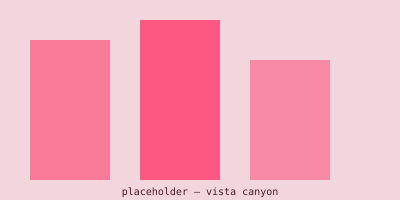

Questa pagina non è un contenuto: è il banco di prova. Ogni blocco ricco
supportato dagli articoli di Fields compare qui una volta, così una
regressione si vede a occhio.

## Grafico

```grafico
tipo: linea
x: ora
serie:
  - chiave: superficie
    etichetta: Superficie
riferimenti:
  - y: 40
    etichetta: Soglia
dati:
  - { ora: "2026-08-14T08:00", superficie: 24 }
  - { ora: "2026-08-14T10:00", superficie: 31 }
  - { ora: "2026-08-14T12:00", superficie: 42 }
  - { ora: "2026-08-14T14:00", superficie: 46 }
  - { ora: "2026-08-14T16:00", superficie: 39 }
  - { ora: "2026-08-14T18:00", superficie: 30 }
didascalia: Temperatura superficiale su travertino esposto a sud, numeri inventati.
```

## Immagine



## Video

[Video di prova](https://youtu.be/dQw4w9WgXcQ)

## LaTeX

Il fattore di vista pesa quanto una superficie contribuisce alla
temperatura radiante in un punto, $F_{p \to i}$, e la somma vale:

$$
T_{mrt} = \left[ \sum_{i=1}^{n} F_{p \to i} \cdot T_i^4 \right]^{1/4}
$$
