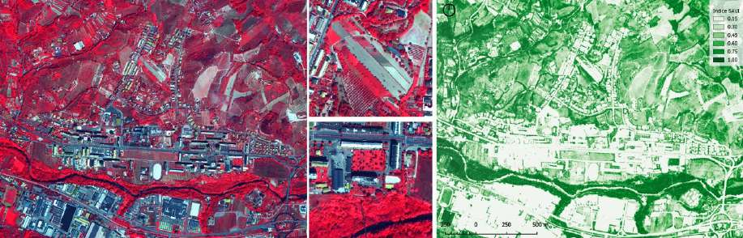
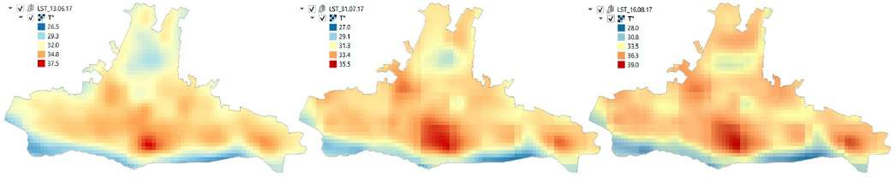
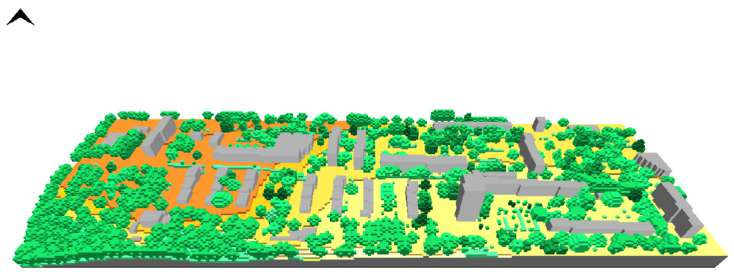
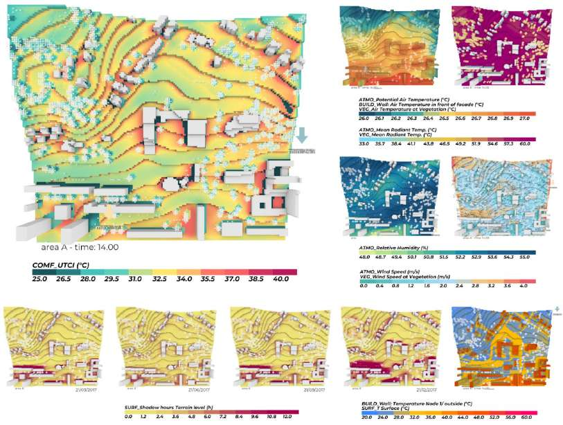

# Reading a neighbourhood's heat, from satellite to street

Monticelli is a district of about 8,000 inhabitants on the edge of Ascoli Piceno, designed in the 1970s by Leonardo Benevolo along the principles of the modern movement and never entirely completed. On its own it covers about an eighth of the artificial surface of the whole municipality, stretched along an east–west axis that residents perceive more as a place to pass through than as a centre. It is here that, with the University of Camerino's CCUHRE project, we tried to answer a concrete question: where, exactly, does a neighbourhood overheat, and who lives in those spots?

The difficulty is not measuring temperature. It is holding together two scales that usually stay separate. Urban risk maps are built at the neighbourhood scale, from satellite and census data, and stop there: they say *which* blocks are hotter, not *what* it feels like on a given street at a given hour. Microclimate simulations do the opposite — they reconstruct the thermal field street by street — but they are so computationally expensive that applying them to a whole neighbourhood is impractical. We put the two in sequence: the broad scale serves to choose where to look closely.

## From the neighbourhood scale to the street scale

We built a funnel-shaped pipeline (**Figure 1**). A first block of analysis in a GIS environment works on the whole neighbourhood and its peri-urban fringes, combining remote sensing, built-form morphology and demographic data into a single *Urban Risk Map*. From that map we extract the most critical portions of territory, and only on those do we run the detailed fluid-dynamic simulation. Remote sensing, in this scheme, is not the answer: it is the filter that keeps us from wasting weeks of computation on blocks that do not need it.

; in the centre, the intermediate outputs (surface and green atlases, thermal stress maps, socio-demographic survey); on the right, the three-dimensional model in Rhino taken into Grasshopper and simulated with ENVI-met for the comfort maps.")

## Reading the neighbourhood from the satellite

In the first step we build two "atlases" of the ground. From multispectral IKONOS imagery we compute the SAVI, a vegetation index that combines the near-infrared and red bands with a correction factor designed for sparsely vegetated terrain[^1]. The result is a continuous map from $-1$ to $1$ that separates the natural component from the anthropic one and lets us reclassify every surface as permeable or impermeable (**Figure 2**).

In parallel, from the thermal bands of the Landsat 8 satellite we derive the *land surface temperature*, the temperature of the "urban canopy" just above the average height of the buildings, for three hot days in the summer of 2017: 13 June, 31 July and 16 August. 2017 was the second-warmest year in the last fifty for the Marche region. The maps (**Figure 3**) show the same pattern on all three dates: the compact core of the neighbourhood and the large asphalted lots are consistently hotter than the cultivated fringes and the strip along the Tronto.

A one-metre-resolution digital surface model, obtained from a LiDAR survey, then feeds the morphological indicators we compute: the *sky view factor* — the fraction of sky visible from a point, proportional to the solar radiation reaching it but also to that point's ability to shed heat at night — and the solar radiation accumulated at ground level: the direct component over the winter quarter (December–February), the global component over the summer one (June–August).

## The risk map

All these layers converge on a grid of hexagons of about 350 m² each. To every hexagon we associate three families of parameters: the presence of vulnerable population (minors, elderly people, housing density, from the 2018 census), the climate data (radiation, surface temperature) and the urban morphology (sky view factor, green and surface atlases). Querying the database with logical operators, we isolate the hexagons above the "critical threshold" for each dimension (**Figure 4**).

 social, (b) thermal, (c) ratio between grey and green infrastructure. Where the three overlap — the central strip along the east–west axis — the risk concentrates.")

The overlay tells a coherent story: the central strip of the neighbourhood, along the east–west axis, is at once the most inhabited by fragile groups, the most impermeable and the poorest in trees. From this reading we extract three areas — we call them A, B and C — on which to bring the detailed simulation (**Figure 5**).

 and the three windows A, B and C taken into simulation. For each, above and to the side, the UTCI comfort-index map at 14:00: red marks the zones under heat stress.")

## The two engines and the reference day

The microclimate simulation is the quantitative heart of our work, and it is the part that deserves the most attention because it conditions every number in it. The engine is ENVI-met, a model dedicated to the urban microclimate that solves the wind field, the radiative exchanges and the heat balance of air, surfaces and vegetation on a three-dimensional grid — in the text we call it "CFD", even though it is not a general-purpose fluid-dynamic solver[^2].

The path from drawing to model goes through Grasshopper, Rhino's visual programming platform, and through the Morpho plugin, which translates the geometry into an ENVI-met model in a parametric, reversible way. We reconstructed the three areas as volumes on a cubic grid 3 metres on a side (**Figure 6**), with dimensions ranging from area A's 170 × 140 × 60 cells to area C's 250 × 78 × 70. To every horizontal surface and every volume we assign a material with its physical parameters: asphalt with an albedo of 0.20, grey concrete 0.50, light paving 0.80, and so on for some thirty entries between soils and tree species, the latter classified from aerial photos by height and canopy density.

The model needs 24 continuous hours of weather data. Here we use the "representative day" technique: instead of the climate average, we search the historical series for the real day whose hourly sequence departs least from all the other hot days in the period[^3]. For Ascoli Piceno that day is 26 June 2017, with an air-temperature peak of just 27 °C.

It must be said clearly how we handled calibration, because the project also included a network of low-cost sensors distributed across the neighbourhood and an app to collect the comfort perceived by residents. Those data did not have the accuracy needed to calibrate the climate scenario, and served mainly for citizen engagement. The simulation therefore rests entirely on the representative day derived from station data, not on a direct comparison between measurement and model in the three areas: it is a forced choice, but it is also the main limitation to keep in mind when reading the results.

## What the simulations say

We photograph the results at 14:00, the hottest hour, and for area A we gather them all into a single panel (**Figure 7**). The picture is that of a microclimate governed by the ground materials more than by the air temperature.

| Quantity (14:00) | Area A | Area B | Area C |
|---|---|---|---|
| Potential air temperature (°C) | 20.2–28.6 | 20.1–26.9 | 26.0–28.0 |
| Mean radiant temperature (°C) | 35.4–62.9 | 33.9–61.9 | 33.1–63.9 |
| Relative humidity (%) | 46.6–65.9 | 49.7–62.9 | 46.6–64.9 |
| Wind speed (m/s) | 0–2.2 | 0–3.2 | 0–2.8 |
| Surface temperature (°C) | 19.6–50.4 | 19.9–35.3 | 19.8–37.1 |

*Minimum and maximum values in the three simulated areas, at 14:00 (Table 5 of the original article).*

The air temperature moves little, between about 20 °C in open spaces and 28.6 °C in the dense built fabric. It is everything else that spreads out. Low-albedo surfaces — asphalt above all — reach 50.4 °C, while natural soils stay much cooler. The mean radiant temperature — the net radiation a still body exchanges with all the surfaces around it, which on the street weighs on comfort more than the air temperature does — drops below 34 °C only in the shade of trees and elsewhere rises to about 64 °C. The UTCI comfort index, which integrates air, radiation, humidity and wind, ranges from 23.8 to 37.1 °C across the three areas.

The gaps that matter for the project we quantify as follows: impermeable surfaces are about 8 °C hotter than permeable ones at peak hours; where tall vegetation is present, surface temperature drops as much as 12 °C below that of asphalt; in the most built-up zones the wind speed halves, which further worsens comfort. Near the Tronto the perceived temperature exceeds 35 °C, but because of the high humidity, not the radiation.

## When the shape of the data misleads

The most instructive part concerns the points where the method shows its limits. Some agricultural areas turn out to be "at risk" and are treated as impermeable only because, on the day the satellite took the image, the fields were ploughed and bare of crops: the SAVI reads them as bare soil. We acknowledge this, and for the future it is worth limiting the assessment to urbanised areas only, associating each hexagon with its actual land use before querying the database. There is also a temporal mismatch that weighs on the green atlas: the IKONOS image from which the SAVI is derived is from 11 August 2006, eleven years before the 2017 thermal analyses[^4].

The simulation results are not uniform either. Area C behaves differently from the other two: its air temperature stays compressed between 26 and 28 °C, without the cool zones that in A and B drop towards 20 °C. It is an area that starts out already hot and has no outlets, a profile that a reading at the neighbourhood scale alone would not have distinguished from the others.

## What we take from it

The value of the work is not a number, it is an order of operations. Starting from remote sensing to build a risk map, using it to choose three windows, and only there spending the computational cost of a microclimate simulation: it is a way to get to telling a designer *where* to intervene — on which paving, with which trees, rethinking which built frontages — before redesigning anything. The pipeline is reusable on other neighbourhoods with the same open data.

Two explicit open worksites remain. The first is calibration: the sensor network must be brought to a level of reliability that allows a real comparison between measurement and simulation in the critical areas. The second is the move from the scenario to the alternative scenario — testing in simulation the desealing of the lots, micro-forestation, high-reflectance materials — to measure how much each move shifts the UTCI, and not only how much it shifts the air temperature.

---

**Bibliographic reference**
R. Cocci Grifoni, G. Caprari, G. E. Marchesani, *Combinative Study of Urban Heat Island in Ascoli Piceno City with Remote Sensing and CFD Simulation — Climate Change and Urban Health Resilience — CCUHRE Project*, Sustainability 14 (2022) 688. <https://doi.org/10.3390/su14020688>

**Data and code availability**
The data presented in the study are available on request. No code or model repository is published. The research was funded by the University of Camerino under the FAR CCUHRE project (2018–2021).

**Short glossary**

- *Urban heat island*: the systematic overheating of an urbanised area relative to the surrounding countryside, due to materials that store radiation, the scarcity of vegetation and reduced ventilation.
- *Remote sensing*: the measurement of properties of the Earth's surface from a distance, by satellite or aircraft, through the radiation that surfaces reflect or emit in different bands of the spectrum.
- *SAVI*: a vegetation index computed from satellite bands (near-infrared and red), with a correction for sparsely vegetated terrain; it distinguishes natural surfaces from built ones.
- *Land surface temperature (LST)*: the temperature of the ground surface and of roofs, derived from the satellite's thermal bands; different from air temperature.
- *Sky view factor (SVF)*: the fraction of the celestial vault visible from a point, between 0 and 1; it governs both the solar radiation reaching it by day and its ability to cool by radiation at night.
- *Mean radiant temperature (MRT)*: the net radiation a still body exchanges with all the surrounding surfaces; in a sunlit open space it is the factor that weighs most on comfort, more than air temperature.
- *UTCI*: a thermal-stress index that combines air temperature, mean radiant temperature, humidity and wind into a single perceived-temperature scale.
- *ENVI-met, Grasshopper, Morpho*: respectively the urban microclimate simulation model, the Rhino parametric platform used to prepare the geometry, and the plugin that makes them talk to each other.
- *Representative day*: the real day in the historical series whose hourly sequence departs least from all the other days in the period considered; used as weather input in place of the climate average.

[^1]: $\text{SAVI} = \dfrac{(\text{NIR} - \text{RED})}{(\text{NIR} + \text{RED} + L)} \times (1 + L)$, with $L = 0.5$ from the literature, a value meant to reduce the influence of the atmosphere on the luminosity of the land in sparsely vegetated areas.

[^2]: ENVI-met solves the air motion field with a fluid-dynamic core, but it is a model dedicated to the urban microclimate, not a general-purpose CFD solver. In the original article "CFD" and "thermal fluid dynamics" are used as synonyms for "ENVI-met simulation".

[^3]: Representative-day technique (Tirabassi and Nassetti, 1999): among the "hot" days — those with a mean daytime temperature above 25 °C over the last five years — the one is chosen that minimises the sum of the hourly squared differences relative to all the others. The model is fed the temperature, humidity, wind speed and direction and shortwave and longwave radiation of the 24 hours of that day.

[^4]: The IKONOS image is dated 11 August 2006 (caption of the corresponding original figure), whereas the surface-temperature analyses and the morphological indices refer to 2017. The neighbourhood is consolidated and has low building turnover, but tree cover may have changed in eleven years.

$$$

# Leggere il calore di un quartiere, dal satellite alla strada

Monticelli è un quartiere di circa 8.000 abitanti alle porte di Ascoli Piceno, disegnato negli anni Settanta da Leonardo Benevolo sui principi del movimento moderno e mai completato del tutto. Da solo occupa circa un ottavo della superficie artificiale dell'intero comune, disteso lungo un asse est-ovest che i residenti percepiscono più come un luogo di attraversamento che come un centro. È qui che, con il progetto CCUHRE dell'Università di Camerino, abbiamo provato a rispondere a una domanda concreta: dove, esattamente, un quartiere si surriscalda, e chi ci abita in quei punti?

La difficoltà non è misurare la temperatura. È tenere insieme due scale che di solito restano separate. Le mappe di rischio urbano si costruiscono a scala di quartiere, con dati satellitari e censuari, e si fermano lì: dicono *quali* isolati sono più caldi, non *come* si sta in una certa strada a una certa ora. Le simulazioni microclimatiche fanno l'opposto — ricostruiscono il campo termico via per via — ma sono così onerose da calcolo che applicarle a un quartiere intero è impraticabile. Abbiamo messo le due cose in fila: la scala larga serve a scegliere dove guardare da vicino.

## Dalla scala del quartiere a quella della strada

Abbiamo costruito un impianto a imbuto (**Figura 1**). Un primo blocco di analisi in ambiente GIS lavora su tutto il quartiere e le sue frange peri-urbane, incrociando telerilevamento, morfologia del costruito e dati demografici in un'unica *Urban Risk Map*. Da quella mappa estraiamo le porzioni di territorio più critiche, e solo su quelle facciamo girare la simulazione fluidodinamica di dettaglio. Il telerilevamento, in questo schema, non è la risposta: è il filtro che ci impedisce di sprecare settimane di calcolo su isolati che non ne hanno bisogno.

; al centro gli output intermedi (atlanti delle superfici e del verde, mappe di stress termico, indagine socio-demografica); a destra il modello tridimensionale in Rhino portato in Grasshopper e simulato con ENVI-met per le mappe di comfort.")

## Leggere il quartiere dal satellite

Nel primo passaggio costruiamo due "atlanti" del suolo. Da immagini multispettrali IKONOS calcoliamo il SAVI, un indice di vegetazione che combina la banda del vicino infrarosso e quella del rosso con un fattore correttivo pensato per i terreni a copertura vegetale scarsa[^1]. Il risultato è una mappa continua da $-1$ a $1$ che distingue la componente naturale da quella antropica e permette di riclassificare ogni superficie come permeabile o impermeabile (**Figura 2**).

In parallelo, dalle bande termiche del satellite Landsat 8 ricaviamo la *land surface temperature*, la temperatura della "volta urbana" appena sopra la quota media degli edifici, per tre giornate calde dell'estate 2017: 13 giugno, 31 luglio e 16 agosto. Il 2017 è stato per le Marche il secondo anno più caldo degli ultimi cinquanta. Le mappe (**Figura 3**) mostrano lo stesso pattern nelle tre date: il nucleo compatto del quartiere e i grandi piazzali asfaltati sono costantemente più caldi delle frange coltivate e della fascia lungo il Tronto.

Un modello digitale delle superfici a un metro di risoluzione, ottenuto da rilievo LiDAR, alimenta poi gli indicatori morfologici che calcoliamo: lo *sky view factor* — la frazione di cielo visibile da un punto, proporzionale alla radiazione solare che vi arriva ma anche alla capacità di quel punto di disperdere calore di notte — e la radiazione solare accumulata al livello del suolo: quella diretta nel trimestre invernale (dicembre–febbraio), quella globale in quello estivo (giugno–agosto).

## La mappa del rischio

Tutti questi strati confluiscono in una griglia di esagoni di circa 350 m² ciascuno. A ogni esagono associamo tre famiglie di parametri: la presenza di popolazione vulnerabile (minori, anziani, densità abitativa, dal censimento 2018), i dati climatici (radiazione, temperatura superficiale) e la morfologia urbana (sky view factor, atlanti del verde e delle superfici). Interrogando il database con operatori logici isoliamo gli esagoni sopra la "soglia critica" per ciascuna dimensione (**Figura 4**).

 sociale, (b) termica, (c) rapporto tra infrastrutture grigie e verdi. Dove le tre si sovrappongono — la fascia centrale lungo l'asse est-ovest — si concentra il rischio.")

La sovrapposizione racconta una storia coerente: la fascia centrale del quartiere, lungo l'asse est-ovest, è insieme la più abitata da gruppi fragili, la più impermeabile e la più povera di alberi. Da questa lettura estraiamo tre aree — le chiamiamo A, B e C — su cui portare la simulazione di dettaglio (**Figura 5**).

 e le tre finestre A, B e C portate in simulazione. Per ognuna, in alto e a lato, la mappa dell'indice di comfort UTCI alle 14:00: il rosso segna le zone in stress da caldo.")

## I due motori e il giorno di riferimento

La simulazione microclimatica è il cuore quantitativo del nostro lavoro, ed è la parte che merita più attenzione perché ne condiziona ogni numero. Il motore è ENVI-met, un modello dedicato al microclima urbano che risolve il campo di vento, gli scambi radiativi e il bilancio termico di aria, superfici e vegetazione su una griglia tridimensionale — nel testo lo chiamiamo "CFD", anche se non è un solutore fluidodinamico generico[^2].

Il percorso dal disegno al modello passa per Grasshopper, la piattaforma di programmazione visuale di Rhino, e per il plugin Morpho, che traduce la geometria in un modello ENVI-met in modo parametrico e reversibile. Abbiamo ricostruito le tre aree in volumi su una griglia cubica di 3 metri di lato (**Figura 6**), con dimensioni che vanno dalle 170 × 140 × 60 celle dell'area A alle 250 × 78 × 70 dell'area C. A ogni superficie orizzontale e a ogni volume assegniamo un materiale con i suoi parametri fisici: l'asfalto con albedo 0,20, il calcestruzzo grigio 0,50, la pavimentazione chiara 0,80, e così via per una trentina di voci tra suoli e specie arboree, queste ultime classificate dalle foto aeree per altezza e densità di chioma.

Il modello ha bisogno di 24 ore continue di dati meteo. Qui usiamo la tecnica del "giorno rappresentativo": invece della media climatica, cerchiamo nella serie storica il giorno reale la cui sequenza oraria si discosta meno da tutti gli altri giorni caldi del periodo[^3]. Per Ascoli Piceno quel giorno è il 26 giugno 2017, con un picco di temperatura dell'aria di appena 27 °C.

Va detto con chiarezza come abbiamo gestito la calibrazione, perché il progetto prevedeva anche una rete di sensori low-cost distribuiti nel quartiere e un'app per raccogliere il comfort percepito dai residenti. Quei dati non avevano l'accuratezza necessaria per calibrare lo scenario climatico, e sono serviti soprattutto all'ingaggio dei cittadini. La simulazione poggia quindi interamente sul giorno rappresentativo ricavato dai dati di stazione, non su un confronto diretto tra misura e modello nelle tre aree: è una scelta obbligata, ma è anche il limite principale da tenere presente leggendo i risultati.

## Cosa dicono le simulazioni

Fotografiamo i risultati alle 14:00, l'ora più calda, e per l'area A li raccogliamo tutti in un unico quadro (**Figura 7**). Il quadro è quello di un microclima governato dai materiali del suolo più che dalla temperatura dell'aria.

| Grandezza (ore 14:00) | Area A | Area B | Area C |
|---|---|---|---|
| Temperatura potenziale dell'aria (°C) | 20,2–28,6 | 20,1–26,9 | 26,0–28,0 |
| Temperatura media radiante (°C) | 35,4–62,9 | 33,9–61,9 | 33,1–63,9 |
| Umidità relativa (%) | 46,6–65,9 | 49,7–62,9 | 46,6–64,9 |
| Velocità del vento (m/s) | 0–2,2 | 0–3,2 | 0–2,8 |
| Temperatura superficiale (°C) | 19,6–50,4 | 19,9–35,3 | 19,8–37,1 |

*Valori minimi e massimi nelle tre aree simulate, alle 14:00 (Tabella 5 dell'articolo originale).*

La temperatura dell'aria si muove poco, tra circa 20 °C negli spazi aperti e 28,6 °C nel costruito denso. È tutto il resto a divaricarsi. Le superfici a bassa albedo — l'asfalto, sopra ogni altra cosa — arrivano a 50,4 °C, mentre i suoli naturali restano molto più freschi. La temperatura media radiante, cioè la radiazione netta che un corpo fermo scambia con tutte le superfici intorno e che in strada pesa sul comfort più della temperatura dell'aria, scende sotto i 34 °C solo all'ombra degli alberi e altrove sale fino a circa 64 °C. L'indice di comfort UTCI, che integra aria, radiazione, umidità e vento, va da 23,8 a 37,1 °C nelle tre aree.

Gli scarti che contano per il progetto li quantifichiamo così: le superfici impermeabili sono circa 8 °C più calde di quelle permeabili nelle ore di picco; dove c'è vegetazione d'alto fusto la temperatura superficiale scende fino a 12 °C sotto quella dell'asfalto; nelle zone più costruite la velocità del vento si dimezza, il che peggiora ulteriormente il comfort. Vicino al Tronto la temperatura percepita supera i 35 °C, ma per l'umidità elevata, non per la radiazione.

## Quando la forma del dato inganna

La parte più istruttiva riguarda i punti in cui il metodo mostra la corda. Alcune aree agricole risultano "a rischio" e vengono trattate come impermeabili solo perché, il giorno in cui il satellite ha ripreso l'immagine, i campi erano arati e privi di colture: il SAVI li legge come suolo nudo. Lo riconosciamo, e per il futuro conviene limitare la valutazione alle sole aree urbanizzate, associando a ogni esagono la destinazione d'uso reale prima di interrogare il database. C'è poi uno sfasamento temporale che pesa sull'atlante del verde: l'immagine IKONOS da cui si ricava il SAVI è dell'11 agosto 2006, undici anni prima delle analisi termiche del 2017[^4].

Anche i risultati delle simulazioni non sono uniformi. L'area C si comporta diversamente dalle altre due: la sua temperatura dell'aria resta compressa tra 26 e 28 °C, senza le zone fresche che in A e B scendono verso i 20 °C. È un'area che parte già calda e non ha punti di sfogo, un profilo che una lettura solo a scala di quartiere non avrebbe distinto dalle altre.

## Cosa se ne ricava

Il valore del lavoro non è un numero, è un ordine di operazioni. Partire dal telerilevamento per costruire una mappa di rischio, usarla per scegliere tre finestre, e solo lì spendere il costo di calcolo di una simulazione microclimatica: è un modo per arrivare a dire a un progettista *dove* intervenire — su quali pavimentazioni, con quali alberi, ripensando quali fronti costruiti — prima di riprogettare qualcosa. La pipeline è riutilizzabile su altri quartieri con gli stessi dati aperti.

Restano due cantieri aperti espliciti. Il primo è la calibrazione: la rete di sensori va portata a un livello di affidabilità che permetta un confronto vero tra misura e simulazione nelle aree critiche. Il secondo è il passaggio dallo scenario allo scenario alternativo — testare in simulazione la desigillazione dei piazzali, la micro-forestazione, i materiali ad alta riflettanza — per misurare quanto ciascuna mossa sposti l'UTCI, e non solo quanto sposti la temperatura dell'aria.

---

**Riferimento bibliografico**
R. Cocci Grifoni, G. Caprari, G. E. Marchesani, *Combinative Study of Urban Heat Island in Ascoli Piceno City with Remote Sensing and CFD Simulation — Climate Change and Urban Health Resilience — CCUHRE Project*, Sustainability 14 (2022) 688. <https://doi.org/10.3390/su14020688>

**Disponibilità di dati e codice**
I dati presentati nello studio sono disponibili su richiesta. Non è pubblicato un repository di codice o di modelli. La ricerca è stata finanziata dall'Università di Camerino nell'ambito del progetto FAR CCUHRE (2018–2021).

**Piccolo glossario**

- *Isola di calore urbana (urban heat island)*: il sovrariscaldamento sistematico di un'area urbanizzata rispetto alle campagne circostanti, dovuto ai materiali che accumulano radiazione, alla scarsità di vegetazione e alla ridotta ventilazione.
- *Telerilevamento (remote sensing)*: la misura di grandezze della superficie terrestre a distanza, da satellite o aereo, tramite la radiazione che le superfici riflettono o emettono in diverse bande dello spettro.
- *SAVI*: indice di vegetazione calcolato da bande satellitari (vicino infrarosso e rosso), con una correzione per i terreni poco vegetati; distingue le superfici naturali da quelle costruite.
- *Land surface temperature (LST)*: la temperatura della superficie del terreno e delle coperture, ricavata dalle bande termiche del satellite; diversa dalla temperatura dell'aria.
- *Sky view factor (SVF)*: la frazione di volta celeste visibile da un punto, tra 0 e 1; governa sia la radiazione solare che vi arriva di giorno sia la capacità di raffreddarsi per irraggiamento di notte.
- *Temperatura media radiante (MRT)*: la radiazione netta che un corpo fermo scambia con tutte le superfici circostanti; in uno spazio aperto assolato è il fattore che pesa di più sul comfort, più della temperatura dell'aria.
- *UTCI*: indice di stress termico che combina temperatura dell'aria, temperatura media radiante, umidità e vento in un'unica scala di temperatura percepita.
- *ENVI-met, Grasshopper, Morpho*: rispettivamente il modello di simulazione del microclima urbano, la piattaforma parametrica di Rhino usata per preparare la geometria, e il plugin che le fa dialogare.
- *Giorno rappresentativo*: il giorno reale della serie storica la cui sequenza oraria si discosta meno da tutti gli altri giorni del periodo considerato; usato come input meteo al posto della media climatica.

[^1]: $\text{SAVI} = \dfrac{(\text{NIR} - \text{RED})}{(\text{NIR} + \text{RED} + L)} \times (1 + L)$, con $L = 0{,}5$ secondo la letteratura, valore pensato per ridurre l'influenza dell'atmosfera sulla luminosità del terreno nelle aree a vegetazione rada.

[^2]: ENVI-met risolve il campo di moto dell'aria con un nucleo fluidodinamico, ma è un modello dedicato al microclima urbano, non un solutore CFD generalista. Nell'articolo originale "CFD" e "thermal fluid dynamics" sono usati come sinonimi di "simulazione con ENVI-met".

[^3]: Tecnica del giorno rappresentativo (Tirabassi e Nassetti, 1999): tra i giorni "caldi" — quelli con temperatura media diurna sopra i 25 °C negli ultimi cinque anni — si sceglie quello che minimizza la somma degli scarti quadratici orari rispetto a tutti gli altri. Vengono immessi nel modello temperatura, umidità, velocità e direzione del vento e radiazione a onda corta e lunga delle 24 ore di quel giorno.

[^4]: L'immagine IKONOS è datata 11 agosto 2006 (didascalia della figura originale corrispondente), mentre le analisi di temperatura superficiale e gli indici morfologici si riferiscono al 2017. Il quartiere è consolidato e a bassa dinamica edilizia, ma la copertura arborea può essere cambiata in undici anni.
