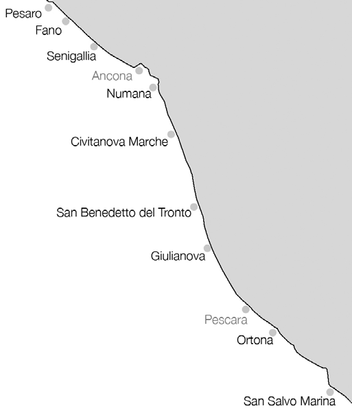
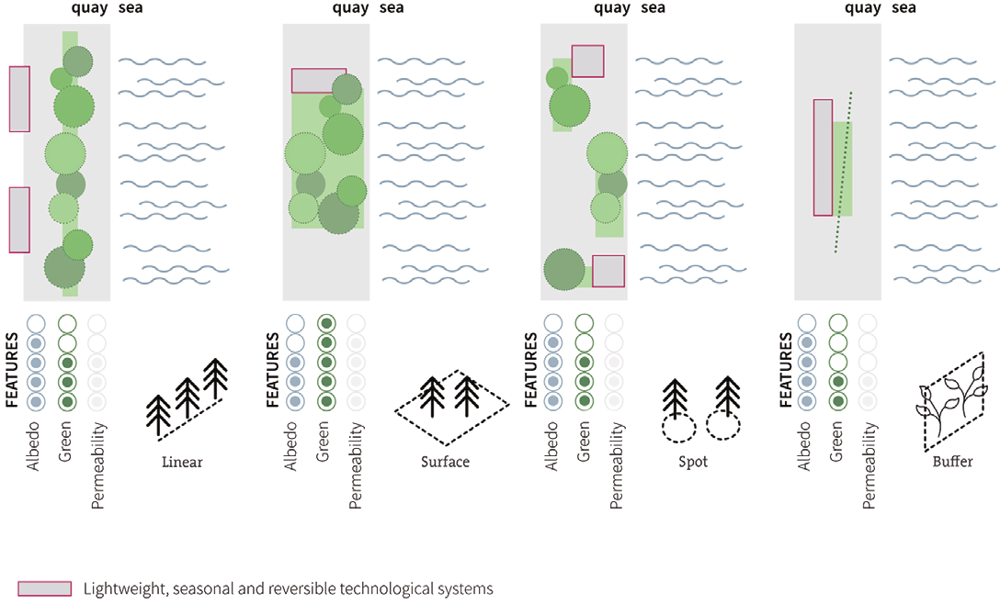
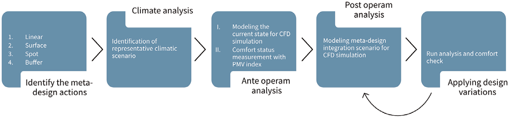
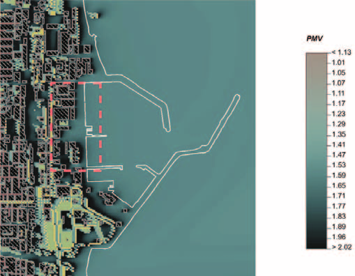

## Micro-forestry, tested on an Adriatic port

---

# La micro-forestazione urbana, misurata su un porto adriatico

$$$

# La micro-forestazione urbana, misurata su un porto adriatico

Il Mediterraneo si scalda circa il 20 % più in fretta della media globale, e le sue acque superficiali arrivano a stare 2 °C sopra le rilevazioni storiche. Sulla costa del medio Adriatico questo dato incontra un tipo di luogo molto preciso: i porti delle città minori — Pesaro, Fano, Senigallia, Civitanova Marche, San Benedetto del Tronto, Giulianova, Ortona[^1] — strisce di suolo demaniale incastrate tra l'abitato e l'acqua, quasi tutte asfaltate, usate intensamente d'estate e semi-abbandonate d'inverno. Ci siamo chiesti se una forma leggera e reversibile di inverdimento — quella che chiamiamo micro-forestazione urbana — possa migliorare in modo misurabile il comfort estivo di uno di questi porti, e abbiamo costruito un flusso di simulazione per verificarlo su un'ipotesi di progetto reale: il porto di San Benedetto del Tronto.

## Nove porti con lo stesso problema

I porti minori del medio Adriatico si somigliano molto. Sono ambiti di categoria II, di competenza prevalentemente regionale, e condividono un morfotipo insediativo ricorrente: attrezzature per pesca e turismo, un'offerta capillare di approdi, un tessuto urbano che arriva fin quasi alla banchina (**Figura 1**). Sono anche accomunati da una stagionalità netta: la popolazione costiera aumenta in modo consistente nei mesi caldi, e proprio quando la città ha più bisogno dei suoi spazi aperti il discomfort da caldo si prolunga anche nei mesi finora considerati di semplice transito stagionale.

I dati di rischio vengono dal progetto INTERREG Italia-Croazia Joint_SECAP, che per le città del medio Adriatico italiano ricostruisce catene di impatto: precipitazioni estreme e grandine che si traducono in allagamenti e dilavamento; innalzamento del livello del mare ed erosione costiera; periodi secchi prolungati con temperature elevate che portano a siccità e incendi. Lo studio si concentra sull'ultima famiglia — caldo, isola di calore urbana, giorni consecutivi senza pioggia — perché è quella che si manifesta nella stagione di massima pressione antropica.

## San Benedetto del Tronto: asfalto e niente ombra

San Benedetto del Tronto, 47.500 abitanti sulla costa meridionale delle Marche, è uno dei centri balneari più noti d'Italia e vede oscillazioni forti della pressione antropica tra inverno ed estate. La sua area portuale, rilevata superficie per superficie, è quasi interamente minerale: l'asfalto da solo copre il 27 % dell'area, le superfici di calpestio effettive sono in pratica tutte asfaltate, a basso coefficiente di albedo, gli edifici sono in laterizio intonacato o pannelli sandwich e le coperture sono piane con guaina bituminosa (**Figura 2**). Il verde è minimo e concentrato in un'unica sacca a ridosso del porto, il che rende l'intera zona fortemente impermeabile.

 portano la quota impermeabile e a basso albedo a dominare le aree effettivamente calpestabili.")

La vegetazione racconta la stessa cosa da un altro lato (**Figura 3**). La copertura arborea è trascurabile: di quel poco che c'è, quasi il 70 % sono conifere di circa 9 metri e un altro quinto è bassa erba, con poche alberature mature isolate. L'area portuale resta così largamente esposta alla radiazione solare, senza schermature. Dalle analisi ante operam questo si traduce in uno spazio aperto inospitale nelle ore centrali della giornata calda — il punto di partenza che le meta-azioni provano a spostare.

 sono presenze isolate sotto il 2 % ciascuna.")

## Quattro meta-azioni di micro-forestazione

La micro-forestazione urbana condivide gli obiettivi della forestazione urbana strutturata, ma con tempi più rapidi, spazi più circoscritti, manutenzione e costi di esercizio ridotti ed eventuale reversibilità: una *NbS agile*. Lo studio la declina in quattro meta-azioni progettuali, integrabili tra loro, tutte fondate sulla riduzione delle superfici impermeabili e sulla loro riconversione in elementi termofisicamente più adatti al contesto (**Figura 4**):

- **Linear** — una fascia parallela allo sviluppo longitudinale del porto: de-sealing, filari di alberi e arbusti, siepi, pareti verdi, pergole verdi lungo gli assi portuali.
- **Surface** — aree a prato fruibile, micro-boschi, tetti verdi, tappeti di erbacee, con una parte di superficie dedicata alla raccolta e allo stoccaggio temporaneo dell'acqua piovana.
- **Spot** — piccole superfici permeabili diffuse con alberature puntuali, pocket garden, green corner, piantumazioni isolate che non formano una chioma continua.
- **Buffer** — quinte verdi schermanti che configurano spazi aperti in modalità protetta e funzionano da filtro climatico, modulando il gradiente termico verso lo spazio interno.

L'idea di sfondo è usare la banchina come area di sosta pedonale e ciclabile protetta, dotata di elementi temporanei, leggeri e reversibili, agganciando la trasformazione a un'infrastruttura che già esiste.

## Come abbiamo simulato

Tutto il processo vive dentro un'unica piattaforma parametrica costruita su Grasshopper, che genera algoritmi proprietari e permette un controllo ricorsivo su ogni passaggio. Il flusso ha una sequenza precisa (**Figura 5**).

Si parte dal clima. Da almeno cinque anni di dati meteoclimatici del sito si ricava un *giorno rappresentativo*[^2]: un giorno reale che sintetizza le condizioni estive dell'area, individuato con un algoritmo dedicato. Gli andamenti annuali di temperatura e di umidità e copertura nuvolosa, e le crono-mappe di temperatura e umidità con direzione e intensità del vento, alimentano questa selezione.

Le condizioni al contorno così ottenute alla macro-scala vengono poi portate alla micro-scala del contesto urbano localizzato con strumenti di analisi termofluidodinamica — un software CFD, ENVI-met — che restituisce lo stato ante operam. Le meta-azioni vengono quindi modellate e inserite nell'area di studio per definire lo stato post operam, applicando le stesse condizioni ambientali: i due stati sono così direttamente confrontabili.

L'indice di comfort è il PMV, il Predicted Mean Vote della norma UNI EN ISO 7730:2006[^3]: un valore adimensionale che va da −3 (molto freddo) a +3 (molto caldo), con lo zero come neutralità, e che combina in un unico numero temperatura dell'aria, temperatura media radiante, umidità e velocità del vento. Un secondo indicatore misura in metri quadri l'aumento di superficie permeabile.

L'ultimo passaggio è un anello: si esegue la simulazione, si verifica il comfort, si variano quantitativamente i parametri della meta-azione e si ripete, per ottimizzare la soluzione o, se non risponde alle attese, escluderla. Va detto con chiarezza che questo studio si ferma alla simulazione: non c'è una validazione sperimentale sul campo, e la semplificazione della complessità urbana è una scelta deliberata per tenere scorrevole il flusso di lavoro.

## Il confronto ante e post operam

I risultati quantificati riguardano la meta-azione Linear, nel giorno rappresentativo caldo, a tre ore della giornata. Sono in **Tabella 1**.

*Dati simulati per la meta-azione Linear nel giorno rappresentativo caldo, prima e dopo l'intervento.*

| Ora | Temp. aria ante | Temp. aria post | Umidità ante | Umidità post | PMV ante | PMV post |
|---|---|---|---|---|---|---|
| 8:00 | 19,6 °C | 19,4 °C | 66,7 % | 67,3 % | 0,7 | 0,7 |
| 14:00 | 24,8 °C | 24,8 °C | 69,7 % | 70,1 % | 1,5 | 0,9 |
| 18:00 | 20,1 °C | 20,0 °C | 70,3 % | 70,6 % | 1,1 | 0,6 |

La temperatura dell'aria non si muove: al massimo 0,2 °C, e a metà pomeriggio resta identica. L'umidità sale di qualche decimo di punto — il verde traspira. Il guadagno è tutto nel PMV, e solo nelle ore centrali: invariato alle 8:00, cala di 0,6 alle 14:00 (da 1,5 a 0,9) e di 0,5 alle 18:00 (da 1,1 a 0,6).[^4] In pratica, nelle ore peggiori la fascia alberata sposta la banchina da una sensazione tra il tiepido e il caldo verso la neutralità.

Il meccanismo non è il raffrescamento dell'aria. È l'ombra, che abbassa la temperatura media radiante, e la schermatura del vento: sono i due termini del PMV su cui una massa verde di questa scala incide davvero. Le mappe lo mostrano a colpo d'occhio — lo stato ante operam ha PMV che sale verso 2,0 in gran parte dell'area (**Figura 6**), quello post operam resta sotto 1,5 (**Figura 7**).

. La scala si ferma intorno a 1,5 e i valori più alti si concentrano sul fronte costruito.")

## Quello che il modello non dice

Il numero forte — meno 0,6 di PMV nelle ore centrali — va letto per quello che è. È simulato, non misurato: lo studio non include rilievi in situ, e sono gli stessi autori a indicare come passo successivo il monitoraggio dal vero, con misure sulla banchina e interviste sistematiche alla comunità locale.

Solo la meta-azione Linear è quantificata nella tabella pubblicata; Surface, Spot e Buffer restano descritte qualitativamente. Il confronto è su un solo giorno rappresentativo e su un solo sito: non è una media stagionale né pluriennale, anche se il metodo del giorno rappresentativo nasce proprio per essere indicativo della stagione. La complessità urbana è semplificata di proposito. E lo studio non affronta la fattibilità sociale, economica e amministrativa dell'uso di suolo demaniale portuale, che gli autori segnalano come nodo strategico.

Infine l'effetto quasi nullo sulla temperatura dell'aria non è un difetto del risultato: dice che a questa scala la micro-forestazione è uno strumento di comfort e di gestione dell'acqua, non di raffrescamento dell'aria.

## Cosa se ne ricava

Una fascia leggera di alberi lungo una banchina, reversibile e poco costosa da mantenere, non raffredda l'aria del porto di San Benedetto — ma nelle ore centrali porta il PMV da circa 1,5 a circa 0,9, più o meno la differenza tra cercare l'ombra e restare dove si è. Per un porto di categoria II, su suolo pubblico che c'è già, è una prima mossa a basso impegno: calcolabile in simulazione prima di posare qualsiasi cosa, e rimovibile se rende meno del previsto. La domanda che lo studio lascia aperta è se quel guadagno modellato regga il contatto con un agosto reale, ed è per questo che il passo successivo sono gli strumenti sulla banchina, non un'altra simulazione.

---

**Riferimento bibliografico**
R. Cocci Grifoni, T. D. Brownlee, G. E. Marchesani, M. F. Ottone, *La micro-forestazione urbana per l'adattamento climatico nei porti minori del medio Adriatico / Urban micro-forestry for climate adaptation in the smaller ports of the mid-Adriatic Sea*, AGATHÓN – International Journal of Architecture, Art and Design, n. 11 (2022) 172-181. <https://doi.org/10.19229/2464-9309/11152022>

**Disponibilità di dati e codice**
Lo studio non dichiara un repository di codice pubblico. I dati di rischio e vulnerabilità climatica provengono dal progetto INTERREG Italia-Croazia Joint_SECAP (deliverable D.3.2.2, «Risk and vulnerability analysis of the INTERREG Joint_SECAP project target areas»), <https://joint-secap.unicam.it>.

**Piccolo glossario**

- *Micro-forestazione urbana*: inserimento di dispositivi verdi leggeri, spesso temporanei e reversibili, con tempi di attuazione rapidi e manutenzione ridotta; una forma "agile" di soluzione basata sulla natura.
- *Nature-based solutions (NbS)*: interventi che usano processi ed elementi naturali per affrontare problemi ambientali urbani, dal calore alla gestione delle acque.
- *PMV (Predicted Mean Vote)*: indice di comfort termico adimensionale, da −3 a +3, che combina temperatura dell'aria, temperatura media radiante, umidità e vento; zero è la neutralità.
- *Temperatura media radiante*: la radiazione netta che un corpo scambia con tutte le superfici circostanti; in uno spazio aperto assolato pesa sul comfort più della temperatura dell'aria.
- *Giorno rappresentativo*: un giorno reale, estratto da anni di serie meteoclimatiche con un algoritmo dedicato, che sintetizza le condizioni estive tipiche di un sito.
- *Ante operam / post operam*: lo stato dell'area prima e dopo l'inserimento delle meta-azioni progettuali, simulati con le stesse condizioni ambientali per essere confrontabili.

[^1]: L'elenco completo dei porti considerati è Pesaro, Fano, Senigallia, Numana, Civitanova Marche, San Benedetto del Tronto, Giulianova, Ortona e San Salvo Marina: scali di categoria II e di prevalente competenza regionale ai sensi dell'art. 4 della Legge 84/1994. Ancona e Pescara, scali maggiori, restano fuori.

[^2]: Il metodo del giorno rappresentativo è quello di Tirabassi e Nassetti (1999) nell'implementazione di Cocci Grifoni et alii (2012). La finestra di dati è di almeno cinque anni; il riferimento locale usato nello studio è l'annata 2018 di San Benedetto del Tronto, in un contesto in cui l'ISPRA indica il 2019 come terzo anno più caldo dal 1961, dopo il 2018 e il 2015.

[^3]: UNI EN ISO 7730:2006, *Ergonomia degli ambienti termici — Determinazione analitica e interpretazione del benessere termico mediante il calcolo degli indici PMV e PPD e dei criteri di benessere termico locale*.

[^4]: Il testo del paper descrive anche una diminuzione del PMV «da circa 0,30 a 0,50» legata all'operazione di downscaling dalla macro alla micro-scala, mentre l'effetto dell'intervento riportato nella Tabella 2 raggiunge 0,6 alle 14:00. Le due grandezze non sono pienamente riconciliate nel testo: qui il calo dell'intervento è descritto sui valori della tabella (0,5-0,6 punti nelle ore centrali).
