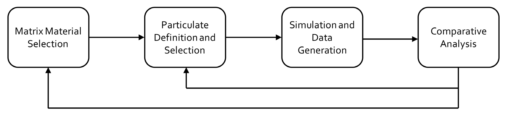
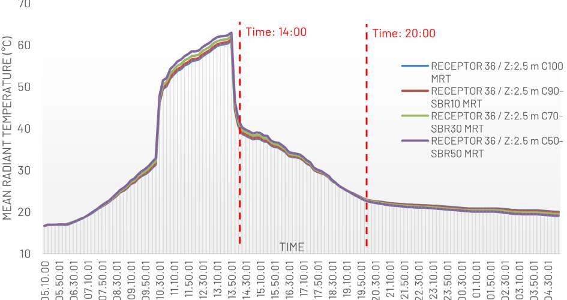

## Waste in the mix, and what changes in the street

---

# Scarti nell'impasto, e cosa cambia nella strada

$$$

# Scarti nell'impasto, e cosa cambia nella strada

Il settore delle costruzioni pesa per circa il 40 % delle emissioni di CO₂ annuali, e la sola produzione di cemento ne vale l'8 %. Il calcestruzzo e l'asfalto che generano quelle emissioni sono anche i materiali che, per la loro alta massa termica, tengono calda una strada molto dopo il tramonto: assorbono radiazione tutto il giorno e la restituiscono di notte, alimentando l'isola di calore urbana, cioè la differenza di temperatura — spesso di diversi gradi — tra un quartiere denso e la campagna intorno (**Figura 1**). Lo stesso materiale sta quindi a monte di due problemi.

La domanda di questo studio è se si possano affrontare insieme. Abbiamo usato un selettore di materiali, il CES GRANTA, per progettare al computer alcune formulazioni di calcestruzzo che incorporano scarti difficili da riciclare — PET (il polietilene tereftalato delle bottiglie), SBR (la gomma stirene-butadiene degli pneumatici) e vetro da finestra macinato — e abbiamo poi verificato in una simulazione microclimatica se questi compositi migliorano davvero il comfort di chi cammina nella strada, o se lo fanno solo sulla carta.

 di giorno sale di diversi gradi sul costruito denso e ricade su verde e acqua; la temperatura dell'aria (tratteggiate) segue lo stesso andamento, più smorzato. Di notte il divario superficiale si riduce ma non si annulla.")

## Un composito è una matrice più un riempitivo

Un materiale composito nasce dall'unione di due o più materiali diversi per ottenere una proprietà che nessuno dei due ha da solo. In quello che ci interessa — il *composito particolato* — una fase dispersa in forma di granuli (il *particolato*) è annegata in un mezzo continuo che la tiene insieme (la *matrice*), a patto che i granuli mantengano le loro caratteristiche durante la lavorazione (**Figura 2**). Qui la matrice è calcestruzzo normale con cemento Portland; il particolato sono i tre scarti, aggiunti in frazioni volumetriche del 10, 30 e 50 %.

, particolato discreto immerso nella matrice (centro), disposizioni fibrose condizionate (destra). Lo studio lavora sul caso centrale.")

## Come si progetta un materiale al computer

Il CES GRANTA è un software con un database esteso di materiali e delle loro proprietà misurate. Invece di produrre fisicamente decine di miscele e portarle in laboratorio, si definisce la matrice, si sceglie il particolato e la sua frazione, e il software stima le proprietà del composito risultante a partire da quelle dei costituenti. Il ciclo ha quattro passi — selezione della matrice, definizione del particolato, simulazione e generazione dei dati, analisi comparativa — e si richiude su sé stesso: i risultati di un'iterazione orientano la successiva (**Figura 3**). Ci siamo concentrati sulle proprietà termiche — densità, conducibilità termica, calore specifico, coefficiente di dilatazione termica — più che su quelle meccaniche, perché sono quelle che governano come una superficie scambia calore con l'aria e con il sole. La scheda di partenza del calcestruzzo di riferimento è in **Figura 4**.

 nel CES GRANTA. Da questa lista di proprietà misurate — conducibilità termica 1,35 W/m·°C, calore specifico 936 J/kg·°C, dilatazione 7,75 µstrain/°C — parte la stima delle proprietà del composito quando si aggiunge il particolato.")

## Cosa cambia nelle proprietà termiche

Le tre famiglie di composito si comportano in modo diverso. La tabella riporta i valori generati dal software per le miscele al 50 % in volume, quelle poi usate in simulazione.

*Proprietà termiche del calcestruzzo di riferimento e delle tre miscele al 50 % di scarto, generate dal CES GRANTA. La conducibilità cala di più con la gomma; il calore specifico cresce con PET e gomma; il vetro resta vicino al calcestruzzo su tutte e quattro le grandezze.*

| Proprietà | Calcestruzzo | + PET 50 % | + SBR 50 % | + Vetro 50 % |
|---|---|---|---|---|
| Densità (kg/m³) | 2390 | 1870 | 1770 | 2440 |
| Conducibilità termica (W/m·°C) | 1,35 | 0,974 | 0,682 | 0,949 |
| Calore specifico (J/kg·°C) | 936 | 1030 | 1130 | 917 |
| Dilatazione termica (µstrain/°C) | 7,75 | 22,4 | 7,79 | 8,92 |

Con PET e SBR il calcestruzzo diventa più leggero e meno conduttivo, e trattiene più calore per grado di temperatura: due proprietà da isolante, che rallentano sia l'ingresso sia l'uscita del calore. La stessa tendenza si accentua passando dal 10 al 50 % di scarto.[^1] Con la gomma crolla anche la rigidezza — il modulo di Young passa da 19,4 a meno di 0,01 GPa — il che rende l'SBR un additivo per le proprietà termiche, non un elemento strutturale. Il vetro va in un'altra direzione: densità in leggero aumento, conducibilità che cala meno degli altri, calore specifico quasi invariato, e proprietà meccaniche che migliorano — la resistenza a trazione sale da 1,2 a 1,86 MPa.

## La simulazione nel canyon urbano

Per capire se queste proprietà si traducono in una strada più vivibile abbiamo costruito un canyon urbano di riferimento — lo spazio verticale racchiuso tra due file di edifici lungo una strada — con dimensioni fisse: altezza 15 m, larghezza 15 m, lunghezza 60 m. La geometria resta costante in tutti i casi, così l'unica variabile è il materiale delle superfici. Su questo modello abbiamo applicato i compositi al 50 % e condotto simulazioni microclimatiche con ENVI-met, un modello che risolve ora per ora gli scambi di calore, radiazione e aria in uno spazio urbano, alimentato dai dati meteo di Ancona per il 15 agosto.

La grandezza osservata è la temperatura media radiante (MRT): la radiazione netta che un corpo fermo scambia con tutte le superfici intorno, sole compreso. In una strada assolata pesa sul comfort più della temperatura dell'aria. L'abbiamo estratta all'altezza di un pedone (2,5 m) in un punto al centro del canyon, per l'intera giornata (**Figura 5**). L'andamento è quello atteso: minimo notturno intorno ai 17 °C, salita ripida dopo l'alba, picco vicino ai 62 °C attorno alle 13:00, poi un crollo quando il sole esce dal canyon — circa 40 °C alle 14:00, circa 22 °C alle 20:00.[^2] Le curve dei quattro materiali in quel punto sono quasi sovrapposte: la differenza tra i materiali non si legge in un singolo ricettore, ma nella distribuzione spaziale e nel confronto a ore diverse.[^3] Per questo abbiamo confrontato le mappe di MRT dell'intero canyon a due istanti: le 14:00, poco dopo il picco, e le 20:00, dopo il tramonto.

## A mezzogiorno PET e SBR peggiorano le cose

Alle 14:00 il risultato è controintuitivo. Solo il composito col vetro abbassa la temperatura media radiante rispetto al calcestruzzo puro; i compositi con PET e con SBR la alzano (**Figura 6**). L'additivo che sulla carta "isola meglio" rende la strada più calda proprio nell'ora peggiore.

La lettura fisica è che conducibilità più bassa e calore specifico più alto non spostano il calore in un verso solo. Nelle ore di sole pieno la faccia esposta di un composito PET o SBR smaltisce verso l'interno della parete meno dell'energia che riceve, e si scalda di più, irraggiando più calore verso chi passa. Il vetro non ha questo problema perché mantiene una conducibilità vicina a quella del calcestruzzo e un calore specifico persino un po' più basso: non si comporta da isolante di superficie.

 e in sezione (sotto), per SBR, PET, vetro e calcestruzzo puro al 50 %. Solo il pannello del vetro mostra più superficie fredda (azzurro) del calcestruzzo; SBR e PET hanno il rosso più esteso. Scala da meno di 32 a oltre 63,5 °C.")

## Alla sera aiutano tutti

Alle 20:00 il quadro si ribalta (**Figura 7**). Tutti e tre i compositi restituiscono un canyon più fresco del calcestruzzo puro, perché durante il giorno ne hanno accumulato meno e di sera ne rilasciano meno. Con PET e SBR il guadagno è modesto; con il vetro è netto — la mappa passa quasi interamente sotto la soglia più bassa della scala, intorno ai 20 °C, mentre le altre restano sui toni caldi. Il vetro è l'unico materiale che aiuta quando la strada è più calda e continua ad aiutare quando si raffredda.

 passa quasi interamente sotto i 20 °C mentre gli altri restano caldi. Scala da meno di 20 a oltre 22,7 °C: l'intervallo dei valori serali è molto più stretto di quello diurno.")

## Cosa non abbiamo ancora fatto

Tutto questo vive dentro due simulazioni in serie: il CES GRANTA che stima le proprietà del composito dai costituenti, ed ENVI-met che ne calcola l'effetto sul microclima. Nessuna delle miscele è stata prodotta e provata: non c'è un pannello reale misurato con termocamera, non c'è un provino di laboratorio, e non c'è un'analisi del ciclo di vita (LCA) che dica quanto valga davvero, in CO₂, sostituire metà del volume di calcestruzzo con scarto. Il passo successivo, che il paper dichiara esplicitamente, è fabbricare le miscele informate dai dati digitali e verificarle empiricamente.

Anche il banco di prova digitale è ristretto: un solo canyon di proporzioni fissate e arbitrarie, un solo giorno d'agosto, una sola località, e nel confronto spaziale solo le miscele al 50 %. Il vento entra nel modello solo attraverso i dati meteo orari, non come flusso che incanala e ventila il canyon. La conducibilità del composito PET, infine, non decresce in modo regolare con la percentuale di scarto — il valore al 50 % risulta più alto di quello al 30 % — il che segnala un limite nel modo in cui il software combina i costituenti a frazioni alte.

## Cosa se ne ricava

Un materiale "migliore in media" — più leggero, meno conduttivo — non è automaticamente migliore per chi sta in strada in ogni ora del giorno. Per PET e SBR l'ora conta più del materiale: aiutano di sera, penalizzano a mezzogiorno. Il vetro macinato è il solo dei tre a lavorare nel verso giusto quando serve di più, ed è anche quello che non indebolisce il calcestruzzo. Il risultato pratico non è "gli scarti riciclati raffreddano la città", ma che il segno dell'effetto dipende dall'ora e dallo scarto, e che una pipeline CES GRANTA → ENVI-met permette di vederlo prima di colare il primo metro cubo — a condizione di chiudere l'anello con una verifica sperimentale.

---

**Riferimento bibliografico**

R. Cocci Grifoni, M. Khodaparast, C. Pasqualini, G. E. Marchesani, *Innovative Composite Formulations for Thermal Regulation: A Synergy of Computational Design and Waste Material Valorisation to Enhance Outdoor Thermal Comfort*, in A. Markopoulou, F. Demeur (a cura di), *Responsive Cities: Design Matter(s) for Decarbonization — Symposium Proceedings 2025*, Institut d'Arquitectura Avançada de Catalunya, Barcelona, 2025, pp. 324–341. ISBN 978-84-120885-9-5.

**Disponibilità di dati e codice**

Il paper non dichiara alcun repository di dati o codice. Gli autori indicano l'analisi del ciclo di vita (LCA) e la fabbricazione fisica delle miscele come sviluppi non inclusi nello studio.

**Piccolo glossario**

- *Isola di calore urbana (UHI)*: la maggiore temperatura di un'area urbana densa rispetto alla campagna circostante, dovuta soprattutto ai materiali ad alta massa termica e alle attività antropiche.
- *Composito particolato*: materiale in cui granuli discreti (il particolato) sono dispersi in un mezzo continuo (la matrice); qui, scarti macinati in una matrice di calcestruzzo.
- *Conducibilità termica*: quanto rapidamente un materiale trasmette calore al suo interno. Più è bassa, più il materiale si comporta da isolante.
- *Calore specifico*: l'energia necessaria per alzare di un grado la temperatura di un chilogrammo di materiale. Più è alto, più il materiale accumula calore a parità di riscaldamento.
- *Temperatura media radiante (MRT)*: la radiazione netta che un corpo fermo scambia con tutte le superfici intorno, sole compreso. In strada pesa sul comfort più della temperatura dell'aria.
- *CES GRANTA*: selettore di materiali con database di proprietà misurate, usato qui per stimare le proprietà dei compositi a partire dai costituenti.
- *ENVI-met*: modello di simulazione microclimatica che risolve ora per ora calore, radiazione e flusso d'aria in uno spazio urbano.

[^1]: Nel dettaglio, la conducibilità termica del composito PET generata dal software è 1,1 W/m·°C al 10 %, 0,632 al 30 % e 0,974 al 50 %: la risalita all'ultimo passo non è monotona e va presa con cautela. Per SBR (1,22 → 0,957 → 0,682) e vetro (1,27 → 1,12 → 0,949) l'andamento con la percentuale è invece regolare.

[^2]: Valori letti dal grafico di Figura 5, non da una tabella: minimo notturno circa 17 °C, picco circa 62 °C verso le 13:00, circa 40 °C alle 14:00, circa 22–23 °C alle 20:00.

[^3]: Il testo del paper rimanda a una «Tabella 8» per i valori puntuali di MRT dei compositi SBR al 10, 30 e 50 %, ma negli atti compare solo la didascalia di quella tabella: i dati numerici non sono pubblicati. La descrizione delle due ore si basa quindi sulle mappe delle Figure 6 e 7 e sulle letture del grafico di Figura 5.
